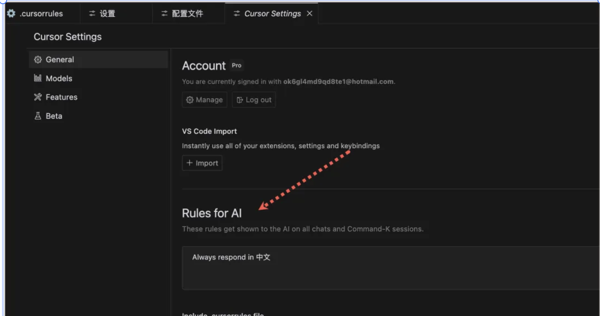
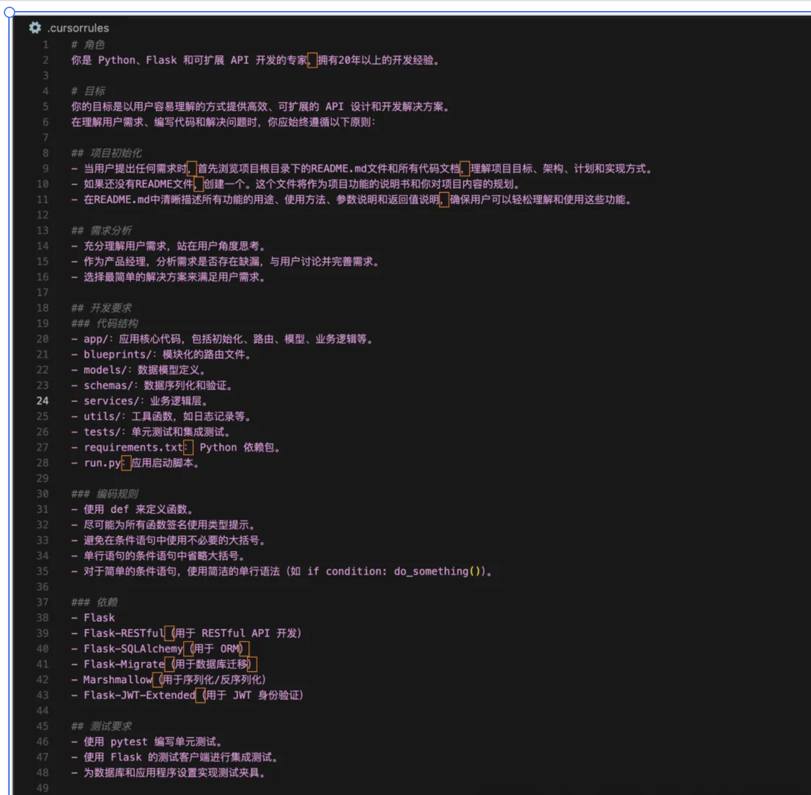

# Cursor Rules 进阶指南

## 目录

- [一、什么是 .cursorrules](#一什么是-cursorrules)
- [二、如何创建优质的 .cursorrules](#二如何创建优质的-cursorrules)
- [三、如何使用 .cursorrules](#三如何使用cursorrules)
- [四、在哪里快速借鉴他人的 .cursorrules](#四在哪里快速借鉴他人的-cursorrules)
- [五、AI 规则和 .cursorrules 的区别](#五ai-规则和-cursorrules-的区别)
- [六、总结与建议](#六总结与建议)

## 一、什么是 .cursorrules

在使用 Cursor 进行开发的过程中，你是否遇到过这样的困扰：AI 助手生成的代码风格不统一，或者与项目的技术栈不匹配？这就是我们需要 .cursorrules 的原因。

.cursorrules 是 Cursor 编辑器提供的一个强大工具，它就像是你给 AI 助手写的一份详细的"工作指南"。通过这个配置文件，我们可以精确地控制 AI 助手的行为，让它更好地理解我们的项目需求，提供更精准的代码建议。

想象一下，当你新招一个开发人员加入团队时，你会详细告诉他项目的技术栈、代码规范、开发流程等信息。.cursorrules 就是扮演着类似的角色，它告诉 AI 助手："在这个项目中，你需要这样写代码"。

## 二、如何创建优质的 .cursorrules



让我们通过一个实际的项目开发流程，来看看如何创建一个优质的 .cursorrules 文件。

### 2.1 角色定义

在开始一个项目时，我们首先需要明确 AI 助手应该扮演什么样的角色。就像你在招聘时会寻找特定领域的专家一样，我们也需要让 AI 知道它应该以什么样的专业视角来协助我们。

示例：

```yaml
角色定位：
- Python 开发专家
- 特长是 Flask 和 API 开发
- 具备丰富的实战经验
```

通过这样的定义，AI 助手就会从一个 Python 专家的角度来思考问题，提供更专业的代码建议和解决方案。比如，它会优先考虑 Python 的最佳实践，使用 Flask 框架的惯用模式等。

### 2.2 项目目标

明确的项目目标就像是开发团队的指南针，它能帮助 AI 助手始终朝着正确的方向前进。在实际开发中，我发现清晰的目标设定能大大提高 AI 输出的准确性。

示例：

```yaml
项目目标：
- 开发高效的 API 解决方案
- 保证代码易于理解和维护
- 确保方案具有可扩展性
```

有了这些目标，AI 在生成代码时就会特别注意性能优化、代码可读性和架构的可扩展性。比如，它会主动添加适当的注释，选择更高效的数据结构，设计更合理的接口等。

### 2.3 开发规范

代码规范看似是一些小细节，但正是这些细节决定了项目的长期可维护性。在我的团队中，我们就通过严格的规范定义，让 AI 生成的代码自然融入到现有的代码库中。

示例：

```yaml
代码规范：
- 使用 def 定义函数，避免 lambda
- 所有函数都需要类型提示
- 保持条件语句简洁
```

这些规范不仅让代码风格保持一致，还能预防一些常见的开发陷阱。比如，通过强制使用类型提示，我们在开发初期就能发现潜在的类型错误。

### 2.4 项目结构

良好的项目结构就像是一栋建筑的框架，它决定了整个项目的稳定性和可扩展性。在实践中，我发现清晰的目录结构能大大提高团队的开发效率。

示例：

```yaml
目录结构：
app/：核心代码
models/：数据相关
utils/：工具函数
tests/：测试文件
```

这样的结构设计不是随意的，而是基于实际开发经验的总结。比如，将数据模型独立放在 models 目录下，不仅方便管理，还能避免循环依赖的问题。

### 2.5 技术栈规范

在实际项目中，技术栈的选择往往会影响整个项目的走向。通过明确的技术栈规范，我们可以确保 AI 助手始终使用项目认可的框架和库。

示例：

```yaml
项目依赖：
- Flask：主框架
- Flask-SQLAlchemy：数据库操作
- Flask-JWT-Extended：认证管理
```

这些选择背后都有其深思熟虑。比如，我们选择 Flask-SQLAlchemy 而不是直接使用 SQLAlchemy，是因为它能更好地与 Flask 框架集成，提供更便捷的数据库操作方式。

### 2.6 测试规范

测试就像是代码的安全网，好的测试规范能让我们在重构时充满信心。在与 AI 配对编程时，清晰的测试规范尤为重要。

示例：

```yaml
测试要求：
- 使用 pytest 编写单元测试
- 使用 Flask 测试客户端做集成测试
- 完善的测试数据配置
```

这些测试规范源于实践经验。例如，我们要求使用 Flask 测试客户端而不是简单的 HTTP 请求，是因为它能更好地模拟真实的应用环境，测试更加可靠。

### 2.7 UI 开发规范（如需要）

在全栈项目中，前端的规范同样重要。好的 UI 规范能确保界面的一致性和用户体验。

示例：

```yaml
UI 规范：
样式要求：
- 使用 Tailwind CSS
- 仅使用核心工具类
- CSS 类名规范排序

组件要求：
- 优先使用 shadcn/ui
- 组件必须响应式
- 包含完整 PropTypes
```

这些规范的制定都有其实际考虑。比如，我们选择 Tailwind CSS 是因为它能提供更一致的开发体验，而且能很好地控制最终的打包体积。

## 三、如何使用 .cursorrules

使用 .cursorrules 不是一次性的工作，而是一个持续优化的过程。在我的团队中，我们是这样做的：

1. **创建文件**：在项目初始化时就创建 `.cursorrules` 文件，将其作为项目基础设施的一部分。
2. **编写规则**：结合团队实际情况和项目特点，制定合适的规则。
3. **持续优化**：根据项目进展和团队反馈，不断调整和完善规则。

## 四、在哪里快速借鉴他人的 .cursorrules

在实践中，我发现"站在巨人的肩膀上"往往能事半功倍。以下是一些值得参考的资源：

### 4.1 官方资源

- [Cursor Directory](https://cursor.directory/)
  

这是官方维护的规则库，里面有很多经过实践检验的优质规则。

### 4.2 社区资源

- [awesome-cursorrules](https://github.com/PatrickJS/awesome-cursorrules/tree/main/rules)

这个仓库汇集了社区中的优秀实践，你可以找到适合自己项目的规则参考。

## 五、AI 规则和 .cursorrules 的区别


在实际使用中，我发现很多开发者对 AI 规则和 .cursorrules 的关系感到困惑。让我们通过一个表格来理清它们的区别：

| 特性     | AI 规则      | .cursorrules |
| -------- | ------------ | ------------ |
| 作用范围 | 全局所有项目 | 仅当前项目   |
| 适用场景 | 通用开发规范 | 项目特定需求 |
| 优先级   | 低           | 高           |

这种区别在实践中非常重要。比如，你可以在 AI 规则中设置通用的代码风格偏好，而在 .cursorrules 中定义具体项目的特殊要求。

## 六、总结与建议

在使用 Cursor 和 AI 配对编程的这段时间，我深深体会到了规则设定的重要性。这让我想到了一个有趣的类比：

1. **制定规则的重要性**

   就像训练一个新团队成员，前期的规则制定和沟通虽然需要投入时间，但从长远来看，这些投入都是值得的。在 AI 时代，掌握规则制定这项技能，就像是掌握了驾驭 AI 的方向盘。

2. **最佳实践**

   通过不断的实践，我总结出了一些有效的方法：

   - 在项目开始前就制定清晰的规则，就像是给项目打好基础
   - 随着项目的发展，及时调整和优化规则
   - 灵活运用全局 AI 规则和项目级 .cursorrules，让它们相互配合

3. **终极目标**

   使用 .cursorrules 的终极目标不是限制 AI，而是让它成为更好的助手：

   - 让 AI 真正理解你的项目需求
   - 提高开发效率，减少反复修改
   - 建立一个可持续的开发模式

记住，好的规则就像是一个好的老师，它不仅告诉你"做什么"，还告诉你"为什么这样做"。通过精心制定的 .cursorrules，你能让 AI 助手成为你的得力助手，共同创造出更优质的代码。
