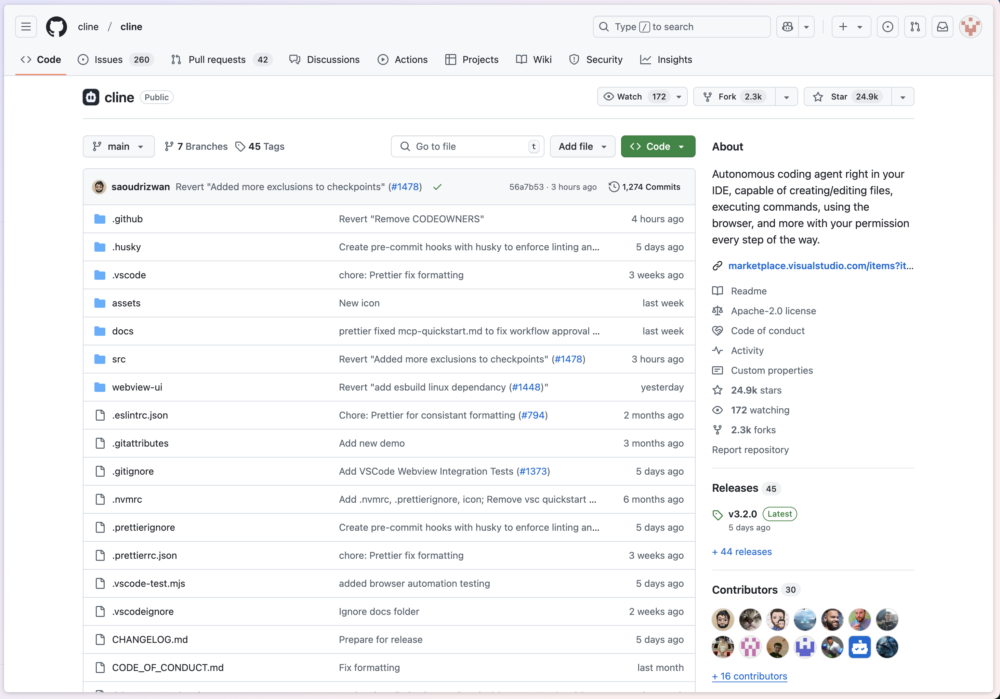

## Introduction: The Changes Brought by Cline v3.0

As a developer, have you often struggled with project configuration management? In team collaboration, establishing unified development standards can be more challenging than the technical aspects themselves. The good news is that Cline v3.0 brings us a game-changing new feature — the `.clinerules` configuration system.



## Getting to Know .clinerules

I still remember my excitement when I first encountered `.clinerules`. This seemingly simple configuration file elegantly solves many pain points in project management. It's not just a collection of rules; it's a crucial bridge connecting teams and standardizing development.

The `.clinerules` file is located in the project's root directory, a perfectly chosen location — like the project's "facade," it's the first stop for new members to understand project standards. Through it, team members can quickly grasp the project's technical choices, development standards, and important considerations.

## Changes Brought by .clinerules

During my time using `.clinerules`, I've deeply appreciated its value in project management. It acts like a "compass" for the project, helping teams find their direction in the ocean of development.

### Project Standards Are No Longer Just Theory

Remember when team standards often remained stuck in documentation, difficult to implement in practice? With `.clinerules`, this problem has been elegantly solved. For example, we can define testing standards like this:

```markdown
# Quality Control Standards

1. Test Coverage Requirements:
   - Ensure code changes have complete test cases
   - All tests must pass before submission
   - Critical functionality requires unit test support
```

This is not just a declaration of standards; it's a guide for team practices.

### Multi-Project Management Made Easy

The advantages of `.clinerules` become even more apparent when managing multiple projects. Each project can have its own configuration characteristics while maintaining unified team development principles. This flexibility makes project management more manageable.

## Practical Sharing: The Art of Configuration

After all this theory, let's look at a practical case. In a React + TypeScript project I participated in, here's how `.clinerules` played its role:

```markdown
# Frontend Development Standards

1. Component Development Standards:
   - Implement atomic design principles
   - Use functional components
   - Strict type checking
```

This configuration may seem simple, but it greatly improved the team's development efficiency. New members can quickly get started, and existing members can maintain consistent development styles.

## Common Issues and Solutions

One of the most frequently asked questions about `.clinerules` concerns configuration conflicts. Honestly, this issue is easily resolved — the system prioritizes settings in `.clinerules`, ensuring project-specific requirements are met.

Another common question is about immediate configuration effects. Thanks to Cline's real-time monitoring mechanism, there's no need to restart the development environment after modifying configurations, greatly enhancing the development experience.

## Future Prospects

As technology evolves, the potential of `.clinerules` is far from fully explored. I look forward to seeing breakthroughs in AI-assisted configuration, cross-platform support, and more. I believe it will bring us more surprises in the near future.

## Final Thoughts

The emergence of `.clinerules` has made project configuration management more elegant and efficient. It's not just a configuration file; it's a catalyst for team collaboration. If you haven't tried it yet, why not start today?

## Learning Resources

Want to learn more about `.clinerules`? These resources might help:

- [GitHub Repository](https://github.com/cline/cline)
