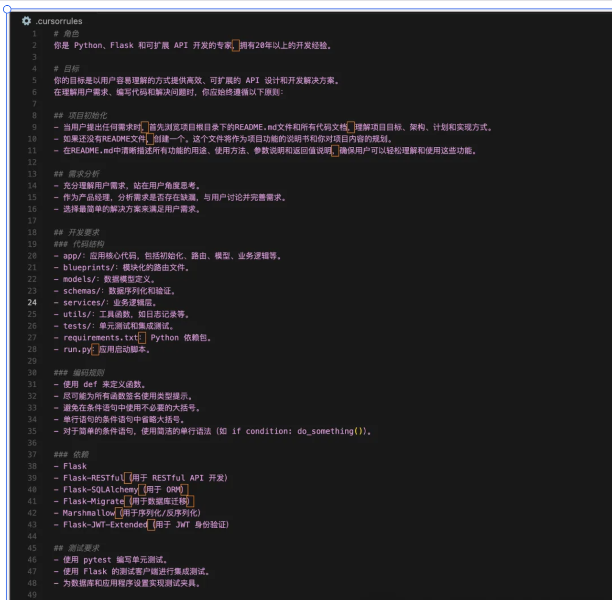

# Advanced Guide to Cursor Rules

## Table of Contents

- [1. What is .cursorrules](#1-what-is-cursorrules)
- [2. How to Create Quality .cursorrules](#2-how-to-create-quality-cursorrules)
- [3. How to Use .cursorrules](#3-how-to-use-cursorrules)
- [4. Where to Find Reference .cursorrules](#4-where-to-find-reference-cursorrules)
- [5. Differences Between AI Rules and .cursorrules](#5-differences-between-ai-rules-and-cursorrules)
- [6. Summary and Recommendations](#6-summary-and-recommendations)

## 1. What is .cursorrules

While developing with Cursor, have you ever been frustrated by inconsistent code styles generated by the AI assistant, or mismatches with your project's tech stack? This is why we need .cursorrules.

.cursorrules is a powerful tool provided by the Cursor editor, acting like a detailed "work guide" for your AI assistant. Through this configuration file, we can precisely control the AI assistant's behavior, helping it better understand our project requirements and provide more accurate code suggestions.

Imagine when you bring a new developer into your team, you would explain the project's tech stack, coding standards, development processes, and other information in detail. .cursorrules plays a similar role, telling the AI assistant: "This is how you should write code in this project."

## 2. How to Create Quality .cursorrules


Let's look at how to create a quality .cursorrules file through an actual project development process.

### 2.1 Role Definition

When starting a project, we first need to clarify what role the AI assistant should play. Just like you would look for experts in specific fields during recruitment, we need to let AI know what professional perspective it should use to assist us.

Example:

```yaml
Role Definition:
  - Python Development Expert
  - Specializes in Flask and API Development
  - Rich Practical Experience
```

With this definition, the AI assistant will think about problems from a Python expert's perspective, providing more professional code suggestions and solutions. For instance, it will prioritize Python best practices and Flask framework idioms.

### 2.2 Project Goals

Clear project goals act like a compass for the development team, helping the AI assistant stay on the right track. In practice, I've found that clear goal setting greatly improves the accuracy of AI output.

Example:

```yaml
Project Goals:
  - Develop efficient API solutions
  - Ensure code is easy to understand and maintain
  - Ensure solution scalability
```

With these goals, AI will pay special attention to performance optimization, code readability, and architecture scalability when generating code. For example, it will proactively add appropriate comments, choose more efficient data structures, and design more reasonable interfaces.

### 2.3 Development Standards

Code standards may seem like small details, but these details determine the long-term maintainability of the project. In my team, we use strict standard definitions to make AI-generated code naturally integrate into the existing codebase.

Example:

```yaml
Code Standards:
  - Use def to define functions, avoid lambda
  - All functions require type hints
  - Keep conditional statements concise
```

These standards not only maintain consistent code style but also prevent common development pitfalls. For example, by enforcing type hints, we can detect potential type errors early in development.

### 2.4 Project Structure

A good project structure is like a building's framework, determining the stability and scalability of the entire project. In practice, I've found that a clear directory structure greatly improves team development efficiency.

Example:

```yaml
Directory Structure:
app/: Core code
models/: Data-related
utils/: Utility functions
tests/: Test files
```

This structure design isn't arbitrary but based on practical development experience. For example, placing data models independently in the models directory not only facilitates management but also helps avoid circular dependency issues.

### 2.5 Tech Stack Standards

In real projects, technology stack choices often affect the entire project's direction. Through clear tech stack standards, we can ensure the AI assistant always uses project-approved frameworks and libraries.

Example:

```yaml
Project Dependencies:
  - Flask: Main framework
  - Flask-SQLAlchemy: Database operations
  - Flask-JWT-Extended: Authentication management
```

There's careful consideration behind these choices. For example, we choose Flask-SQLAlchemy over direct SQLAlchemy because it integrates better with the Flask framework and provides more convenient database operations.

### 2.6 Testing Standards

Testing is like a safety net for code, and good testing standards give us confidence during refactoring. Clear testing standards are particularly important when pair programming with AI.

Example:

```yaml
Testing Requirements:
  - Write unit tests using pytest
  - Use Flask test client for integration tests
  - Complete test data configuration
```

These testing standards come from practical experience. For example, we require using the Flask test client instead of simple HTTP requests because it better simulates the real application environment, making tests more reliable.

### 2.7 UI Development Standards (if needed)

In full-stack projects, frontend standards are equally important. Good UI standards ensure interface consistency and user experience.

Example:

```yaml
UI Standards:
Style Requirements:
  - Use Tailwind CSS
  - Only use core utility classes
  - Standardized CSS class name ordering

Component Requirements:
  - Prioritize shadcn/ui
  - Components must be responsive
  - Include complete PropTypes
```

These standards are established with practical considerations. For example, we choose Tailwind CSS because it provides a more consistent development experience and better controls final bundle size.

## 3. How to Use .cursorrules

Using .cursorrules isn't a one-time task but a continuous optimization process. In my team, we do it like this:

1. **Create File**: Create the `.cursorrules` file during project initialization as part of the project infrastructure.
2. **Write Rules**: Develop appropriate rules based on team circumstances and project characteristics.
3. **Continuous Optimization**: Continuously adjust and improve rules based on project progress and team feedback.

## 4. Where to Find Reference .cursorrules

In practice, I've found that "standing on the shoulders of giants" often yields twice the results with half the effort. Here are some valuable resources:

### 4.1 Official Resources

- [Cursor Directory](https://cursor.directory/)
  

This is the officially maintained rules library, containing many quality-tested rules.

### 4.2 Community Resources

- [awesome-cursorrules](https://github.com/PatrickJS/awesome-cursorrules/tree/main/rules)

This repository collects excellent practices from the community where you can find rule references suitable for your project.

## 5. Differences Between AI Rules and .cursorrules


In practice, I've found many developers confused about the relationship between AI rules and .cursorrules. Let's clarify their differences through a table:

| Feature  | AI Rules                      | .cursorrules                  |
| -------- | ----------------------------- | ----------------------------- |
| Scope    | All projects                  | Current project only          |
| Use Case | General development standards | Project-specific requirements |
| Priority | Low                           | High                          |

This distinction is very important in practice. For example, you can set general code style preferences in AI rules while defining specific project requirements in .cursorrules.

## 6. Summary and Recommendations

During my time pair programming with Cursor and AI, I've deeply experienced the importance of rule setting. This reminds me of an interesting analogy:

1. **Importance of Rule Setting**

   Like training a new team member, although initial rule setting and communication require time investment, these investments are worthwhile in the long run. In the AI era, mastering rule setting is like mastering the steering wheel of AI.

2. **Best Practices**

   Through continuous practice, I've summarized some effective methods:

   - Set clear rules before project start, like laying a good foundation
   - Adjust and optimize rules as the project develops
   - Flexibly use global AI rules and project-level .cursorrules to complement each other

3. **Ultimate Goal**

   The ultimate goal of using .cursorrules isn't to restrict AI but to make it a better assistant:

   - Help AI truly understand your project requirements
   - Improve development efficiency, reduce repeated modifications
   - Establish a sustainable development mode

Remember, good rules are like a good teacher, telling you not just "what to do" but also "why to do it." Through carefully crafted .cursorrules, you can make the AI assistant your capable helper in creating better code.
