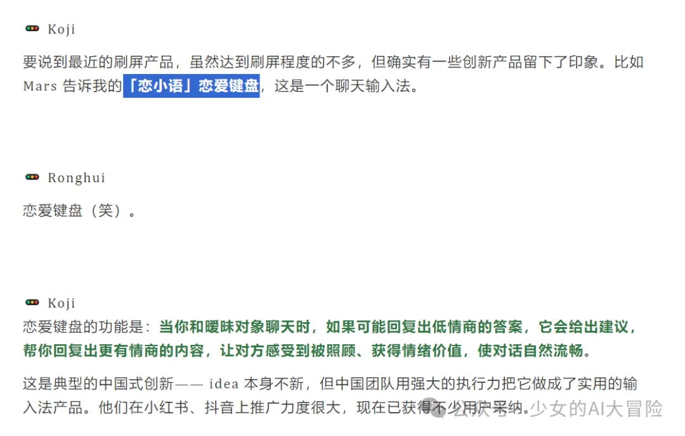

# From 0 to 1: A Beginner's Journey into Cursor Development

::: tip
This is a real development story, recording the whole process of a zero-based developer using Cursor to complete WeChat Mini Program development from 0 to 1. I hope this article can give you some inspiration and help if you are also a beginner.
:::

## Preface

The starting point of breaking through the defense

Such is the case, tonight, by chance, I was climbing the walls in various AI groups and saw an article on a [crossroad blog](https://mp.weixin.qq.com/s?__biz=MzAxMDMxOTI2NA==&mid=2649090446&idx=1&sn=9147c58fe7cb34275524c5fc9130cb54&scene=21#wechat_redirect), which mentioned a product called Love Keyboard. Seeing this, I felt a bit disheartened, not because of anything else, but because this is the input method I wanted to make a month ago~~ Unfortunately, I worked on it for a month with a cursor and couldn't get it done, and in the end, this company made it;/(ㄒoㄒ)/~~

_Competitive Analysis: Love Keyboard Product Interface_

---

## Cause

The matter started like this, in late September, I got to know a group owner named claude on Zhihu (yes, the one with the same name as the model developed by Anthropic company) who started a co-learning group called cursor. Thinking that cursor was so popular, I wanted to participate and learn as well, aiming to become an independent developer in the future, where I could turn my ideas into products at any time; so, I signed up for it.

::: tip Product inspiration
During the meeting, as everyone spoke, I had an idea for improving communication and exchange products: by analyzing the other person's words, interpreting the intentions of the angel and devil (like the two little people in everyone's heart), and replying and sending content based on the intention analysis.
:::

_Product Concept: Analysis of Angel and Devil Dialogue_

---

## Action journey

### Did you lose in the first step?

Got it done, I wrote down my ideas and output the corresponding product PRD. Originally planned to refer to the 66 keyboard, initially intended to be in the form of an input method, which needs to be downloaded and used as a carrier for the APP, and to achieve commercialization; but in the research, I found that the workload of using input method + APP form is quite large, and it is not something that a beginner who just touches the code and knows nothing can bear. So my idea is to make a plugin first.

::: warning Development Challenges
The first lesson for beginners: At the beginning, I often couldn't find the right method, and many times I got stuck at the first step of environment installation:

- Don't know where the terminal is, how to operate
- Don't know the environment, only needs to be installed once
- Unknown environment dependency failure may be due to internet speed issue
- Requirement description and implementation are not clear
  :::

_Development environment: Initial configuration interface_

Later, I carefully reviewed other people's projects, especially those on Bilibili, and when I successfully implemented them exactly as the project was, I realized; it's important to describe the requirements well and communicate with the cursor step by step with patience, not to rush into development

Of course, I also found a lot of basic practice tutorial materials, especially the most regrettable thing is that I only found out after paying for a month's membership that the cursor can actually be used for free......Me.......(OS: It's another day of being a big victim); and I also need to ask Cursor to help write a README document, recording the current progress, the next plan, and how to open and close the project for memo.

### **Is it okay after crossing the first step?**

::: warning Issues Encountered

- After using the cursor frequently, the generated effect becomes worse
- Member function experience is average
- The code gets messier as it is changed
- Interface loading error
  :::

::: tip Solutions

1. When encountering problems, give up in time and change it the next day
2. Pay attention to the network status
3. Reasonable control of usage frequency
4. Do well in code version management
   :::

After I subscribed to the membership, it was actually just like that; even after flipping through the paid membership large model, I didn't see anything special; some people say it's a network issue; but from the perspective of trying and developing, it's not just that, it's possible to switch to the cursor's own large model after exceeding a certain number of model usage times, but I haven't noticed it, this is just my intuition talking, it may not be true

It's always a mess when I keep changing it, and it's impossible to troubleshoot. The more I change, the more mistakes I make, and even the page can't be loaded; I just thought maybe I need to optimize my path. There's no plan, just a small plugin, simple (is it?), some experience posts, sketching prototypes, confirming over and over, there are some, nothing; but it still often goes wrong, you spend several hours writing, making demands to the cursor, fixing bugs, the more I change, the lazier I get, the harder it is to go back; if it's still a bug, I can't accept it; you still can't understand the code and find the cause...

Later, I really had no choice but to feel that the biggest problem was that I didn't know what the cursor was doing at each step, even if I knew what it had done above, I didn't know which code changes corresponded to it, even if I knew the code changes, I felt that the cursor often didn't follow the predetermined route and had its own ideas, especially when facing multiple interface jump issues

So, I thought of a solution, isn't it just that the requirements were not clear at the beginning, just not recorded, not planned well; don't hurry, think about the division of labor in daily development, project - product - technical solution - testing; by the way; I'll make a project requirement description document, a functional design technical document, and a code file change description document, isn't that enough~~~

1. Firstly, form the project requirement document, further communicate and confirm the details of the requirements with the composer, and review the corresponding documents
2. Further organize the corresponding modules according to the project requirement document, carry out functional module document design, including clarifying requirements, UI and technology (front-end and back-end implementation methods), test cases, and review and improve the functional module document written by AI, and you can roughly understand how this project is technically implemented and executed
3. Then, write the code step by step according to the module tasks, and write the code files and change logs in the corresponding code description document. This way, when there are errors, you can easily find out which function corresponds to which code file, and by adding code annotations for this function, basically, there won't be any problems

Especially when writing technical documents for function design, it is necessary to review them yourself for clarity, and there are some unclear points in the cursor that must be changed in time; test cases must also be written, which is very important; after each functional block is developed in time, running the test cases will be much better; and once confirmed, do not make extensive changes, especially since I directly changed the plugin file into a mini-program later on, which is completely unworkable

Finally, opening the browser at index.html seems to work; then, wouldn't installing the plugin in the browser~~complete the next step?

_Project interface: Initial version design_

_Functional test: interface interaction_

_Project structure: File organization_

_Development process: code writing_

In the computer's recycle bin, you can still see some things that were formed when the project was being done

The result, as expected, was in the browser installation

_Development issues: error prompts_

_Problem debugging: troubleshooting process_

My mood is as shown in the figure:

_At this moment, feeling: helpless.gif_

### **Change to mini-program**

::: warning Development Challenges
After spending more than half a month, I realized several issues:

1. Plugin form is not the best choice
2. Mainly used in mobile phones
3. Need to re-plan the technical route
   :::

::: danger Technical Difficulties
Main technical difficulties encountered during the development process:

1. API call issue
2. Backend service deployment
3. Database configuration
4. User verification implementation
5. Prompt word optimization
   :::

On the basis of the original project, the changes have become more and more chaotic. When I open the WeChat developer tools, it's all red error messages, and it's not easy to fix; it's better to start a new account; then, while developing, the first problem arises, when the user clicks the intent analysis button, an error occurs when accessing the API; the cause of the error is probably that the front-end doesn't run the API directly; it needs to be connected to the back-end, and it's best to connect to a cloud server for forwarding...

Let's use the Alibaba Cloud server I bought, after all, the previous project Werss (the news one) was deployed on an Alibaba Cloud server, and it suddenly disconnected, and when I logged in again, I couldn't scan the code and couldn't log into the account (a search on the forum was all about Tencent's competition, blocking the interfaces from Alibaba Cloud, feeling like everything could happen to me~~); after all, it's also idle, for the mini-program, considering high concurrency and database, cloud servers can only be used;

The result is, as expected, the code was already hard to understand, let alone the backend, which requires cloud servers, Baota, cursor, WeChat developer tools to switch back and forth, and user verification, database, transfer, and fine-tuning of prompt words to test the effect; it's not that I don't understand, but that we all pass the blame, and when something goes wrong, you don't know who to find~~, even the Alibaba Cloud customer service can't help, because this is a project backend issue, and there's no way to help you trace the cause......

Alright, alright, at least the initial index.html of this project can run smoothly, there are achievements in the joint study report, and naturally there is a senior backend programmer in the group who is willing to come and help, helping me debug and solve problems; the backend is really complex, I really can't handle it, so let's just cooperate and finish this project, share the achievements together; I will handle the frontend and product, provide all the necessary model API, cloud server, recordal, and mini-program audit fee expenses, and the senior will handle the backend, which is just right for me to learn in the back end.

_Project Planning: Example of Requirements Document_

### **Front-end development**

The initial 小程序 created with the cursor was very primitive, as shown below. I wanted to add background elements (images of angels and devils) to create an atmosphere (os: Looking back now, it's even more primitive than the original version), and then used AI to generate an image, selected a frame, and created a sense of angels and devils facing each other

_Mini-program interface: initial version_

_Mini-program interface: optimized version_

After adding the frame, it becomes adaptive, giving users a feeling of sliding inside the frame, while also ensuring the font is clear, so the request was gradually adjusted; however, due to the inherent reasons of the large model, it is impossible to truly understand the feeling of sliding within a picture frame, as well as the feeling of being able to slide up and down when customized; so I took a long time, and basically the entire page screenshot was due to various errors...

_Development debugging: problem troubleshooting_

Then comes the intent analysis page, the most important thing is how the information is presented, especially to make the layout and overall style more reasonable; since the large model indeed cannot understand the impact of the white mask on the display of text, and whether there is a better solution to address this; plus, I'm not very familiar with visual presentation schemes and UI either; so, it's another round of intelligence and courage against the large model...

_Function demonstration: Intent analysis page_

This product's most important feature is generating posters, especially when the intent analysis text is too long, requiring a limit on the number of words and lines. The most important thing is to add a mini program code for easy sharing by users. Moreover, when adjusting the position and visual presentation, the large model doesn't quite understand; and if the requirements are not paid attention to, he will even delete the intent analysis page, just。。。。。。

_Feature demonstration: poster generation effect_

At first, the reference was the style generated by Claude using SVG, but it often couldn't be generated, especially the large models couldn't understand the concept of expression

Originally, there was a reply generation page, but considering the difficulty of development and the token, the key is that it's a big trouble for the big shot to remotely control and fix the port database bug at midnight; let's just give it up. The token cost of the model is also a problem, and it's difficult to monetize; just a test, nothing is useful, and 20 yuan is gone

## **Lesson**

Gradually and slowly, it took more than a month to get it done; I thought the development was finished; turns out the big shot tested it and told me, what I did is the page style that can't be saved... I still need to make a style for saving posters......I was squeezed by the cursor for a month, and I no longer want to open the cursor; the big shot saw that my project was really crashing, so he helped me solve it along the way; thank you very much♥You are really great!

You thought that was it, how could it be? Mini-program individual qualification review and filing; after finishing that, there's still cloud server domain purchase and domain filing (used for backend server forwarding); and it has been delayed for another half a month... However, \[experience +1\]

**Talk about some useful and important software in project development**

**github:** This is well-known, so there is no need to say more; the biggest gain from this project is that it taught me how to use GitHub, as well as the treasure trove of open-source project libraries on GitHub~~

Apifox: A software for testing ports and API responses; it looks quite useful

DBeaver: Database-related, I'm not sure what it's used for myself

**Docker Desktop:** Some projects can be installed and downloaded using Docker; see my previous article for its importance

WeChat Developer Tools: This is an indispensable tool for developing WeChat mini-programs

**It is most important to have a large-scale model API**

At first, I used ZhiPu because they had an activity during National Day, giving away many tokens. But I only found out on November 1st that the resource package has a quota and expiration date, and it seems that the model type I received is not correct, so I was charged a lot of money. Unable to do anything, I contacted customer service and found out that it had expired. It's only cost-effective to buy a 9.9 yuan resource package; you also need to check it in time to prevent expiration, otherwise, using it through normal channels will cost a lot of money...

All right, the backend big shot took a quick look while searching for the model interface and found that ZhiPu has a free model. After asking the customer service, they said: Just pass this model code when calling the interface, there's no charge for the direct call; \[But it's charged when using the knowledge base for reasoning and vector retrieval\], that's great; Anyway, it's just a few prompts, and although the effect isn't very good; it's fine to be able to use it \[Yes, I've given up struggling~~\]

_Technical configuration: API interface settings_

## Experience Summary

::: tip Recommended Development Tools

1. **Github**

- Code version management
- Open-source project reference
- Team collaboration essential

2. **Apifox**

- API interface test
- Interface document management
- Team collaboration efficiency improvement

3. **DBeaver**

- Database management tool
- Supports multiple databases
- Visual operation interface

4. **Docker Desktop**

- Container deployment
- Environmental consistency guarantee
- Quick start and debugging

5. **WeChat Developer Tools**

- Mini-program development essentials
- Debugging function is powerful
- The development experience is good
  :::

::: warning API Usage Experience

1. **Choose the appropriate model**

- According to requirements, select the appropriate API
- Please note the calculation method of the fee
- Pay attention to usage restrictions

2. **Cost control**

- Use free resource package
- Reasonable setting of call frequency
- Monitor usage

3. **Optimization suggestions**

- Cache common results
- Batch processing request
- Error retry mechanism
  :::

### Core Experience

1. **Preliminary requirement analysis**

- Detailed requirements document
- Clear technical plan
- Reasonable development plan

2. **Modular development**

- Function module splitting
- Independent test verification
- Document synchronization update

3. **Code management**

- Version control
- Comment specification
- Code review

4. **Problem handling**

- Timely record the issue
- Analyze the cause
- Summarize experience

::: tip Summary
At the end, the road of development is arduous, but each attempt is a valuable experience. I hope this article can help other friends who are learning, and take fewer detours.
:::
