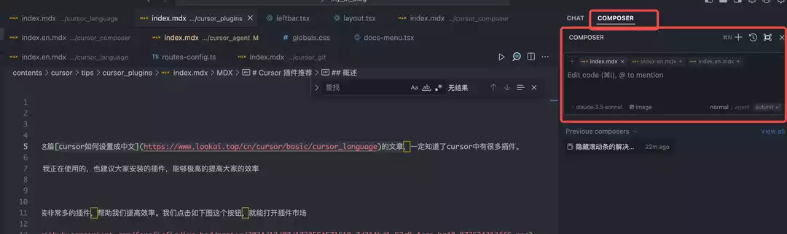
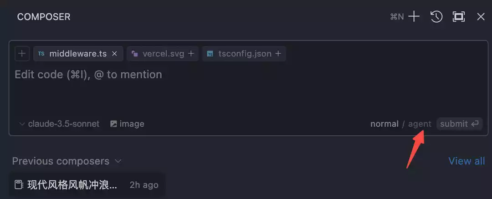
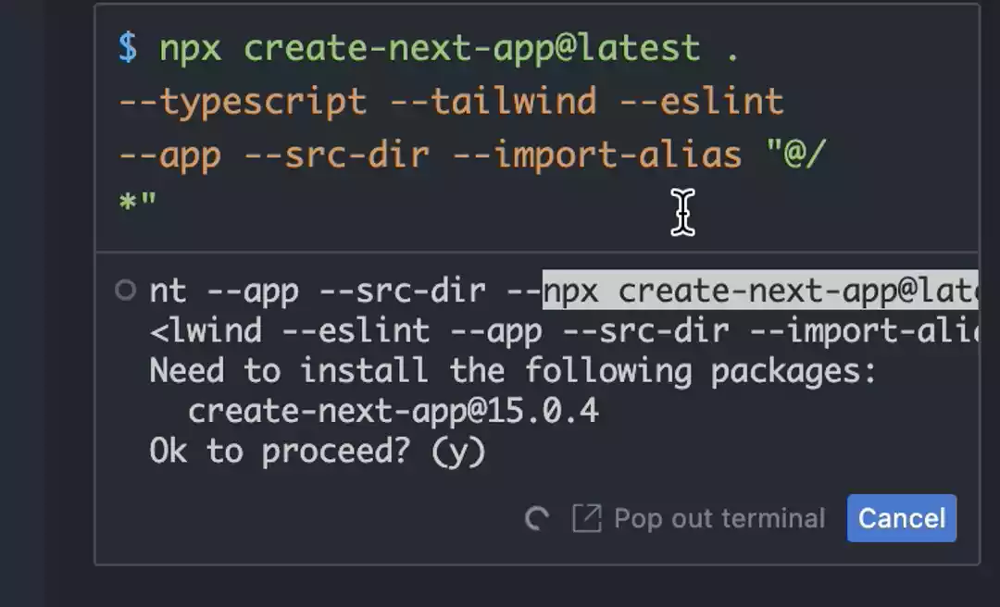
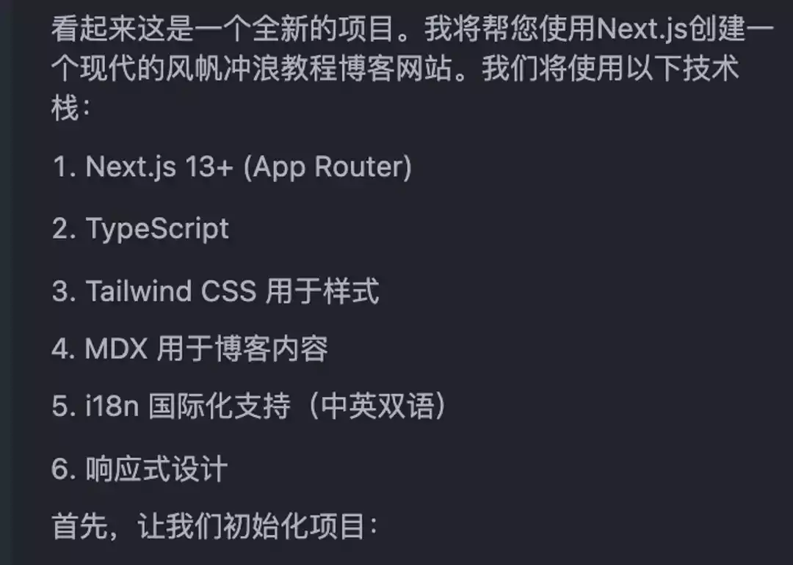
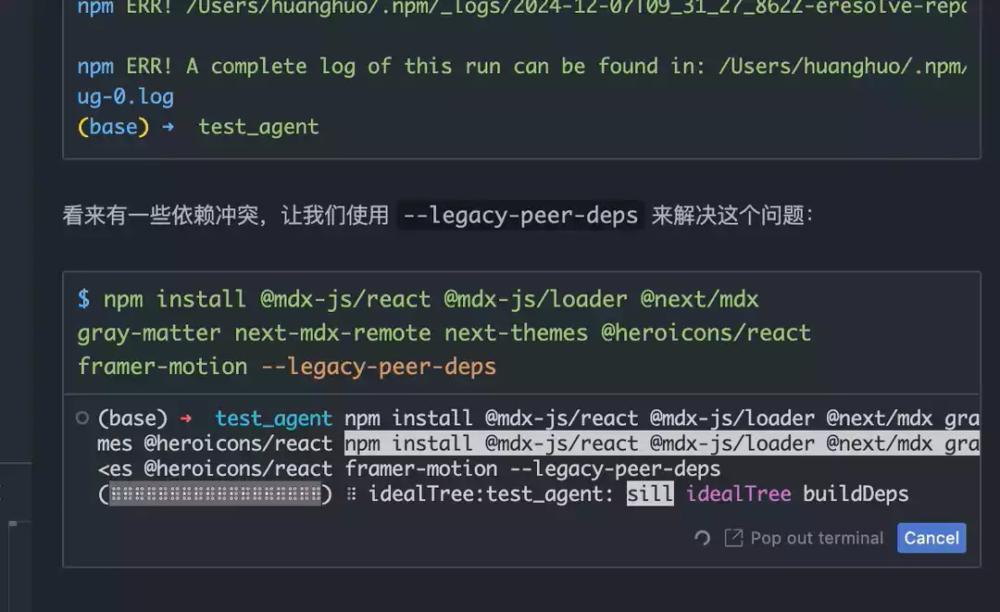

# Agent AI Assistant



Cursor Agent is a revolutionary AI agent system that is not just a simple code assistant but an intelligent partner that can think and work like a real programmer. It can autonomously complete complex programming tasks, understand project context, and provide continuous development support.

## What is Agent?

Agent is a major update feature introduced in Cursor version 4.3. Unlike traditional code completion or simple Q&A, Agent is more like a "thinking" programming assistant. Its two key features are:

- **Proactivity**: Ability to actively understand requirements, plan solutions, and solve problems
- **Execution**: Ability to autonomously complete complex task sequences



## Core Features

### 1. Intelligent Context Understanding

- **Automatic Context Collection**: Actively analyzes project structure and related code
- **Requirement Understanding**: Accurately grasps development intentions and goals
- **Dependency Analysis**: Identifies project dependencies and tech stack

### 2. Proactive Problem Solving

- **Error Diagnosis**: Automatically analyzes and fixes errors
- **Performance Optimization**: Identifies and resolves performance bottlenecks
- **Code Refactoring**: Provides code improvement suggestions

### 3. Multi-task Coordination

- **Parallel Processing**: Handles multiple related tasks simultaneously
- **State Management**: Maintains task execution states
- **Resource Coordination**: Optimizes resource usage

## Layout and Interface

### New Layout Changes


- **Composer Position**: Moved from screen center to right side
- **Chat Integration**: Shares right tab bar with Chat
- **Quick Switching**: Use cmd+L and cmd+I to switch between features

### Enabling Agent Mode


1. Open Composer (cmd+I)
2. Click the Agent icon to switch to Agent mode
3. Start using enhanced features

## Practical Application Scenarios

### 1. Project Initialization

```typescript
// Agent can help set up complete project framework
interface ProjectSetup {
  name: string
  template: 'next' | 'vite' | 'express'
  features: string[]
  dependencies: Record<string, string>
}

// Example: Initialize Next.js project
const setup: ProjectSetup = {
  name: 'my-next-app',
  template: 'next',
  features: ['typescript', 'auth', 'database'],
  dependencies: {
    'next': 'latest',
    '@prisma/client': '^5.0.0'
  }
}
```

### 2. Feature Development



Agent will:

1. Analyze requirements and break down tasks
2. Plan implementation steps
3. Write core code
4. Add test cases
5. Optimize code quality

### 3. Problem Diagnosis and Fixing

```typescript
// Agent automatically diagnoses and fixes problems
interface DiagnosticResult {
  type: 'error' | 'warning' | 'info'
  location: CodeLocation
  message: string
  suggestion?: string
  autoFix?: () => Promise<void>
}

async function diagnoseAndFix(
  issue: string
): Promise<DiagnosticResult[]> {
  // 1. Analyze problem
  const diagnosis = await analyzeProblem(issue)

  // 2. Generate fixes
  const fixes = await generateFixes(diagnosis)

  // 3. Apply fixes
  await applyFixes(fixes)

  return diagnosis
}
```

## Workflow

### 1. Requirement Analysis



- Understanding user requirements
- Determining technical constraints
- Planning implementation paths

### 2. Code Generation and Optimization

Agent-generated code follows best practices:

- Type safety
- Error handling
- Performance optimization
- Maintainability

### 3. Testing and Deployment

- Automatically generates test cases
- Runs test suites
- Provides deployment suggestions

## Best Practices

### 1. Effective Communication

For best results:

- Provide clear requirement descriptions
- Specify concrete constraints
- Give timely feedback

### 2. Progressive Development

1. Start with small tasks
2. Gradually increase complexity
3. Continuously validate and optimize

### 3. Code Review

Agent can:

- Check code quality
- Identify potential issues
- Provide improvement suggestions

## Usage Tips

### 1. Command Execution



- Agent automatically executes commands in Composer
- User confirmation required before execution
- Supports background running

### 2. Multi-task Handling

- Terminal commands and conversations can run in parallel
- Real-time task status updates
- Automatic resource scheduling

### 3. Problem Solving

When encountering problems, Agent will:

1. Actively analyze causes
2. Provide solutions
3. Verify fix effectiveness

## Important Notes

::: tip Tips

- Provide detailed context information
- Verify generated code
- Maintain interaction with Agent
  :::

::: warning Cautions

- Important decisions need human confirmation
- Regularly backup critical data
- Pay attention to code security
  :::

## Common Issues

### 1. Agent Mode Not Working

- Check if Cursor version is up to date
- Confirm Agent mode is correctly enabled
- Verify network connection status

### 2. Code Generation Quality

- Provide more context information
- Clearly specify constraints
- Give timely feedback and corrections

### 3. Performance Issues

- Optimize task scale
- Set reasonable concurrency
- Use background execution appropriately

## Future Outlook

Agent technology is rapidly developing:

- Stronger understanding capabilities
- Smarter decision-making
- More natural interaction
- Broader applications

Through continuous learning and adaptation, Agent will become an even more capable assistant for developers, helping us complete development tasks more efficiently.
