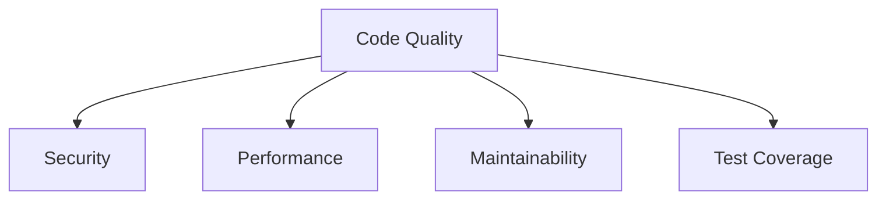
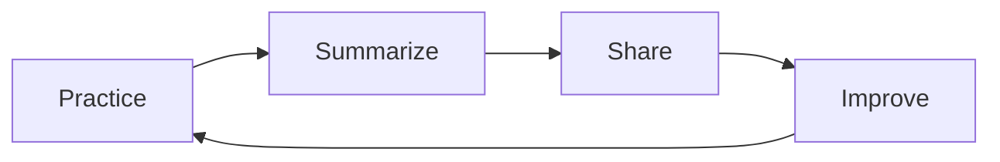

<style>
.custom-block {
  margin: 2rem 0;
}

.custom-block + .custom-block {
  margin-top: 1.5rem;
}
</style>

# The Mindset of AI Programming

Before you start AI programming, you need to understand some of its key characteristics:

::: warning 🎲 Regarding Randomness
Large language models work by predicting the most suitable next word, which means that even for the same question, you might get different solutions each time. This is not a flaw, but a feature. If you want to achieve more consistent results, the best approach is to provide more specific requirements, such as specifying a particular tech stack or framework. This helps the AI narrow its focus.
:::

::: info 📊 Regarding Universality
AI is trained on vast amounts of internet data, which means it tends to provide more mainstream solutions. If you need a specialized implementation, it is best to clearly state your specific requirements, such as asking it to follow a particular design standard or coding convention. This will guide the AI to generate code that better meets your expectations.
:::

::: tip 📝 Regarding Context Limitations
Current AI models have limitations when processing long texts, with a typical context window of around 200,000 characters. This means that when dealing with large projects, you need to plan your project structure and file partitioning wisely. It is recommended to document your project early on (for example in a README.md) and utilize methods like @codebase during conversations to provide the necessary context.
:::

::: details 🤔 Regarding Thought Processes
AI tends to directly satisfy your surface requests but might overlook deeper system design considerations. When you encounter complex problems, it is advisable to let the AI help analyze the issue first rather than immediately asking for a solution. By guiding it to think more comprehensively, you can obtain better results.
:::

In the AI era, we need to adopt a new programming mindset. AI is not a substitute but a powerful assistant and collaborator. This article will help you establish the right mindset to leverage AI for enhancing programming efficiency and quality.

## Basic Principles

### 1. Treat AI as Your Programming Partner 🤝

Imagine AI as an experienced colleague who can offer advice and references, but the final decision still rests with you. Just like in a restaurant where the waiter may recommend the special, you are the one who decides what to eat.

When programming:

- Ask AI for suggestions, but do not follow them blindly.
- Actively consider whether its suggestions are appropriate.
- Save good solutions and gradually build your own "treasure trove of tips".

### 2. Be the Helmsman of Your Project ⛵

Remember, you are the captain of your project and AI is your first mate. Decisions on the project's direction, choice of tech stack, and coding quality standards must be made by you.

Just like using a GPS while driving:

- You decide the destination while AI helps chart the route.
- You assess the road conditions and detour when necessary, even if the navigation suggests a congested route.
- You are responsible for safety; you must keep an eye on the road regardless of the navigation's instructions.

### 3. Maintain a Passion for Learning 📚

The growth of a programmer is like leveling up in a game; AI can help you progress faster, but you still need to accumulate skill points gradually:

- When encountering a new feature, first understand how it is implemented.
- When you see good code, ponder why it was written that way.
- Stay curious and frequently ask "why" and "is there a better way?"

Remember: AI is not here to replace your brain but to make it stronger. Like a personal trainer at the gym, it can guide you on the proper techniques, but ultimately, you build your own strength.

## Work Approach

### 1. Task Breakdown

::: tip 🎯 Start from a Global Perspective
Before you start coding, take the time to understand the entire project's requirements and objectives—just as a painter sketches a draft before painting—to plan the technical architecture and implementation path, thereby avoiding later detours.
:::

::: info 🚶 A Gradual Implementation Strategy
Break large tasks into smaller pieces, just as you eat one bite at a time. Focus on solving one problem at a time, and gradually build your project with incremental steps.
:::

::: tip 🔄 A Mindset of Continuous Improvement
Start by building the basic framework, much like laying the foundation of a house, and then gradually add features. Continuously improve code quality so that the project evolves and grows.
:::

### 2. Collaborating with AI

1. **Clear Communication**

```
// A good prompt example:
"Create a TypeScript function for handling user authentication,
which should include:
1. Input validation
2. Password encryption
3. Token generation
4. Error handling"

// A bad prompt example:
"Write a login function"
```

2. **Incremental Development**

```typescript
// Step 1: Basic Structure
async function authenticateUser(credentials: Credentials) {
  // Basic validation logic
}

// Step 2: Add Detailed Implementation
async function authenticateUser(credentials: Credentials) {
  // 1. Validate input
  validateCredentials(credentials)

  // 2. Find user
  const user = await findUser(credentials.email)

  // 3. Verify password
  await verifyPassword(credentials.password, user.password)

  // 4. Generate token
  return generateToken(user)
}

// Step 3: Add Error Handling
async function authenticateUser(credentials: Credentials) {
  try {
    validateCredentials(credentials)
    const user = await findUser(credentials.email)
    await verifyPassword(credentials.password, user.password)
    return generateToken(user)
  }
  catch (error) {
    handleAuthError(error)
  }
}
```

3. **Code Review**

```typescript
// Review the AI-generated code
function processData(data: unknown) {
  // Checkpoint 1: Type safety
  if (!isValidData(data)) {
    throw new Error('Invalid data')
  }

  // Checkpoint 2: Performance consideration
  const results = processLargeDataSet(data)

  // Checkpoint 3: Error handling
  try {
    return transformResults(results)
  }
  catch (error) {
    handleError(error)
  }
}
```

## Best Practices

### 1. The Art of Prompt Engineering 🎨

Interacting with AI is like instructing a smart assistant that needs clear directives. To craft a good prompt, consider the following:

Imagine you are writing an email to a foreign friend; articulate your requirements clearly and in detail. For example, instead of just saying "I need a login function", specify the particular components such as user authentication, password encryption, and token generation. This way, AI can provide an accurate answer.


### 2. Controlling Code Quality 🔍

Just like constructing a building, code quality directly impacts the long-term stability of a project. We need to pay special attention to:

- Security: Just like installing burglar alarms and surveillance on a house.
- Performance: Ensuring that the elevator is fast and the hallways are wide enough.
- Maintainability: Organizing pipelines logically to facilitate future maintenance.
- Test Coverage: Similar to conducting waterproof and earthquake resistance tests.



### 3. The Path to Continuous Improvement 🌱

Programming is like gardening; it requires continual nurturing and enhancement. Here’s what you can do:

- Record daily gains and lessons, much like writing in a diary.
- Regularly review and summarize your progress, just as you weed and prune a garden.
- Share experiences within your team to learn from each other and grow together.



::: tip Tip

- Regard AI as a collaborative partner rather than a substitute.
- Maintain the habit of learning and reflecting.
- Focus on code quality and long-term maintenance.
  :::

::: warning Caution

- Do not overly rely on AI.
- Retain your ability for independent thought.
- Always pay attention to code quality and security.
  :::
