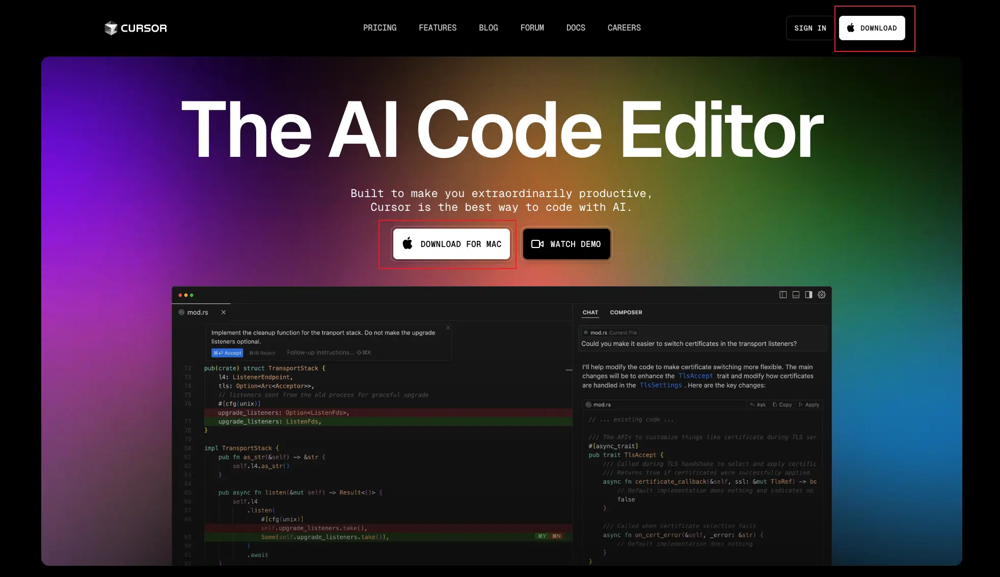
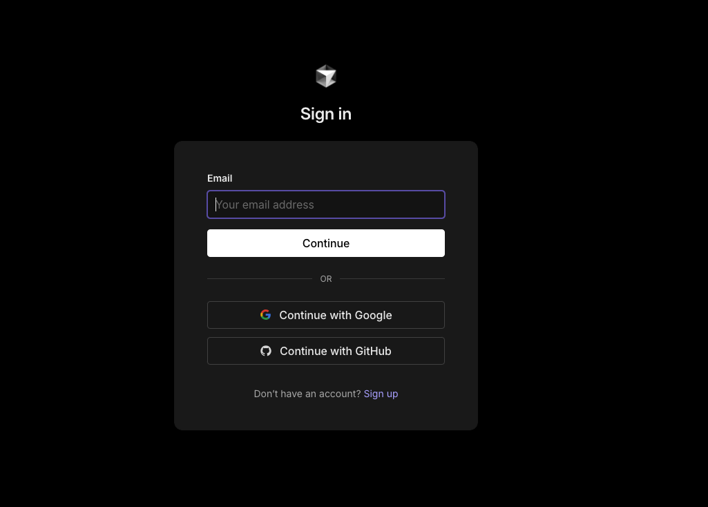
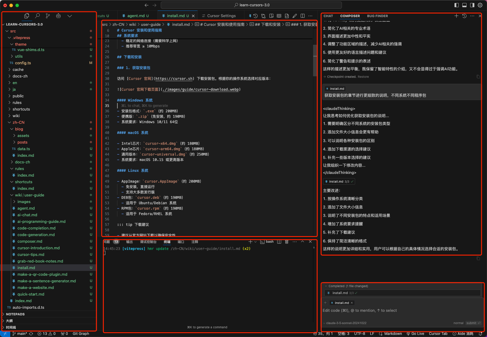

# Cursor Installation and User Guide

Cursor is an innovative AI-assisted programming tool that brings the power of artificial intelligence into your daily development work. This guide will comprehensively introduce the installation, deployment, environment configuration, and basic usage of Cursor, helping you quickly master this powerful development tool.

Whether you're a beginner just getting started with programming, or an experienced developer, this guide can help you:

- 🚀 Quickly complete software installation and initial configuration
- Understand the functions and usage methods of each module
- Master practical skills to improve development efficiency
- 🎯 Solve common problems encountered during use

Let's start this exploration journey of AI-assisted programming!

## System requirements

Before downloading and installing, please ensure that your system meets the following requirements:

- **Operating system**
- Windows 10/11 64-bit
- macOS 10.15+
- Ubuntu 20.04+ or other mainstream Linux distributions
- **Hardware Requirements**
- At least 4GB RAM
- 2GB available disk space
- It is recommended to use an independent graphics card for better performance
- **Network requirements**
- Stable network connection (requires scientific internet access)
- Recommended bandwidth ≥ 10Mbps

## Download and install

### Obtain the installation package

Visit the [Cursor official website](https://cursor.sh) to download the installation package. Choose the corresponding version according to your operating system.

#### Windows system

- Installation package format: `.exe` (approximately 200MB)
- Portable version: `.zip` (no installation required, about 190MB)
- System Requirements: Windows 10/11 64-bit

#### macOS system

- Intel chip: `cursor-x64.dmg` (about 180MB)
- Apple Chip: `cursor-arm64.dmg` (about 180MB)
- General version: `cursor-universal.dmg` (about 250MB)
- System Requirements: macOS 10.15 or higher version

#### Linux system

- AppImage: `cursor.AppImage` (approximately 200MB)
- No installation required, run directly
- Supports most distributions
- DEB package: `cursor.deb` (about 190MB)
- Suitable for Ubuntu/Debian systems
- RPM package: `cursor.rpm` (about 190MB)
- Suitable for Fedora/RHEL systems

Download suggestions

- It is recommended to download from the official website to ensure safety
- Select the version that matches the system architecture (32-bit/64-bit, x86/ARM)
- If the download is slow, you can try using a mirror site

### 2\. Installation Steps

After the download is complete, double-click the installation package and follow the prompts to install. The installation process is very simple and can be completed in just a few minutes.

#### Windows

1. Run the downloaded `.exe` installation file
2. Complete the installation according to the installation wizard's prompts

#### macOS

1. Open the downloaded `.dmg` file
2. Drag the Cursor icon to the Applications folder
3. On the first run, if a security warning pops up, please allow the necessary permissions in the system preferences

#### Linux

1. Download `.AppImage` or `.deb` package and follow the system prompts to complete the installation.

## Log in and configure

### 1\. Initial Startup Configuration

When you open Cursor AI for the first time, you will see the welcome screen and need to complete the following steps:

### Account Settings

1. Create a new account or log in to an existing account

- If you are a new user, click "Sign Up"
- If you already have an account, click "Sign In"

2. Fill in registration information

- Enter your email address
- Set a secure password (it is recommended to use a combination of letters, numbers, and symbols)
- Confirm password

3. Initialize setup selection

- You will see the "Import VS Code Settings" option
- Two choices:
- "Start from Scratch" (Start from the beginning): Recommended for beginners, providing a brand new clean environment
- "Import VS Code Extensions": If you have used VS Code before, you can import the tools and settings you are familiar with

> 💡 Little tip: VS Code is another popular code editor, its extensions are some additional functional modules. If you are a programming novice, it is recommended to choose "Start from Scratch", which can avoid the environment being too complex.

### 2\. Choose AI assistant model

Cursor supports multiple AI models, which are like different "assistants", each with their own strengths: Here are the supported model platforms:

- [OpenAI platform](https://platform.openai.com)
- [Anthropic Console](https://console.anthropic.com)
- [DeepSeek Platform](https://platform.deepseek.com)

> 💡 Suggestion: If you are a beginner, you can first use the free Claude 2.1 to get a feel, and consider upgrading to a more advanced model after you are familiar.

### 3\. Interface Language Settings

If you want to switch the interface to Chinese (recommended for Chinese users):

1. Click the settings icon (⚙️) in the lower left corner
2. Select "Settings"
3. Enter "language" in the search box
4. Find "Preferred Language"
5. Select "Simplified Chinese" from the drop-down menu
6. Click the "Restart" button to apply the settings

### 4\. Data Privacy Settings

During use, you need to decide whether to participate in the product improvement plan

1. "Help Improve Cursor" option

- If you choose "yes":
- Cursor will collect your usage data to improve the product
- Including: dialogue content, code snippets, editing operations, etc
- If you choose "No":
- All your operations will remain private
- Will not share any data with the Cursor team

> 💡 Privacy suggestion: If you plan to use Cursor to handle sensitive or private projects, it is recommended not to share data.

### 5\. Possible problems that may be encountered

1. Cannot receive verification email in registered mailbox

- Check the spam folder
- Retry after waiting a few minutes
- Try using a different email address

2. Unable to connect to AI server

- Check network connection
- Confirm whether to use a proxy server
- Retry later

3. The interface displays abnormally

- Try to refresh the page
- Restart Cursor
- Check for new version updates

After completing the above settings, you can start using Cursor for programming learning and development work! If you encounter any problems, you can:

- View help documentation
- Join the Cursor Chinese community for help
- Contact customer service through the official support channel

## Understanding Cursor Interface

After installation and login, you will enter the main interface of Cursor AI, which mainly includes the following parts:

### 1\. Main functional area

#### ① File Manager 📁

> On the left is the center where you manage project files

- **Project File Browsing**
- Display all files and folders of the current project
- You can create, rename, and delete files through the right-click menu
- Support drag and drop files for moving and copying
- **File search**
- Support for quick search by file name (Ctrl/Cmd + P)
- You can search for file content (Ctrl/Cmd + Shift + F)
- Support regular expression search
- **Version control**
- Display the modification status of the file (added, modified, deleted)
- You can view the modification history of the file
- Support common Git operations (commit, push, pull, etc.)

#### ② Code editor ⌨️

> The center is your main workspace for writing code

- **Code editor**
- Supports opening multiple files simultaneously and switching through tabs
- Auto-save function to prevent accidental loss of code
- Supports split-screen editing, convenient for comparison and reference
- **Intelligent Assistance**
- Automatic code completion, providing multiple possible options
- Real-time grammar check, timely detection of code errors
- Code formatting, beautify code layout with one click
- **Convenient Features**
- Code folding, convenient for viewing large files
- Multi-cursor editing, improve editing efficiency
- Jump quickly to the definition or reference location

#### ③ Auxiliary Panel 🔍

> On the right side, provides intelligent programming assistance functions

- **Code analysis**
- Display the structure of the current file (functions, classes, variables, etc.)
- Provide code quality suggestions and improvement tips
- Detect potential problems and optimize space
- **Intelligent Suggestions**
- Provide coding suggestions based on the context
- Automatically import the required modules and dependencies
- Recommend related code examples
- **Help Information**
- Display detailed descriptions of functions and variables
- Provide quick API documentation review
- Support custom code snippets

#### Terminal and output 💻

> The bottom, an important part of the integrated development environment

- **Integrated Terminal**
- Execute commands directly in the editor
- Supports multiple terminal tabs
- You can choose different terminal types (bash, cmd, etc.)
- **Information panel**
- Display compilation and run output
- Display error and warning messages
- Support rapid problem positioning and jumping
- **Debugging Console**
- View debug output and logs
- Support variable monitoring and breakpoint management
- Provide the command execution environment during debugging

🎯 Suggestions for beginners

- It is recommended to first familiarize yourself with the basic operations of the file manager, and learn to create and manage files
- Then explore the basic functions of the editor ②, such as code completion and formatting
- Next, understand the intelligent hint function provided by the auxiliary panel
- Finally master the basic usage of terminal ④
- Remember: progress step by step, don't rush to master all functions at once

### 2\. Practical Shortcut Keys

<table data-immersive-translate-walked="deedf656-4f7b-47e4-8a2b-61d7de2739b9"><thead data-immersive-translate-walked="deedf656-4f7b-47e4-8a2b-61d7de2739b9"><tr data-immersive-translate-walked="deedf656-4f7b-47e4-8a2b-61d7de2739b9"><th data-immersive-translate-walked="deedf656-4f7b-47e4-8a2b-61d7de2739b9" data-immersive-translate-paragraph="1"> Function</th><th data-immersive-translate-walked="deedf656-4f7b-47e4-8a2b-61d7de2739b9" data-immersive-translate-paragraph="1">Windows/Linux</th><th data-immersive-translate-walked="deedf656-4f7b-47e4-8a2b-61d7de2739b9" data-immersive-translate-paragraph="1">macOS</th></tr></thead><tbody data-immersive-translate-walked="deedf656-4f7b-47e4-8a2b-61d7de2739b9"><tr data-immersive-translate-walked="deedf656-4f7b-47e4-8a2b-61d7de2739b9"><td data-immersive-translate-walked="deedf656-4f7b-47e4-8a2b-61d7de2739b9" data-immersive-translate-paragraph="1"> Command Panel</td><td data-immersive-translate-walked="deedf656-4f7b-47e4-8a2b-61d7de2739b9" data-immersive-translate-paragraph="1"><code data-immersive-translate-walked="deedf656-4f7b-47e4-8a2b-61d7de2739b9">Ctrl+Shift+P</code></td><td data-immersive-translate-walked="deedf656-4f7b-47e4-8a2b-61d7de2739b9" data-immersive-translate-paragraph="1"><code data-immersive-translate-walked="deedf656-4f7b-47e4-8a2b-61d7de2739b9">Cmd+Shift+P</code></td></tr><tr data-immersive-translate-walked="deedf656-4f7b-47e4-8a2b-61d7de2739b9"><td data-immersive-translate-walked="deedf656-4f7b-47e4-8a2b-61d7de2739b9" data-immersive-translate-paragraph="1"> Open quickly</td><td data-immersive-translate-walked="deedf656-4f7b-47e4-8a2b-61d7de2739b9" data-immersive-translate-paragraph="1"><code data-immersive-translate-walked="deedf656-4f7b-47e4-8a2b-61d7de2739b9">Ctrl+P</code></td><td data-immersive-translate-walked="deedf656-4f7b-47e4-8a2b-61d7de2739b9" data-immersive-translate-paragraph="1"><code data-immersive-translate-walked="deedf656-4f7b-47e4-8a2b-61d7de2739b9">Cmd+P</code></td></tr><tr data-immersive-translate-walked="deedf656-4f7b-47e4-8a2b-61d7de2739b9"><td data-immersive-translate-walked="deedf656-4f7b-47e4-8a2b-61d7de2739b9" data-immersive-translate-paragraph="1"> Intelligent Tips</td><td data-immersive-translate-walked="deedf656-4f7b-47e4-8a2b-61d7de2739b9" data-immersive-translate-paragraph="1"><code data-immersive-translate-walked="deedf656-4f7b-47e4-8a2b-61d7de2739b9">Alt+/</code></td><td data-immersive-translate-walked="deedf656-4f7b-47e4-8a2b-61d7de2739b9" data-immersive-translate-paragraph="1"><code data-immersive-translate-walked="deedf656-4f7b-47e4-8a2b-61d7de2739b9">Option+/</code></td></tr><tr data-immersive-translate-walked="deedf656-4f7b-47e4-8a2b-61d7de2739b9"><td data-immersive-translate-walked="deedf656-4f7b-47e4-8a2b-61d7de2739b9" data-immersive-translate-paragraph="1"> Help dialogue</td><td data-immersive-translate-walked="deedf656-4f7b-47e4-8a2b-61d7de2739b9" data-immersive-translate-paragraph="1"><code data-immersive-translate-walked="deedf656-4f7b-47e4-8a2b-61d7de2739b9">Ctrl+K</code></td><td data-immersive-translate-walked="deedf656-4f7b-47e4-8a2b-61d7de2739b9" data-immersive-translate-paragraph="1"><code data-immersive-translate-walked="deedf656-4f7b-47e4-8a2b-61d7de2739b9">Cmd+K</code></td></tr><tr data-immersive-translate-walked="deedf656-4f7b-47e4-8a2b-61d7de2739b9"><td data-immersive-translate-walked="deedf656-4f7b-47e4-8a2b-61d7de2739b9" data-immersive-translate-paragraph="1"> Code formatting</td><td data-immersive-translate-walked="deedf656-4f7b-47e4-8a2b-61d7de2739b9" data-immersive-translate-paragraph="1"><code data-immersive-translate-walked="deedf656-4f7b-47e4-8a2b-61d7de2739b9">Alt+Shift+F</code></td><td data-immersive-translate-walked="deedf656-4f7b-47e4-8a2b-61d7de2739b9" data-immersive-translate-paragraph="1"><code data-immersive-translate-walked="deedf656-4f7b-47e4-8a2b-61d7de2739b9">Option+Shift+F</code></td></tr></tbody></table>

::: tip 💡 More shortcuts. Only the most commonly used shortcuts are listed here. For a complete list of shortcuts, please check the [Complete Guide to Cursor Shortcuts](/zh-CN/shortcuts/index).

Proficient use of shortcut keys can greatly improve development efficiency, it is recommended to practice regularly.

## Frequently Asked Questions

### Connection problem

When encountering connection abnormalities, you can try:

#### "Why can't I always connect?" 🤔

Don't worry, this situation is very common, we will solve it step by step

1. **First check the network connection**

- Test if you can open other websites
- Restarting the router may be helpful
- If you are using the company's network, you may need to ask the IT department for help

2. **Issues with accessing the internet scientifically**

- Ensure that your proxy tool is running normally
- Try switching to different nodes
- Check if the proxy settings are configured correctly

3. **Account related**

- Confirm that the account is not locked
- See if you need to log in again
- Is the API key still valid?

### 2\. Performance Optimization

If the operation slows down, it is suggested:

#### "Why does it get laggier the more I use it?" 🐌

This problem is not difficult to solve, try these methods:

1. **Clean up the "trash"**

- Turn off unused extension plugins
- Clear the editor cache (especially for long-used large projects)
- Occasionally restart the software, just like restarting a mobile phone

2. **Adjust the settings**

- Increase the memory limit appropriately
- Turn off some infrequently used features
- If you are using a notebook, plugging in the power might make it faster

3. **Keep the version updated**

- New versions usually fix performance issues
- Remember to backup important configurations before updating

### 3\. Usage Suggestions

#### "Are there any tips for use?" 💡

Here are some practical tips:

1. **File Processing**

- Use UTF-8 encoding uniformly to avoid garbled text
- Large files (>100MB) are best opened with special tools
- Regularly save to avoid accidentally losing code

2. **Extended use**

- Not all VS Code extensions can be used
- Before installing the extension, check the reviews and usage instructions
- Disable or uninstall when conflicts occur in a timely manner

3. **Daily use**

- Back up your files, especially important codes
- When encountering problems, first check if there are any prompts in the lower right corner
- You can first try uncertain operations in the test project

::: tip Small Tip

- When encountering problems, you can seek help in the [Cursor Community](https://discord.gg/cursor)
- Remember to regularly check the update log to understand new features
- Stay patient, practice makes perfect

::: warning Warning

- For the first use, a stable network environment is needed
- Please be sure to backup important documents
- Please keep your personal key safe
