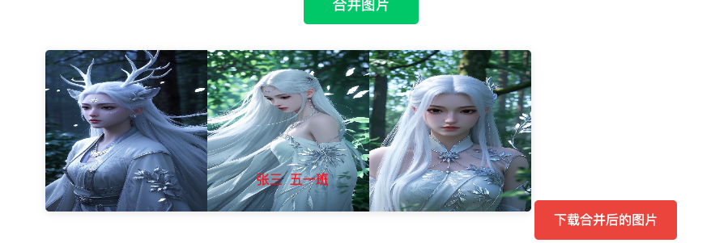

# Practical Tutorial: Building an Image Merger Tool Through Conversation

::: tip 💡 Learning Objectives
This tutorial will teach you through a practical case how to:

- Transform everyday needs into concrete products
- Rapidly develop features using Cursor AI
- Debug and optimize code through conversation
  :::

## I. Project Origin

### 1. Background Requirements

In daily life, schools often require parents to provide feedback information, such as registration forms or other documents. This information usually includes multiple images that need to:

- Merge multiple images together
- Add the child's name
- Organize into a complete image to send to the teacher

### 2. Current Pain Points

The current processing method is quite cumbersome:

- Need to open Word document
- Manually insert images one by one
- Adjust position and size
- Add text descriptions
- Finally take a screenshot to save

### 3. Solution

Develop a simple web tool that achieves:

- Batch upload images
- Drag and drop to adjust positions
- Add text descriptions
- One-click merge and download

## II. Development Process

### 1. Environment Preparation

::: warning Preliminary Preparation

- Create a new project folder
- Open folder with Cursor
- Familiarize with basic interface
  :::


### 2. Requirements Description

Open the AI dialog box (shortcut `Ctrl+i`), clearly describe the product requirements:

```
Help me create a PC website with the following features:
1. An image upload entry that can upload multiple images
2. A merge button that, when clicked, will merge the uploaded images together for display, and the merged image can be downloaded
```


After the code is generated, the following information appears


The first red box represents modified or generated files

The second red box

Reject all means rejecting this code, clicking it will undo these new additions

Accept all means accepting the code, the code will take effect

Boldly click Accept all

After opening the webpage, it looks like this. Everyone's interface might be different, but that's okay, you can adjust everything through AI dialogue.


## III. Feature Iteration

### 1. Basic Feature Implementation

What you need to do now is start debugging features, see what issues there might be


All at once, you can click to download.

### 2. Drag and Drop Optimization

Currently, images can only be merged horizontally side by side. I want to be able to adjust positions freely, like having image 1 in the first position, image 2 in the second row. So tell the AI what optimization you want to make

> The merged image area should implement the following features:
>
> 1. Images can be dragged freely to change order, like image 1 to the right of image 2, image 3 below image 1
> 2. You can make something like a canvas feature

The first sentence describes the specific functionality, the second sentence guides the AI in this direction. You can also skip this sentence and go step by step.

After updating the code, this issue appeared


The images are overlapping, but don't worry, tell the AI your problem

> There's now an issue that needs fixing, as follows:
>
> The dragged images are overlapping. I require that images cannot overlap, each image should occupy its own position.

After submission, the overlapping issue is resolved, but images cannot be dragged below other images


> The overlapping issue is solved, but images still can't be dragged below other images. Let me clarify the requirements again
>
> 1. Images can be dragged to the left or right of other images, occupying that position after dragging
> 2. Images can be dragged above or below other images, also occupying that position after dragging.
>
> For example, initially with image 1, image 2, image 3, if I drag image 3 below image 1, then in the merged image, image 3 will be below image 1.


The issue is solved, but there are white gaps between images

> The merged images should not have white gaps between them, images should be right next to each other


### 3. Text Addition Feature

Adding the child's name

> Add a new feature.
>
> Add an input box where you can enter text, this text can also be dragged to any position, the text is red, and the merged image should include this text




Finally, ask AI to optimize the page and write down the feature instructions


## IV. Experience Summary

::: tip 💡 Development Insights

1. **AI-Driven Development**

   - No need to write code manually
   - Implement features through conversation
   - AI understands natural language requirements

2. **Iterative Optimization**

   - First implement basic features
   - Gradually add new features
   - Continuously optimize user experience

3. **Practical Suggestions**
   - Be clear and specific in descriptions
   - Problems can be solved step by step
   - Don't be afraid to ask AI questions
     :::

Throughout the entire process, I didn't write a single line of code myself, it was all automatically completed by AI. Terrifyingly impressive.

However, this project is very simple, only frontend. In our second practical project, we will include backend and database.

The final experience is that everyone should be brave in asking AI questions, as it will answer all of them.
