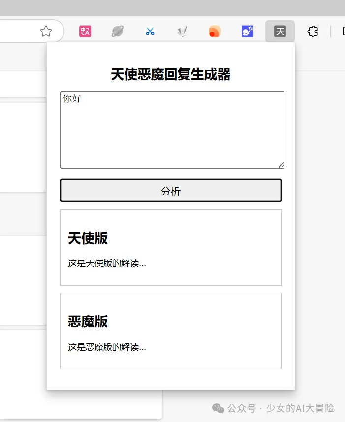
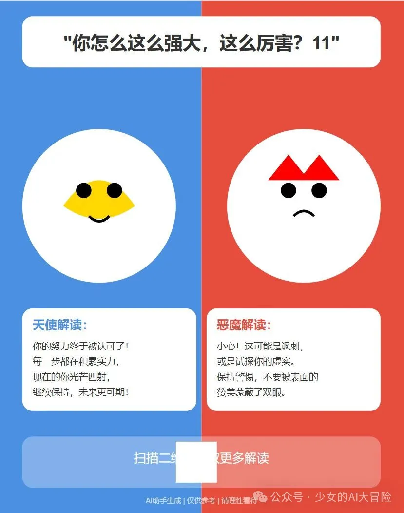

# 从0到1：一个小白的Cursor开发之旅

::: tip 写在前面
这是一个真实的开发故事，记录了一个零基础开发者如何使用Cursor从0到1完成微信小程序开发的全过程。希望这篇文章能给同样是初学者的你一些启发和帮助。
:::

## 序言

📌 破防的起点

是这样的，今晚无意中在各种AI群爬楼，看到一个 [十字路口博客文章](https://mp.weixin.qq.com/s?__biz=MzAxMDMxOTI2NA==&mid=2649090446&idx=1&sn=9147c58fe7cb34275524c5fc9130cb54&scene=21#wechat_redirect)，聊到一个叫做恋爱键盘产品，看到这里有点破防，不是别的，就是这个不是我一个多月之前的想做的输入法嘛\~\~可惜，拿cursor做了一个多月，没做成，结果让这家公司做成了；/(ㄒoㄒ)/\~\~

_竞品分析：恋爱键盘产品界面_

---

## 起因

事情起因是这样的，9月下旬的时候，我在知乎上认识的一个群主claude（没错，与那个Anthropic公司所开发模型齐名）开办一个叫做cursor的共学，想着cursor那么火，自己也要参与学习学习，以后成为一个独立开发者，可以把自己想法随时转化为产品；于是，我就报名参加了。

::: tip 产品灵感
会上，随着大家发言，我有了一个关于改善沟通和交流产品的想法：通过分析对方话语，进行天使恶魔（就像每个人心里都住着两个小人）意图解读，并根据意图分析内容进行回复并发送。
:::

_产品概念：天使恶魔对话分析_

---

## 行动历程

### 第一步就败北了吗？

说干就干，我把我的想法记录了下来，并输出了对应产品的PRD。本来参考66键盘，一开始准备以输入法形式，需下载需要用APP作为载体，并实现商业化；但调研中发现，用输入法+APP形式工作量比较大，并不是我一个刚接触代码，啥也不会小白能够承受的，所以我的想法是先做一个插件。

::: warning 新手的第一个教训
一开始我老是不得其法，甚至很多时候卡在了第一步环境安装上：

- 不知道终端在哪，怎么操作
- 不知道环境只需要安装一次
- 不知道环境依赖失败可能是网速问题
- 需求描述和实现不够清晰
  :::

_开发环境：初始配置界面_

后来，我仔细看了别人的项目，尤其是b站的，按照 那个项目 原封不动的去实现，真的就成功的时候，我悟了；描述好需求以及耐心一步步先和cursor沟通清楚，不着急开发很重要；&#x20;

当然，我也找了很多基础实践教程资料，尤其是最后悔的是，充完才知道买了一个月会员的cursor其实是可以白嫖。。。。。我。。。。。。（os:又是当大冤种的一天）；以及及需要让Cursor帮忙写一个README的文档，记录目前的进展、下一步计划，以及如何开启和关闭项目做备忘。&#x20;

### **跨过了第一步就好了嘛？**

::: warning 遇到的问题

- Cursor使用次数多了后，生成效果变差
- 会员功能体验一般
- 代码越改越乱
- 界面加载出错
  :::

No!No!No! 我在使用cursor过程中遇到了很多问题。即使知道Save All和Accept ALL，也知道确认更新没问题后再Accept，但是一天用多了cursor后，发现大模型好像变笨了，生成效果经常出错，还越改越错。

::: tip 解决方案

1. 遇到问题时适时放弃，第二天再改
2. 注意观察网络状态
3. 合理控制使用频率
4. 做好代码版本管理
   :::

我充了会员后其实也就那样，翻了会员付费大模型次数也没看出啥；有人说是网络的问题；但我一直在尝试和开发角度来看，不止，有可能超过一定模型使用次数后，切到cursor自己的大模型，但我没没有察觉，这只是我的直觉之谈，不一定为真；&#x20;

老是改着改着就出问题，而且还没法排查，越改越错，甚至加载不出来页面；我才觉得可能是需要优化一下我的路径，方案没啥，而且就是个小插件，简单（吗？），经验贴啥的，画原型图，一遍遍确认，也有呀，没啥；但还是经常出错，就是你写了好几个小时，向cursor提需求，改bug ，越改越偷懒，越改越回不去；不接受还是bug；你还看不懂代码找不到原因。。。。。。&#x20;

后来我实在没办法，觉得最大问题在于我不知道cursor每一步在干什么，即使知道干了上面，也不知道对应代码变动哪些，即使知道了代码变动，感觉cursor老是不按照既定路线走下去，还是有自己想法，尤其是面对多个界面跳转问题上面；&#x20;

于是，我想到一个解决方案，不就是需求一开始没盘明白嘛，不就是没记录，没规划好嘛；别急，想一想日常开发的分工，项目--产品--技术方案--测试；对了；我弄一个项目需求说明文档，一个功能设计技术文档，一个代码文件更改说明文档不就行了吗\~\~\~&#x20;

1. 先形成项目需求文档，进一步与composer沟通确认需求细节，并查看对应文档，

2. 再根据项目需求文档整理对应模块，进行功能设计模块文档设计，包括明确需求，进行UI和技术（前后端实现途径），测试用例，根据AI写的功能设计模块文档，观看确认和完善，你就能大概了解这个项目技术上怎么实现，怎么执行

3. 然后根据模块任务一点点写代码，并将代码文件和更改记录写道对应代码说明文档，这样有错误你也好查询时哪一个功能对应哪个代码文件，在用上代码注解这个功能，基本上就没啥问题了；

尤其是在功能设计技术文档时，一定要自己看一遍清楚一些，而且cursor有一些写的不明确的地方，一定要及时更改；测试用例也必须写上，很重要；在每个功能块及时开发完时候，在用测试用例跑一遍，就会好很多；以及及一旦确认就不要大范围的更改，尤其是我后期在插件文件上直接改成小程序，是完全行不通的；&#x20;

终于，在index.html打开浏览器好像是能跑通的；那我下一步在浏览器中安装上插件，岂不\~\~就完成了？&#x20;

_项目界面：初版设计_

_功能测试：界面交互_

_项目结构：文件组织_

_开发过程：代码编写_

在电脑的回收箱里还能看到当初做项目一些成型的东西&#x20;

结果，不出意外的，在安装浏览器里；&#x20;

_开发遇到的问题：错误提示_

_问题调试：排查过程_

我的心情如图所示：&#x20;

_此刻心情：无奈.gif_

### **改成小程序**

::: warning 转折点
在花费了半个多月的时间后，我意识到了几个问题：

1. 插件形式并不是最佳选择
2. 主要使用场景在手机端
3. 需要重新规划技术路线
   :::

后来想了想花了半个多月弄的，十一放假没回家就搞这个了，结果就这。。。。还不如不搞。。。感觉插件也不是很方便呀，关键是沟通发生场景大部分在手机端，而不是电脑端，当初做插件考虑方便，降低开发成本，且方便打开产品的想法并不可靠，所以，换条路子，走走小程序？

::: danger 技术难点
在开发过程中遇到的主要技术难点：

1. API调用问题
2. 后端服务部署
3. 数据库配置
4. 用户验证实现
5. 提示词优化
   :::

在原先项目基础上改，越改越乱，一打开微信开发者工具全是红字报错，还不好改；还是重新起号来吧；然后开发开着，就涉及到第一个问题，当用户点击意图分析按钮，接入API时报错；报错原因大概是前端不然直接跑API；需要接入后端，最好是接入云服务器搞转发。。

那就用上我买的阿里云服务器吧，【毕竟上个项目Werss（新闻那个）部署在阿里云服务器，结果一时断线，再登竟然扫不了码，登不上去账号（一翻论坛又是腾搞竞争，屏蔽了来自阿里云的接口，感觉啥事都能让我遇上\~\~）】；毕竟闲着也是闲着，小程序稍微考虑高并发、数据库啥的只能用云服务器了；&#x20;

结果，不出意外，代码本来就看不懂了，何况后端这些，需要云服务器、宝塔、cursor、微信开发者工具来回切，还有用户验证、数据库、转接、提示词微调测效果；不是不懂，是互相甩锅，出错你不知道找谁\~\~，找了阿里云客服都不行，因为这属于项目后端的事情，没办法帮你排查原因。。。。。&#x20;

还好，还好，这个项目前期index.html起码能跑通，共学汇报有成果，自然群里有个后端程序员大佬，愿意过来帮忙，帮助我排BUG，解决问题；后端真的好复杂，我真的搞不定，那就索性一起合作，把这个项目搞完，有成果一起分成，我搞前端和产品，提供所需要一切接模型API、云服务器、备案、小程序审核费用支出，大佬搞搞后端，正好在后面学习学习；&#x20;

_项目规划：需求文档示例_

### **前端开发**

一开始用cursor生成的小程序非常简陋，就大概如下面所示，我想加点背景元素（天使恶魔图片）去营造一下氛围（os:现在来看还不如原版简陋的呢），然后就用AI生成了一张图片，选了一个画框，天使与恶魔对望的感觉；&#x20;

_小程序界面：初始版本_

_小程序界面：优化版本_

加了画框之后，就是自适应，让用户有种再画框里面滑动的感觉，同时还要使得字体清晰，所以提需求慢慢调；但由于大模型自身原因，是无法真正理解镶在画里滑动是什么感觉，以及自定义多了可以上下滑动那种感觉；所以我弄了好久，基本上一整页截图就是因为各种出错。。。。。。&#x20;

_开发调试：问题排查_

然后就是意图分析页面，最重要的是信息如何展示，尤其是要使得排版和整体风格更合理；由于大模型确实不能理解由于白色遮罩带来文字展现的影响，以及有没有更好方案去解决；加上本人也不是很懂视觉呈现方案和UI哪些；所以，又是和大模型斗智斗勇。。。。。。&#x20;

_功能展示：意图分析页面_

这个产品最重要的就是生成海报，尤其是有时候意图分析字数过长，需要字数显示和行数的限制，最重要的是加上小程序码，便于用户去分享，再调整位置和视觉呈现上，大模型又是不咋理解；而且需求稍微没注意，他就把意图分析页面给弄没了，就。。。。。。。&#x20;

_功能展示：海报生成效果_

一开始参考是claude用svg生成的样式，但老是生成不出来，尤其是大模型理解不了表情这回事&#x20;

本来还有个回复生成页面，但考虑开发难度和token，关键是老麻烦大佬半夜远程操控给我修端口数据库的BUG；还是算了吧，模型的token费用也是个问题，变现也困难；光测个试，啥也没用20块就没了<哭晕在厕所>，&#x20;

## **教训**

陆陆续续，拖拖拉拉，搞了一个多月，以为开发完了；结果大佬测完告诉我，我做的是页面样式没办法保存。。。。还要弄个保存海报的样式。。。。。被cursor揉捏了一个月，再也不想打开cursor；大佬看我这个项目实在搞的崩溃，就顺道帮我解决了；非常感谢♥有你真好！&#x20;

你以为这就完了，怎么可能呢？小程序个人资质审核、备案；弄完后，还有云服务器域名购买，域名备案（用于后端服务器转发）；就又拖了半个多月。。。。。。不过【经验+1】&#x20;

**说几个项目开发中比较好用和重要软件吧&#x20;**

**github:&#x20;**&#x8FD9;个大名鼎鼎，自然不必多说；这个项目最大收获就是让我学会用github，以及及github宝藏开源项目库\~\~&#x20;

**Apifox:&#x20;**&#x68C0;验端口以及API是否有效回应的软件；看起来还挺好用的；&#x20;

**DBeaver:&#x20;**&#x6570;据库用的，具体我也不懂干啥&#x20;

**Docker Desktop:&#x20;**&#x6709;些项目安装下载可以使用Docker;重要性参见我上篇文章&#x20;

**微信开发者工具：&#x20;**&#x8FD9;个开发微信小程序绕不过去&#x20;

**最重要的是大模型API：**

一开始我用的是智谱，因为他家国庆时候搞活动，送很多token，但11月1日发消息才知道，资源包有额度和日期的时效，且好像我接的模型种类不对，所以扣了好多的钱；没办法，我找了客服，才知道过期了，买9.9元资源包才划算；还要随时查看防止过期，不然走正常途径稍微用扣很多的钱。。。。

还好，后端大佬在找模型接口时稍微浏览了一下，才发现智谱有个免费的模型，问了一下客服，客服说：调用接口时传这个模型编码就行，直接调用不收费；【但使用知识库进行推理，向量检索时收费】，太好了；反正其实就点提示词，虽然效果并不是怎么太好；但能用就行【对，我已经放弃挣扎了\~\~】

_技术配置：API接口设置_

## **经验总结**

::: tip 开发工具推荐

1. **Github**

   - 代码版本管理
   - 开源项目参考
   - 团队协作必备

2. **Apifox**

   - API接口测试
   - 接口文档管理
   - 团队协作效率提升

3. **DBeaver**

   - 数据库管理工具
   - 支持多种数据库
   - 可视化操作界面

4. **Docker Desktop**

   - 容器化部署
   - 环境一致性保证
   - 快速启动和调试

5. **微信开发者工具**
   - 小程序开发必备
   - 调试功能强大
   - 开发体验良好
     :::

::: warning API使用经验

1. **选择合适的模型**

   - 根据需求选择合适的API
   - 注意费用计算方式
   - 关注使用限制

2. **成本控制**

   - 使用免费资源包
   - 合理设置调用频率
   - 监控使用情况

3. **优化建议**
   - 缓存常用结果
   - 批量处理请求
   - 错误重试机制
     :::

### 核心经验

1. **前期需求分析**

   - 详细的需求文档
   - 清晰的技术方案
   - 合理的开发计划

2. **模块化开发**

   - 功能模块拆分
   - 独立测试验证
   - 文档同步更新

3. **代码管理**

   - 版本控制
   - 注释规范
   - 代码审查

4. **问题处理**
   - 及时记录问题
   - 分析原因
   - 总结经验

::: tip 写在最后
开发之路虽然艰辛，但每一次的尝试都是宝贵的经验。希望这篇文章能够帮助到其他正在学习的朋友，少走一些弯路。
:::

---
