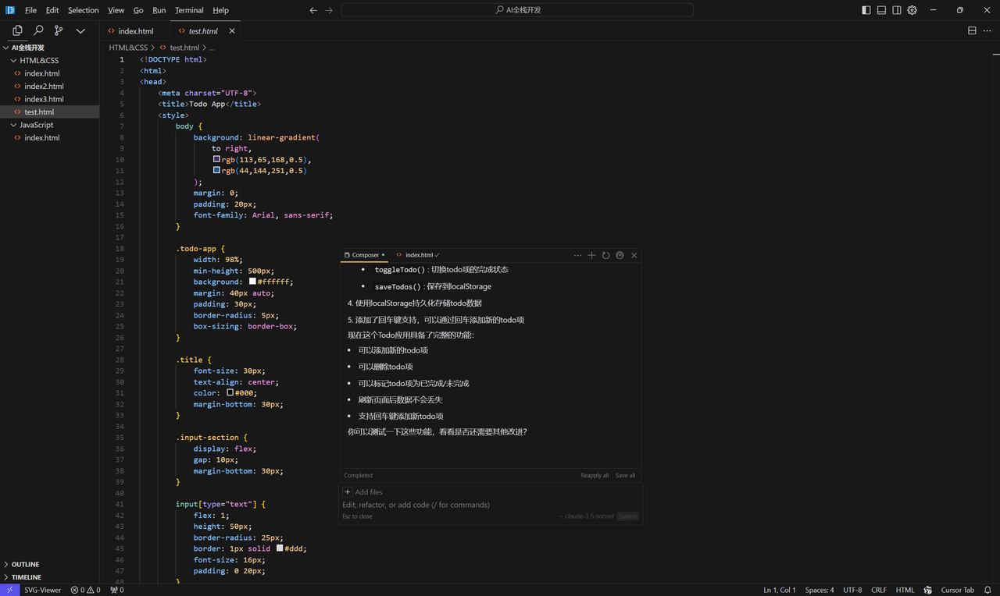
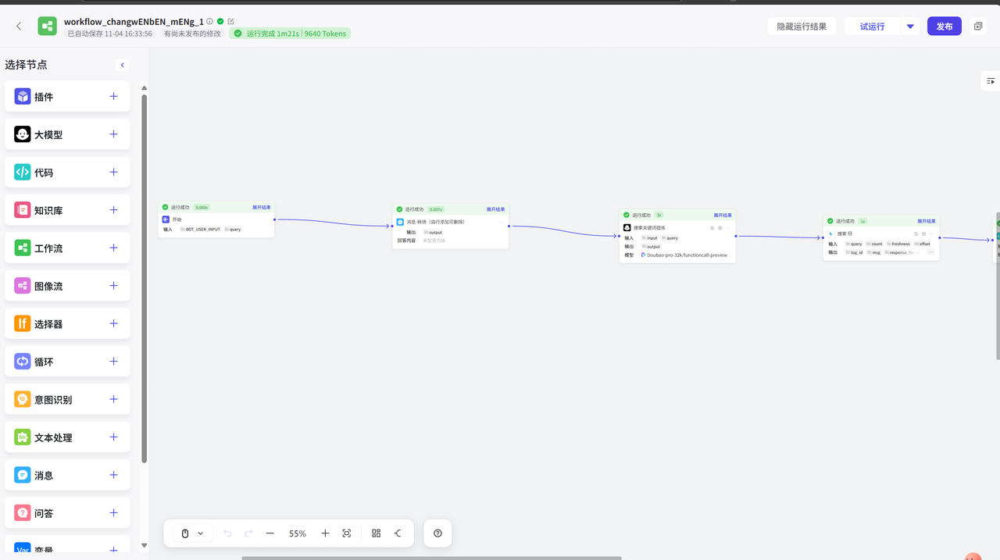
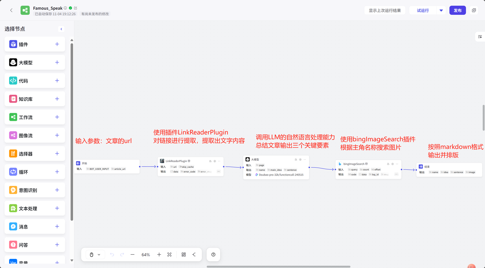
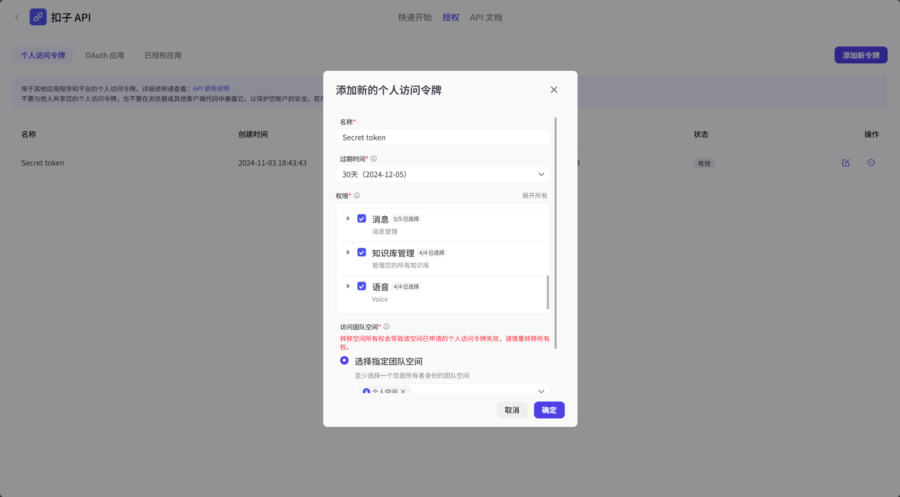
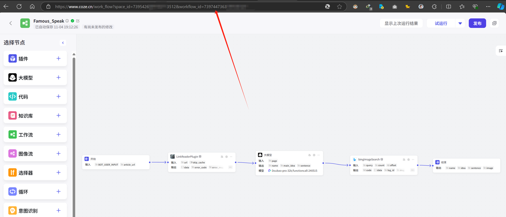
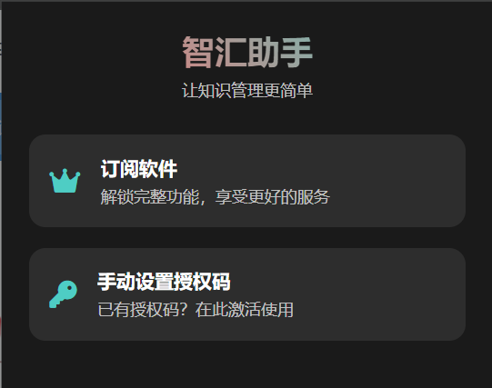
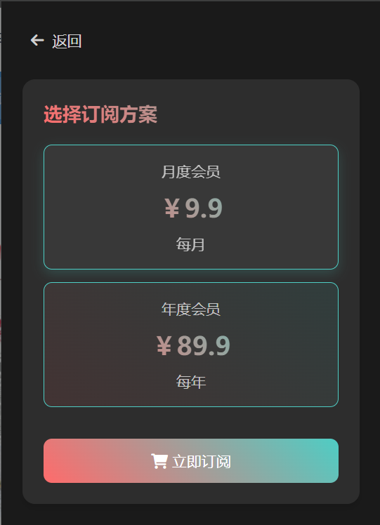
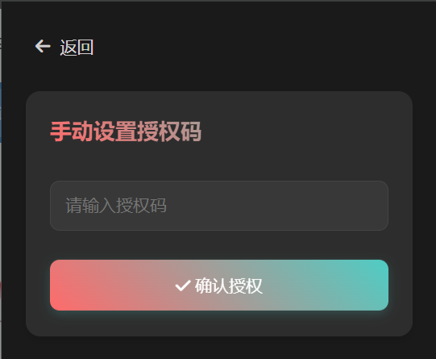

# Cursor + Coze 工作流打造网页内容提取插件 教程

## 1. 项目概述

> 💡 本教程将带你使用 Cursor AI 和 Coze 工作流开发一个网页内容提取Chrome插件，让我们一起探索AI辅助开发的魅力。

<div class="project-image">


_项目最终效果预览_

</div>

### 1.1 开发背景

作为经常阅读技术文章的开发者，我常常想找到一个**便捷的工具来提取和保存文章精华**。这促使我萌生了开发一个**浏览器插件**的想法。在 AI 的协助下，这个想法很快就变成了现实。

应众多小伙伴的请求，我决定分享这次完整的开发历程。

---

## 2. 技术栈介绍

### 2.1 Cursor：AI 驱动的智能编辑器

<div class="tech-image">


_Cursor编辑器界面展示_

</div>

> 🔧 Cursor是一款革新性的代码编辑器，保留了VS Code的熟悉界面，同时集成了强大的AI功能。它最大的特色是具备自然语言交互的composer功能。

### 2.2 Coze：可视化工作流平台

<div class="tech-image">


_Coze可视化工作流界面_

</div>

> 🔄 Coze工作流是一个强大的可视化工具，能够实现：
>
> - 复杂稳定的业务流程编排
> - 多种功能的灵活组合
> - 高稳定性的任务流处理

---

## 3. 功能需求分析

### 核心功能清单：

1. ✨ 网页链接提取
2. 📝 LLM网页内容总结
3. 🎯 输出三个关键变量：
   - 主角
   - 文章概括
   - 金句提取
4. 🖼️ 主角相关图片搜索
5. 📊 美观的图文总结卡片排版

---

## 4. 技术架构

> 🏗️ 采用前后端分离架构：
>
> - 后端：基于 Coze 工作流构建业务逻辑
> - 前端：Chrome 浏览器插件，提供轻量级交互界面

## 5. 工作流搭建

### 5.1 核心组件配置

<div class="workflow-image">


_工作流整体架构图_

</div>

#### 关键配置要点：

1. **大模型节点提示词**：
<div class="code-block">

\```plain text
prompt：您作为一位资深且专业的文章编辑，能够透彻理解我给出的文章{page}内涵，进而提供以下三部分内容: 1.文章所讲述的主人公 (比如"雷军") 2.精确概括文章的主旨要义3.精准找出文章主人公的精彩金句(如有)
\```

</div>

2. **输出节点markdown排版**：
<div class="code-block">

```markdown
👤主角：{{name}}

📷主角图片：

<!--  -->

{此处将显示主角图片}

📝文章内容：{{idea}}

💖金句：{{sentence}}
```

</div>

> ⚠️ 特别注意：输出图片变量使用 **contentUrl**

## 6. Chrome插件开发

### 6.1 Coze关键配置获取

<div class="steps-container">

#### 步骤1：获取授权令牌


_在个人设置中获取授权令牌_

#### 步骤2：获取工作流ID


_在工作流界面获取工作流ID_

</div>

## 7. 界面优化

<div class="ui-showcase">


_优化后的插件主界面_


_作者信息展示页面_


_核心功能展示_

</div>

---

## 8. 总结与展望

> 🎯 本教程介绍了主要开发流程，但在实际开发中你可能会遇到：
>
> - 图标样式优化
> - 错误处理
> - Cursor coding细节问题

### 项目源码

📦 代码仓库：[CozeSummarizer](https://github.com/Yeadon8888/CozeSummarizer)

<style>
.project-image img,
.tech-image img,
.workflow-image img,
.ui-showcase img {
    border-radius: 8px;
    box-shadow: 0 4px 8px rgba(0,0,0,0.1);
    margin: 20px 0;
    max-width: 100%;
}

.project-image,
.tech-image,
.workflow-image,
.ui-showcase {
    text-align: center;
    margin: 20px 0;
}

.code-block {
    background: #f6f8fa;
    padding: 16px;
    border-radius: 8px;
    margin: 16px 0;
}

.steps-container {
    background: #f8f9fa;
    padding: 20px;
    border-radius: 8px;
    margin: 20px 0;
}

blockquote {
    border-left: 4px solid #42b883;
    padding-left: 16px;
    margin: 16px 0;
    background: #f8f9fa;
    padding: 16px;
    border-radius: 0 8px 8px 0;
}
</style>
