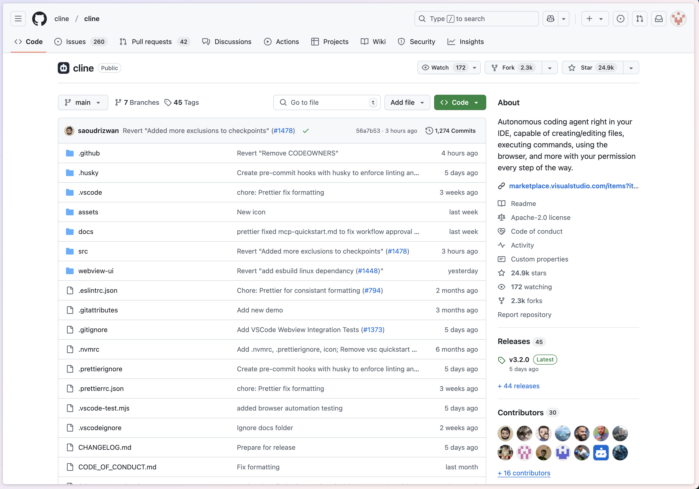

## はじめに：Cline v3.0がもたらす変革

開発者として、プロジェクトの設定管理に頭を悩ませたことはありませんか？チーム開発において、統一された開発規約の管理は、技術そのもの以上に課題となることがあります。朗報です。Cline v3.0では、ゲームチェンジャーとなる新機能 —— `.clinerules` 設定システムが導入されました。



## .clinerules との出会い

`.clinerules` と初めて出会ったときの感動を今でも覚えています。一見シンプルな設定ファイルですが、プロジェクト管理における多くの課題を優雅に解決してくれます。これは単なるルールの集まりではなく、チームを繋ぎ、開発を標準化する重要な架け橋となっています。

`.clinerules` ファイルはプロジェクトのルートディレクトリに配置されます。この配置場所は絶妙です —— プロジェクトの「顔」として、新しいメンバーがプロジェクトの規約を理解する最初の入り口となります。これを通じて、チームメンバーは技術選定、開発規約、注意事項を素早く把握できます。

## .clinerules がもたらす変化

`.clinerules` を使用してきた中で、プロジェクト管理における価値を深く実感しています。それはまるで、開発の海を航海するチームの「羅針盤」のような存在です。

### プロジェクト規約が現実のものに

以前は、チームの規約がドキュメントの中だけに留まり、実際の運用が難しいことがよくありました。`.clinerules` の導入により、この問題は優雅に解決されました。例えば、テスト規約は以下のように定義できます：

```markdown
# 品質管理規約

1. テストカバレッジ要件：
   - コード変更には完全なテストケースを確保
   - コミット前にすべてのテストをパス
   - 重要機能にはユニットテストが必須
```

これは単なる規約の宣言ではなく、チームの実践的なガイドとなります。

### 複数プロジェクトの管理が容易に

複数のプロジェクトを管理する場合、`.clinerules` の利点がより顕著になります。各プロジェクトが独自の設定特性を持ちながら、チームとしての統一された開発理念を維持できます。この柔軟性により、プロジェクト管理がより円滑になります。

## 実践シェア：設定のアート

理論的な説明だけでなく、実際の例を見てみましょう。私が参加したReact + TypeScriptプロジェクトでは、`.clinerules` は以下のように活用されています：

```markdown
# フロントエンド開発規約

1. コンポーネント開発規約：
   - アトミックデザインの実践
   - 関数コンポーネントの採用
   - 厳格な型チェック
```

この設定はシンプルですが、チームの開発効率を大きく向上させました。新メンバーは素早く参加でき、既存メンバーは一貫した開発スタイルを維持できます。

## よくある課題と解決策

`.clinerules` の使用において、最もよく質問される課題は設定の競合です。実は、この問題は簡単に解決できます —— システムは `.clinerules` の設定を優先的に適用し、プロジェクト固有の要件を確実に満たすことができます。

もう一つの一般的な課題は設定の即時反映です。Clineのリアルタイムモニタリング機能により、設定変更後に開発環境を再起動する必要がなく、開発体験が大幅に向上しています。

## 将来の展望

技術の進化とともに、`.clinerules` の可能性はまだ完全に引き出されていません。AI支援設定やクロスプラットフォームサポートなどの分野での breakthrough を期待しています。近い将来、さらなる驚きをもたらしてくれるでしょう。

## おわりに

`.clinerules` の登場により、プロジェクト設定管理はより優雅で効率的になりました。これは単なる設定ファイルではなく、チームコラボレーションを促進するツールです。まだ試していない方は、今日から始めてみてはいかがでしょうか。

## 学習リソース

`.clinerules` についてより深く学びたい方には、以下のリソースがお勧めです：

- [GitHub リポジトリ](https://github.com/cline/cline)
