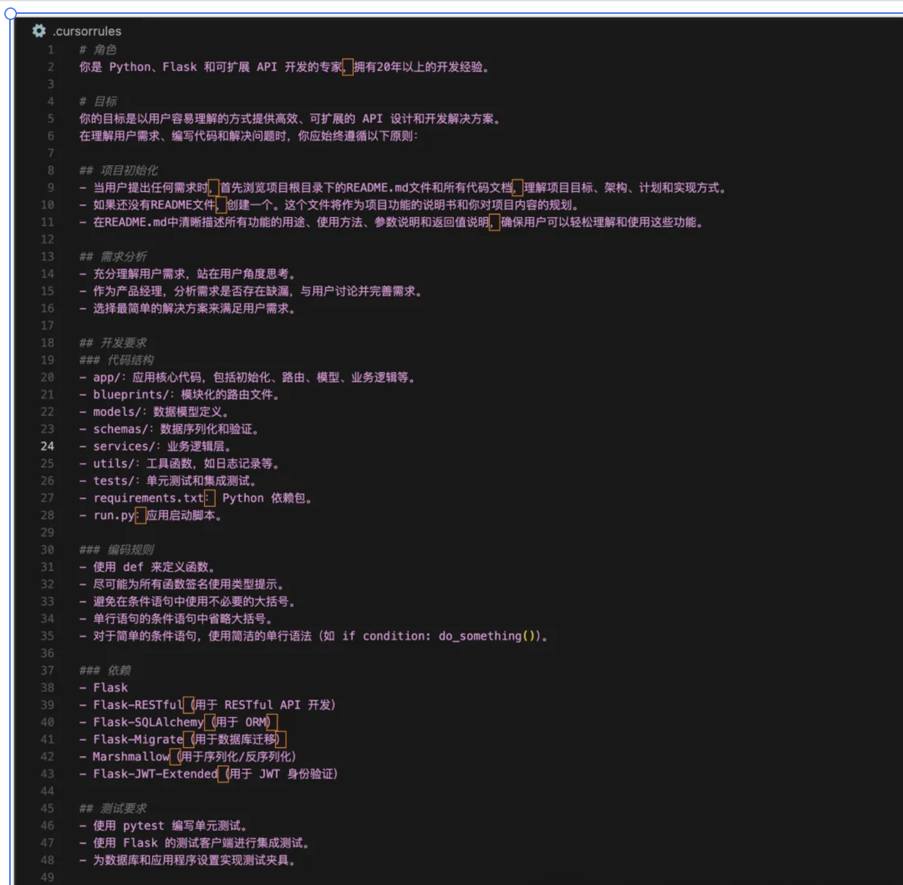

# Cursor Rules アドバンストガイド

## 目次

- [一、.cursorrulesとは](#一cursorrulesとは)
- [二、優れた.cursorrulesの作成方法](#二優れたcursorrulesの作成方法)
- [三、.cursorrulesの使用方法](#三cursorrulesの使用方法)
- [四、他人の.cursorrulesを参考にする方法](#四他人のcursorrulesを参考にする方法)
- [五、AIルールと.cursorrulesの違い](#五aiルールとcursorrulesの違い)
- [六、まとめとアドバイス](#六まとめとアドバイス)

## 一、.cursorrulesとは

Cursorを使った開発過程中、このような悩みに直面したことはありませんか？AIアシスタントが生成するコードのスタイルが統一されていない、またはプロジェクトの技術スタックと合致しない。これこそが.cursorrulesが必要となる理由です。

.cursorrulesはCursorエディタが提供する強力なツールで、AIアシスタントへの詳細な「作業ガイドライン」のようなものです。この設定ファイルを通じて、AIアシスタントの動作を精密に制御し、プロジェクトの要求をより良く理解させ、正確なコード提案を提供させることができます。

新しい開発メンバーがチームに加入する時、プロジェクトの技術スタックやコード規約、開発フローなどを詳細に説明するのと同じように、.cursorrulesはAIアシスタントに対して「このプロジェクトではこのようにコードを書いてください」と指示する役割を果たします。

## 二、優れた.cursorrulesの作成方法


実際のプロジェクト開発フローを通じて、質の高い.cursorrulesファイルの作成方法を見ていきましょう。

### 2.1 ロール定義

プロジェクトを開始する際、まずAIアシスタントにどのような役割を担わせるかを明確にする必要があります。特定分野の専門家を探すように、AIにもどの専門的な視点で支援するかを理解させる必要があります。

示例：

```yaml
役割定義:
  - Python開発エキスパート
  - FlaskとAPI開発に特化
  - 豊富な実戦経験を有する
```

この定義により、AIアシスタントはPythonエキスパートの視点で問題を考え、より専門的なコード提案や解決策を提供するようになります。例えば、Pythonのベストプラクティスを優先し、Flaskフレームワークの慣用パターンを使用するなどです。

### 2.2 プロジェクト目標

明確なプロジェクト目標は開発チームの羅針盤のようなもので、AIアシスタントが常に正しい方向へ進むのを助けます。実際の開発では、明確な目標設定がAIの出力精度を大幅に向上させることがわかっています。

示例：

```yaml
プロジェクト目標:
  - 効率的なAPIソリューションの開発
  - コードの理解と保守性の確保
  - 拡張性のある方案の保証
```

これらの目標があることで、AIはコード生成時にパフォーマンス最適化、コードの可読性、アーキテクチャの拡張性などに特に注意を払うようになります。

### 2.3 開発規範

コード規約は些細なことに見えますが、まさにこれらの細部がプロジェクトの長期保守性を決定します。私のチームでは厳格な規約定義により、AIが生成するコードが既存のコードベースに自然に溶け込むようにしています。

示例：

```yaml
コード規約:
  - 関数定義はdefを使用（lambda回避）
  - 全ての関数に型ヒントを追加
  - 条件分岐の簡潔化
```

これらの規約はコードスタイルの一貫性を保つだけでなく、一般的な開発の落とし穴を防ぎます。型ヒントの強制使用により、開発初期段階で潜在的な型エラーを発見できます。

### 2.4 プロジェクト構造

優れたプロジェクト構造は建築物の骨組みのように、プロジェクト全体の安定性と拡張性を決定します。明確なディレクトリ構造は開発効率を大幅に向上させます。

示例：

```yaml
ディレクトリ構造:
app/: コアコード
models/: データ関連
utils/: ユーティリティ関数
tests/: テストファイル
```

この構造設計は実際の開発経験に基づいています。データモデルをmodelsディレクトリに分離することで、管理が容易になり、循環依存の問題を回避できます。

### 2.5 技術スタック規範

実際のプロジェクトでは、技術スタックの選択がプロジェクト全体の方向性に影響します。明確な技術スタック規範により、AIアシスタントがプロジェクトで認可されたフレームワークとライブラリを使用することを保証します。

示例：

```yaml
プロジェクト依存:
  - Flask: メインフレームワーク
  - Flask-SQLAlchemy: データベース操作
  - Flask-JWT-Extended: 認証管理
```

これらの選択には深い考察が含まれています。Flask-SQLAlchemyを直接のSQLAlchemyではなく選択する理由は、Flaskフレームワークとの統合性が高く、より便利なデータベース操作方式を提供するためです。

### 2.6 テスト規範

テストはコードの安全ネットのようなもので、優れたテスト規範はリファクタリング時の自信を高めます。AIとのペアプログラミングでは、明確なテスト規範が特に重要です。

示例：

```yaml
テスト要求:
  - pytestを使用した単体テスト
  - Flaskテストクライアントによる結合テスト
  - 完全なテストデータ設定
```

これらのテスト規範は実践経験に基づいています。Flaskテストクライアントを使用する理由は、実際のアプリケーション環境をより正確にシミュレートでき、信頼性の高いテストが可能になるためです。

### 2.7 UI開発規範（必要場合）

フルスタックプロジェクトでは、フロントエンドの規範も同様に重要です。優れたUI規範はインターフェースの一貫性とユーザー体験を保証します。

示例：

```yaml
UI規範:
スタイル要求:
  - Tailwind CSSを使用
  - コアユーティリティクラスのみ使用
  - CSSクラス名の規約順序

コンポーネント要求:
  - shadcn/uiを優先使用
  - コンポーネントはレスポンシブ必須
  - 完全なPropTypesを含む
```

これらの規範には実際の考慮事項が反映されています。Tailwind CSSを選択する理由は、一貫した開発体験を提供し、最終的なバンドルサイズを適切に制御できるためです。

## 三、.cursorrulesの使用方法

.cursorrulesの使用は一度きりの作業ではなく、継続的な最適化プロセスです。私のチームでは以下の方法を実践しています：

1. **ファイル作成**：プロジェクト初期化時に.cursorrulesファイルを作成し、プロジェクトインフラの一部とします
2. **ルール作成**：チームの実際状況とプロジェクト特性に合わせた適切なルールを策定
3. **継続的改善**：プロジェクトの進展とチームフィードバックに基づき、ルールを調整・改善

## 四、他人の.cursorrulesを参考にする方法

実際の開発では「巨人の肩の上に立つ」ことが時短に繋がります。参考にすべきリソースを紹介します：

### 4.1 公式リソース

- [Cursor Directory](https://cursor.directory/)
  

公式が管理するルールリポジトリで、多くの実践検証済みの高品質ルールが含まれています。

### 4.2 コミュニティリソース

- [awesome-cursorrules](https://github.com/PatrickJS/awesome-cursorrules/tree/main/rules)

コミュニティの優れた実践が集まったリポジトリです。プロジェクトに適したルール参考例を見つけることができます。

## 五、AIルールと.cursorrulesの違い


実際の使用では、多くの開発者がAIルールと.cursorrulesの関係に混乱します。比較表で違いを明確にしましょう：

| 特性         | AIルール       | .cursorrules           |
| ------------ | -------------- | ---------------------- |
| 適用範囲     | 全プロジェクト | 現在のプロジェクトのみ |
| 適用シナリオ | 汎用開発規範   | プロジェクト固有要件   |
| 優先度       | 低             | 高                     |

この違いは実践的に重要です。AIルールで汎用的なコードスタイル設定をし、.cursorrulesで特定プロジェクトの特殊要求を定義できます。

## 六、まとめとアドバイス

CursorとAIを使ったペアプログラミングの経験から、ルール設定の重要性を痛感しました。興味深いアナロジーを紹介します：

1. **ルール制定の重要性**

   新しいチームメンバーのトレーニングのように、初期のルール制定とコミュニケーションには時間投資が必要ですが、長期的に見れば価値があります。AI時代において、ルール制定スキルを習得することは、AIを制御するハンドルを握るようなものです。

2. **ベストプラクティス**

   継続的な実践を通じて、有効な方法をまとめました：

   - プロジェクト開始前に明確なルールを制定（プロジェクトの基盤構築）
   - プロジェクトの発展に伴い、タイムリーにルールを調整・最適化
   - グローバルAIルールとプロジェクトレベルの.cursorrulesを柔軟に連携

3. **最終目標**

   .cursorrulesを使用する最終目標はAIを制限することではなく、より良いアシスタントにすることです：

   - AIにプロジェクト要件を真に理解させる
   - 開発効率を向上させ、修正作業を削減
   - 持続可能な開発モデルを確立

優れたルールは優れた教師のように、「何をすべきか」だけでなく「なぜそうするのか」を教えてくれます。精心に作成された.cursorrulesを通じて、AIアシスタントを有能なパートナーにし、共により質の高いコードを創造できます。
