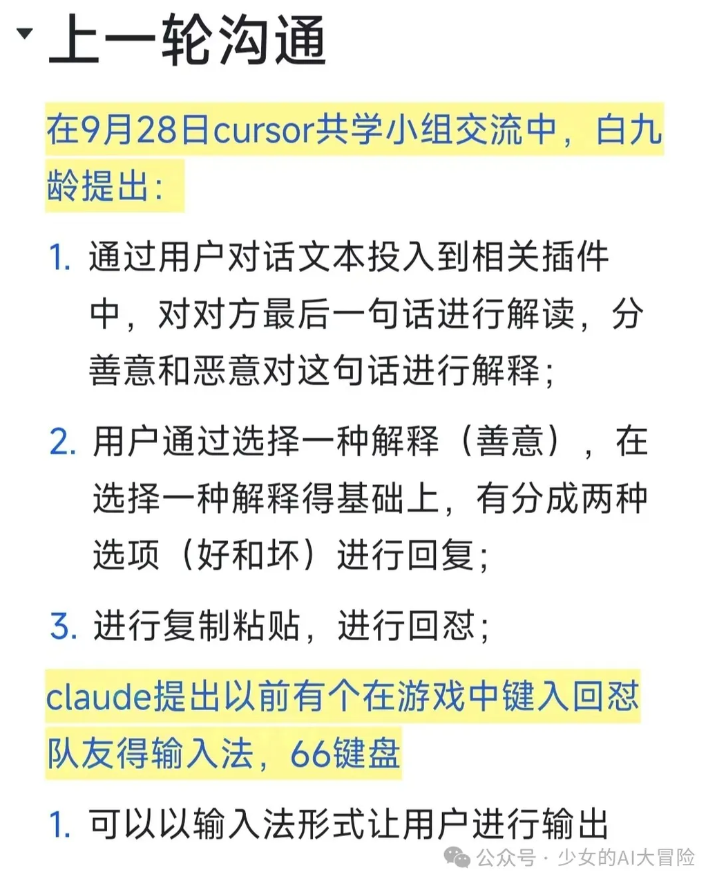
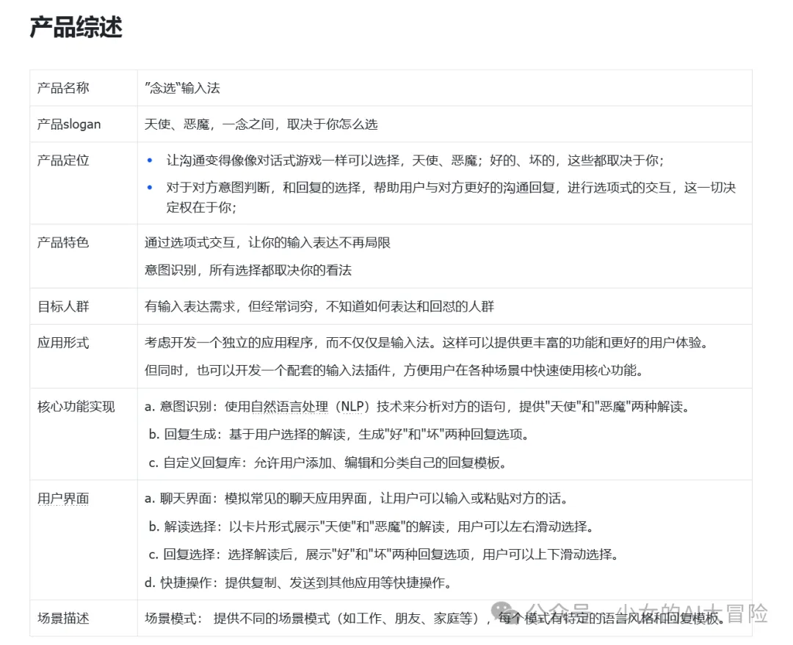
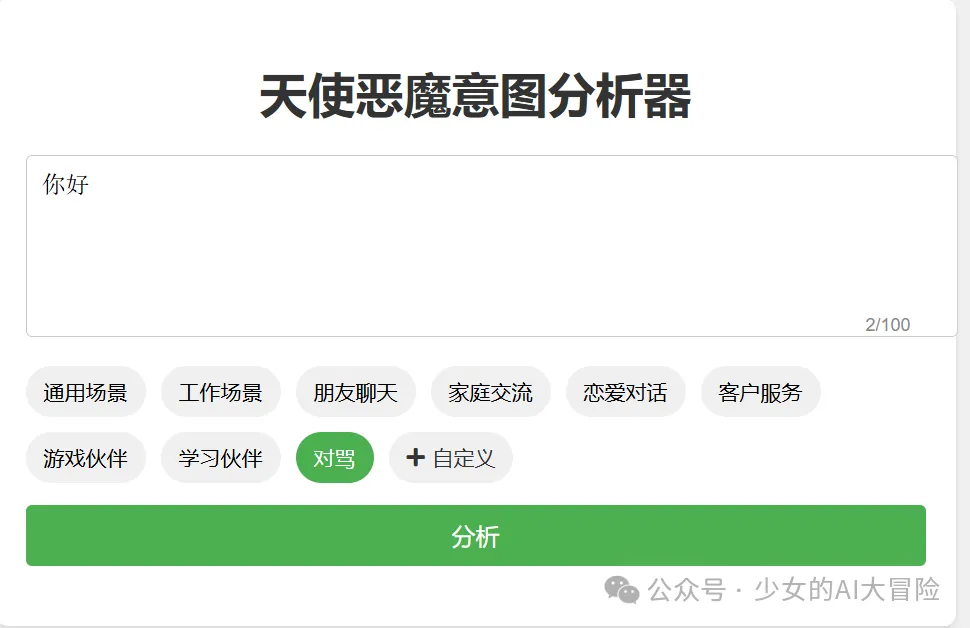
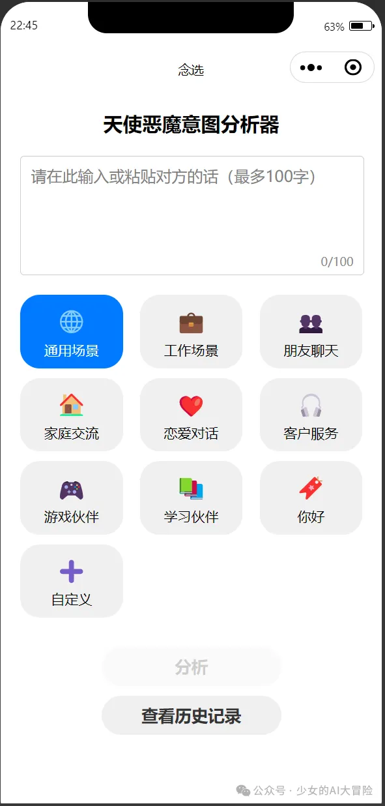

# Cursorと微信ミニプログラム開発の冒険記録

> **開発者ノート**：この記事はプログラミング初心者がCursorとChatGPTを活用し、微信ミニプログラムを開発する過程で遭遇した困難と学びを記録したものです。開発期間1ヶ月半、総コスト約200元（主にクラウドサービスとAI API費用）

## きっかけ

2023年9月下旬、知乎で知り合ったコミュニティリーダー「claude」が主催するCursor共学プロジェクトに参加しました。当時話題になっていたCursorを学び、独立開発者として自分のアイデアを製品化できるようになりたいと考えたからです。

::: tip プロダクトアイデア
議論の中で閃いたのが「天使と悪魔の対話分析」機能。相手の発言をAIが善悪両面から分析し、適切な返答を提案するコミュニケーション支援ツールの構想です。
:::

_コンセプト：天使と悪魔の対話分析_

---

## 開発の軌跡

### 第一歩でつまずく？

構想をPRD（製品要求仕様書）にまとめ、最初は入力法アプリとして開発を考えました。しかし調査の結果、アプリ開発の工数が想定以上であることが判明。プログラミング初心者には荷が重いと判断し、ブラウザ拡張機能として再設計しました。

::: warning 初心者の教訓
開発環境構築で早くも壁に直面：

- ターミナルの操作方法がわからない
- 環境構築の基本を理解していない
- ネットワーク問題による依存関係のインストール失敗
- 曖昧な要件定義
  :::

_開発環境：初期設定画面_

B站（Bilibili）のチュートリアルを忠実に再現することでようやく環境構築に成功。ここで学んだのは「焦らずに要件を明確化し、Cursorと丁寧にコミュニケーションを取ること」の重要性でした。また、Cursorの有料機能を購入後に無料版で十分だったと気づき、少し後悔...（内心OS: またやらかした）

### 本当の困難はここから

::: warning 遭遇した問題

- Cursorの生成精度が使用回数と共に低下
- 有料版の価値が見えず
- コードが複雑化して制御不能
- 画面表示エラー多発
  :::

「Save All」や「Accept ALL」の基本操作を知っていても、Cursorの生成品質が不安定になる問題に悩まされました。特に以下の要因が影響していると推測：

1. ネットワーク接続の不安定さ
2. 使用回数制限によるモデル切り替え
3. 複数画面遷移時の制御ロジックの矛盾

コードの可読性低下とエラー頻発により、デバッグが困難に。この経験から、以下の改善策を実施：

::: tip 解決策

1. 開発ドキュメント体系の整備：
   - 要件定義書
   - 機能設計書（UI/技術仕様/テストケース）
   - コード変更記録書
2. モジュール単位の開発とテスト
3. 大規模な設計変更の禁止
   :::

_画面プレビュー：初期デザイン_

### ミニプログラムへの転換

::: danger 技術的課題
プラグインから微信ミニプログラムへの移行で発生した問題：

1. API呼び出し制限
2. バックエンドサーバー構築の難易度
3. データベース設定の複雑さ
4. ユーザー認証実装の壁
   :::

阿里雲（Alibaba Cloud）サーバーでのデプロイ試行も、認証問題やプラットフォーム間の互換性問題で頓挫。最終的にはバックエンドエンジニアとの協業で解決：

_プロジェクト計画：要件定義書例_

### フロントエンド開発の苦闘

Cursorが生成する初期コードは機能本位の簡素なUI。天使と悪魔の対比を表現するため、AI生成画像を背景に追加しようと試みましたが...（結果は以下の画像参照）

_UIの変遷：機能性からデザイン性への挑戦_

---

## 学びと気づき

1. **段階的な開発の重要性**：MVP（Minimum Viable Product）から始める
2. **ドキュメンテーションの価値**：変更履歴とテストケースの管理
3. **技術選定の慎重さ**：モバイルシーンに適したプラットフォーム選択
4. **協業の効用**：専門分野の分担による開発効率向上

_機能展示：意図分析ページ_

このプロダクトで最も重要なのはポスター生成機能です。特に意図分析のテキストが長すぎる場合、文字表示と行数の制限が必要で、最も重要なのはミニプログラムコードを追加してユーザーが共有しやすくすることでした。レイアウト調整とビジュアル表現に関しては、大規模言語モデルはあまり理解できませんでした。また、要件のちょっとした見落としで意図分析ページが消えてしまうことも...（泣）

_機能展示：ポスター生成効果_

最初はClaudeがSVGで生成したスタイルを参考にしていましたが、なかなかうまく生成できませんでした。特に大規模モデルが絵文字を理解できないことが問題でした。

元々返信生成ページもありましたが、開発難易度とトークンコスト、特に先輩に深夜リモートでポートやデータベースのバグを直してもらう手間を考慮して断念しました。モデルのトークン費用も問題で、収益化も困難でした。テストだけで20元も使ってしまい...（泣）

## **教訓**

だらだらと1ヶ月以上かけて開発完了かと思ったら、先輩のテストで「ページスタイルが保存できない」と指摘され、さらにポスター保存機能を実装する必要が... Cursorに揉まれ続けた1ヶ月、もう開きたくないほどでした。先輩がこのプロジェクトを見かねて助けてくれました。本当に感謝しています♥

これで終わりかと思いきや、ミニプログラムの個人認証審査と登録、クラウドサーバードメインの購入、ドメイン登録（バックエンドサーバー転送用）にさらに半月かかりましたが、【経験値+1】を得ました。

**開発で役立った重要なソフトウェア**

**GitHub:** 言わずと知れたプラットフォーム。このプロジェクトでGitHubの使い方とオープンソースプロジェクトの探し方を学びました。

**Apifox:** ポート検証とAPIの有効性チェックに便利なツール。

**DBeaver:** データベース管理用（詳細は理解できず）

**Docker Desktop:** プロジェクトのインストールに使用。重要性は前回記事参照

**微信開発者ツール:** ミニプログラム開発に必須

**最も重要な大規模モデルAPI:**

最初は智譜AIを使用していました（国庆節キャンペーンで多くのトークンを提供）。しかし11月1日にリソースパックに有効期限があることを知り、間違ったモデルを接続していたため多額の費用がかかってしまいました。サポートに問い合わせて、9.9元のリソースパックがお得だと知りました。期限切れに注意しないと通常料金で高額請求されます。

幸い、バックエンドエンジニアがモデルインターフェースを調査中に、智譜AIに無料モデルがあることを発見。サポートに確認すると、「インターフェース呼び出し時にこのモデルコードを指定すれば無料」とのこと。知識ベースを使った推論やベクトル検索は有料ですが、プロンプトのヒント表示には十分です。効果は完璧ではありませんが、使えるだけで満足です（もう諦めました～）。

_技術設定：APIインターフェース設定_

## **経験まとめ**

::: tip 開発ツール推薦

1. **GitHub**

   - コードバージョン管理
   - オープンソースプロジェクト参考
   - チームコラボレーション必須

2. **Apifox**

   - APIインターフェーステスト
   - インターフェースドキュメント管理
   - チームコラボレーション効率化

3. **DBeaver**

   - データベース管理ツール
   - 多種データベース対応
   - 可視化操作インターフェース

4. **Docker Desktop**

   - コンテナ化デプロイ
   - 環境一貫性保証
   - 迅速な起動とデバッグ

5. **微信開発者ツール**
   - ミニプログラム開発必須
   - 強力なデバッグ機能
   - 良好な開発体験
     :::

::: warning API使用経験

1. **適切なモデル選択**

   - 要件に合ったAPI選択
   - 費用計算方式の注意
   - 使用制限の確認

2. **コスト管理**

   - 無料リソースパック活用
   - 呼び出し頻度の適正設定
   - 使用状況の監視

3. **最適化提案**
   - 常用結果のキャッシュ
   - リクエストの一括処理
   - エラー再試行メカニズム
     :::

### コア経験

1. **事前要件分析**

   - 詳細な要件ドキュメント
   - 明確な技術ソリューション
   - 現実的な開発計画

2. **モジュール化開発**

   - 機能モジュール分割
   - 独立テスト検証
   - ドキュメント同期更新

3. **コード管理**

   - バージョン管理
   - コメント規約
   - コードレビュー

4. **問題処理**
   - 即時問題記録
   - 原因分析
   - 経験まとめ

::: tip 最後に
開発の道は厳しいですが、毎回の挑戦が貴重な経験になります。この記事が他の学習者の方々の役に立ち、回り道を減らせれば幸いです。
:::

---

関連タグ: #AI開発 #微信ミニプログラム #Cursor #初心者向け #開発体験記 #API管理 #GitHub #Docker
