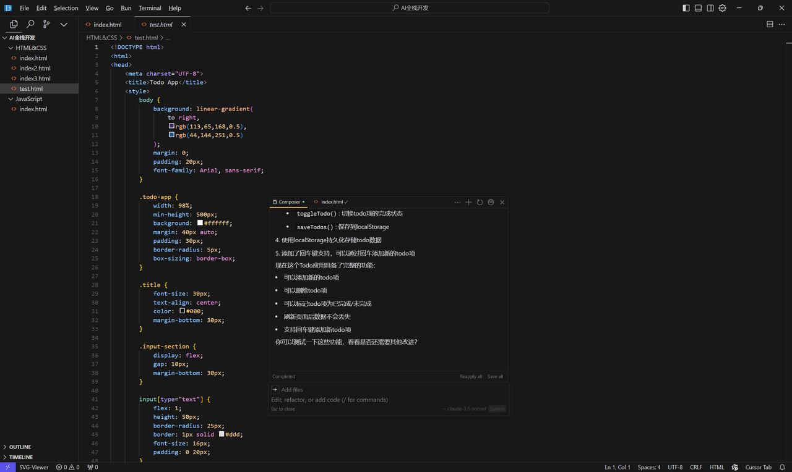
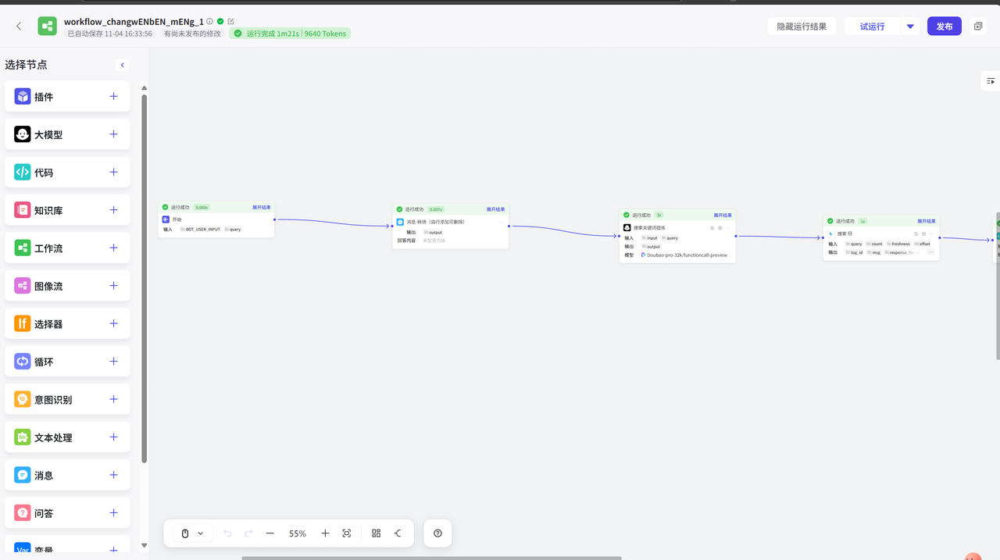
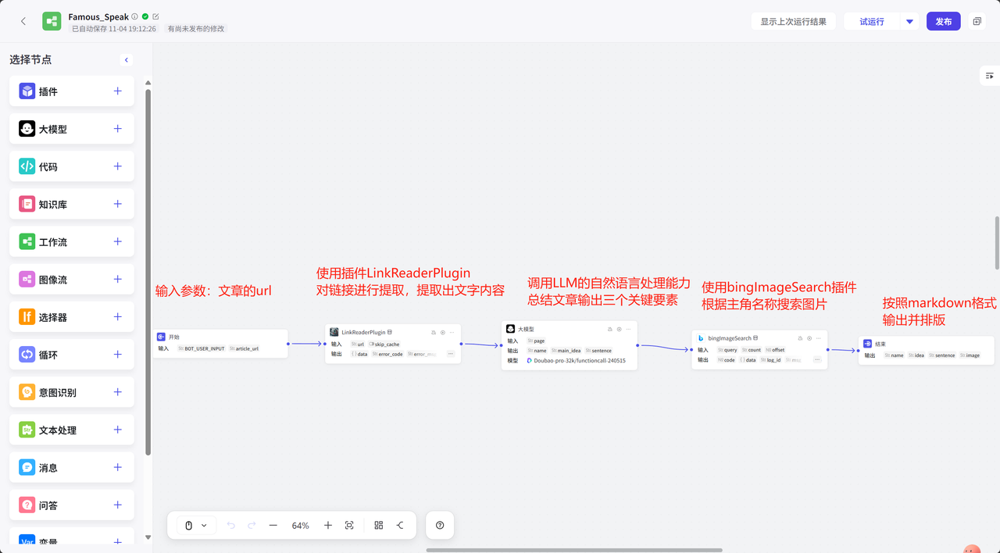
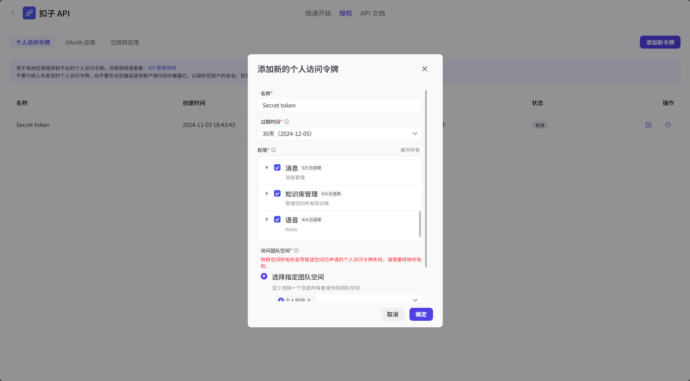
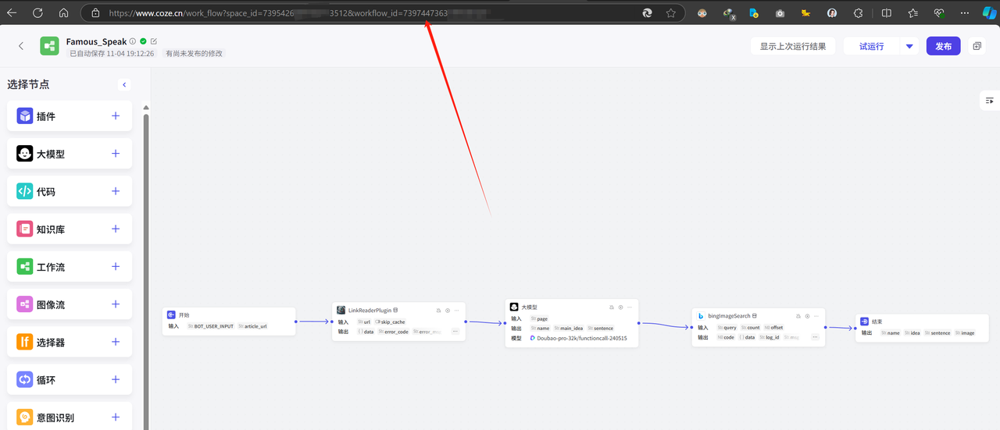
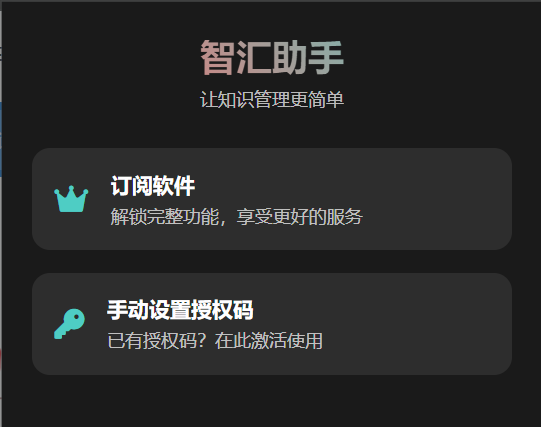
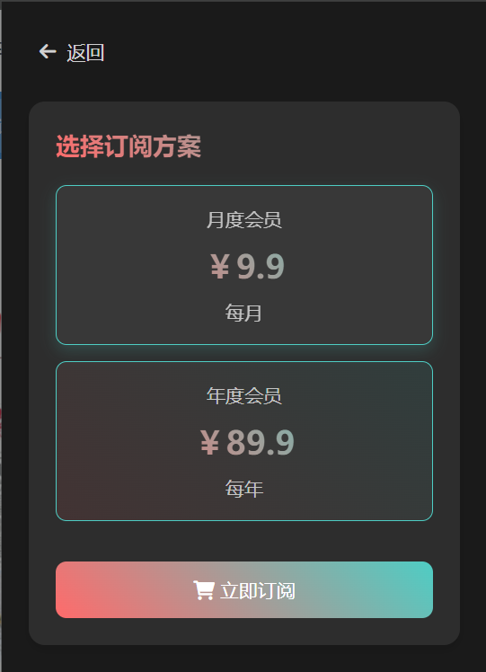
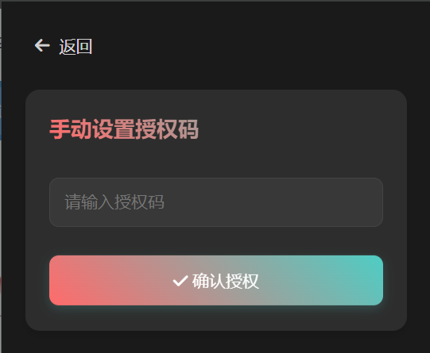

# Cursor + Coze ワークフローで構築するウェブコンテンツ抽出プラグイン チュートリアル

## 1. プロジェクト概要

> 💡 本チュートリアルではCursor AIとCozeワークフローを使用して、ウェブコンテンツ抽出Chrome拡張機能を開発する方法を解説します。AIを活用した開発の魅力を一緒に探求しましょう。

<div class="project-image">


_プロジェクト完成イメージ_

</div>

### 1.1 開発背景

技術記事を頻繁に読む開発者として、**記事の要点を抽出・保存する便利なツール**を常に探していました。このニーズから**ブラウザ拡張機能**の開発を思いつきました。AIの助力により、このアイデアはすぐに現実のものとなりました。

多くの方々からの要望を受け、今回の開発プロセス全体を共有することにしました。

---

## 2. 技術スタック紹介

### 2.1 Cursor：AI駆動のスマートエディタ

<div class="tech-image">


_Cursorエディタインターフェース_

</div>

> 🔧 Cursorは革新的なコードエディタで、VS Codeの親しみやすいインターフェースを保持しつつ、強力なAI機能を統合しています。最大の特徴は自然言語による対話が可能なcomposer機能です。

### 2.2 Coze：ビジュアルワークフロープラットフォーム

<div class="tech-image">


_Cozeビジュアルワークフローインターフェース_

</div>

> 🔄 Cozeワークフローは強力なビジュアルツールで、以下の実現が可能：
>
> - 複雑で安定した業務プロセスの編成
> - 多機能の柔軟な組み合わせ
> - 高安定性のタスク処理

---

## 3. 機能要件分析

### コア機能リスト：

1. ✨ ウェブリンク抽出
2. 📝 LLMによるコンテンツ要約
3. 🎯 3つの主要変数の出力：
   - 主役
   - 記事概要
   - 名言抽出
4. 🖼️ 主役関連画像検索
5. 📊 美しい図文要約カードのレイアウト

---

## 4. 技術アーキテクチャ

> 🏗️ フロントエンド・バックエンド分離アーキテクチャを採用：
>
> - バックエンド：Cozeワークフロー基盤のビジネスロジック
> - フロントエンド：Chromeブラウザ拡張機能（軽量インターフェース）

## 5. ワークフロー構築

### 5.1 コアコンポーネント設定

<div class="workflow-image">


_ワークフロー全体アーキテクチャ_

</div>

#### 主要設定ポイント：

1. **大規模言語モデルノードのプロンプト**：
<div class="code-block">

\```plain text
prompt：プロの記事編集者として、提供された記事{page}の内容を深く理解し、以下の3点を提供してください：

1. 記事の主役（例：「雷軍」）
2. 記事の主旨の正確な要約
3. 主役の名言（存在する場合）
   \```

</div>

2. **出力ノードのMarkdownレイアウト**：
<div class="code-block">

```markdown
👤 主役：{{name}}

📷 主役画像：

<!--  -->

{ここに主役画像が表示されます}

📝 記事内容：{{idea}}

💖 名言：{{sentence}}
```

</div>

> ⚠️ 重要注意：画像変数には**contentUrl**を使用

## 6. Chrome拡張機能開発

### 6.1 Coze主要設定取得

<div class="steps-container">

#### ステップ1：認証トークンの取得


_個人設定から認証トークンを取得_

#### ステップ2：ワークフローIDの取得


_ワークフロー画面からIDを取得_

</div>

## 7. インターフェース最適化

<div class="ui-showcase">


_最適化後のプラグインメインインターフェース_


_作者情報表示ページ_


_主要機能表示_

</div>

---

## 8. まとめと展望

> 🎯 本チュートリアルでは主な開発プロセスを紹介しましたが、実際の開発では以下のような問題に直面する可能性があります：
>
> - アイコンスタイルの最適化
> - エラー処理
> - Cursor codingの詳細な問題

### プロジェクトソースコード

📦 コードリポジトリ：[CozeSummarizer](https://github.com/Yeadon8888/CozeSummarizer)

<style>
.project-image img,
.tech-image img,
.workflow-image img,
.ui-showcase img {
    border-radius: 8px;
    box-shadow: 0 4px 8px rgba(0,0,0,0.1);
    margin: 20px 0;
    max-width: 100%;
}

.project-image,
.tech-image,
.workflow-image,
.ui-showcase {
    text-align: center;
    margin: 20px 0;
}

.code-block {
    background: #f6f8fa;
    padding: 16px;
    border-radius: 8px;
    margin: 16px 0;
}

.steps-container {
    background: #f8f9fa;
    padding: 20px;
    border-radius: 8px;
    margin: 20px 0;
}

blockquote {
    border-left: 4px solid #42b883;
    padding-left: 16px;
    margin: 16px 0;
    background: #f8f9fa;
    padding: 16px;
    border-radius: 0 8px 8px 0;
}
</style>
