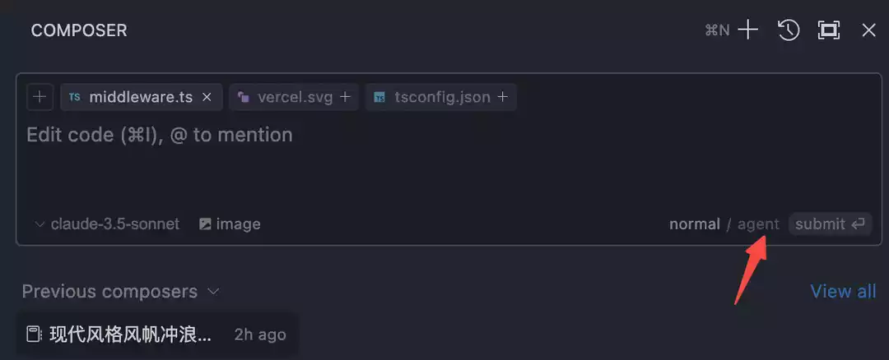
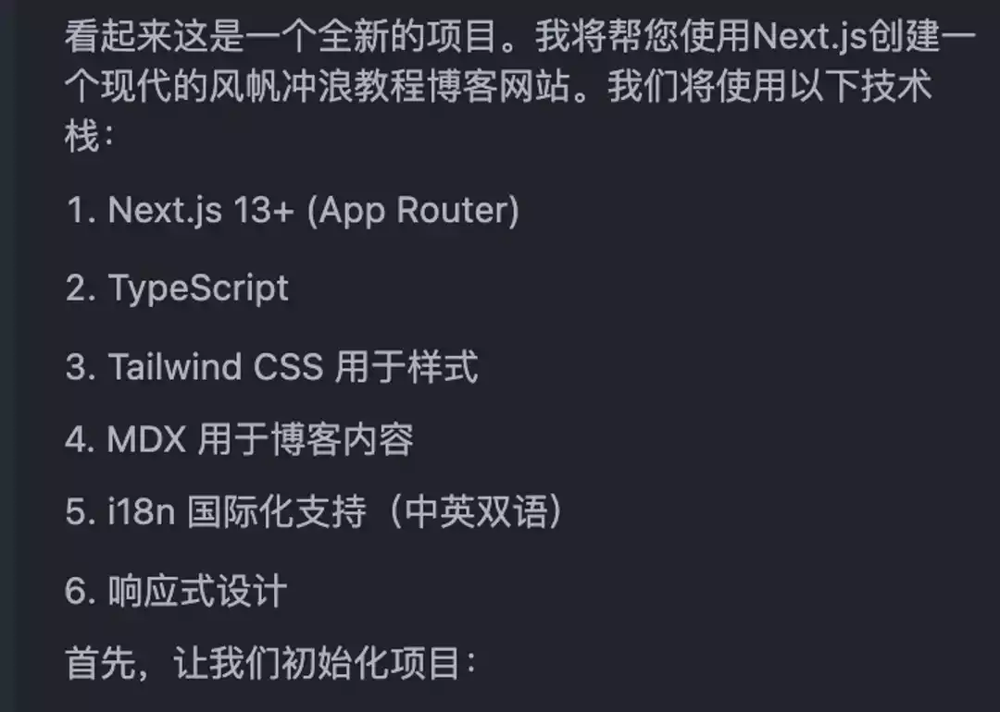
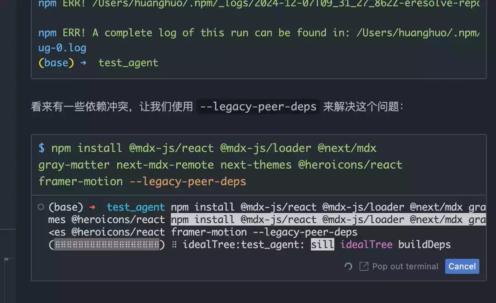

# Agentインテリジェントアシスタント


Cursor Agentは革新的なAIエージェントシステムで、単なるコードアシスタントではなく、実際のプログラマーのように思考し作業するインテリジェントパートナーです。複雑なプログラミングタスクを自律的に完了し、プロジェクトのコンテキストを理解し、継続的な開発サポートを提供できます。

## Agentとは？

Agent（インテリジェントエージェント）はCursor 4.3バージョンで導入された重要な更新機能です。従来のコード補完や単純な質疑応答とは異なり、Agentは「思考する」プログラミングアシスタントと言えます。主な特徴は：

- **自発性**：要求を自発的に理解し、解決策を計画し、問題を解決する能力
- **実行力**：複雑なタスクシーケンスを自律的に完了する能力



## コア機能

### 1. インテリジェントコンテキスト理解

- **自動コンテキスト収集**：プロジェクト構造と関連コードを自動分析
- **要求理解**：開発意図と目標を正確に把握
- **依存関係分析**：プロジェクト依存関係と技術スタックを識別

### 2. 自発的問題解決

- **エラー診断**：エラーの自動分析と修正
- **パフォーマンス最適化**：ボトルネックの識別と解決
- **コードリファクタリング**：コード改善提案

### 3. マルチタスク連携

- **並列処理**：複数の関連タスクを同時処理
- **状態管理**：タスク実行状態の維持
- **リソース調整**：リソース使用の最適化

## レイアウトとインターフェース

### 新レイアウト変更点


- **Composer位置**：画面中央から右側に移動
- **Chat統合**：Chatと右側タブバーを共有
- **クイック切り替え**：cmd+Lとcmd+Iで機能切り替え

### Agentモードの有効化


1. Composerを開く（cmd+I）
2. AgentアイコンをクリックしてAgentモードに切り替え
3. 拡張機能の使用開始

## 実践的ユースケース

### 1. プロジェクト初期化

```typescript
// Agentは完全なプロジェクトフレームワーク構築を支援
interface ProjectSetup {
  name: string
  template: 'next' | 'vite' | 'express'
  features: string[]
  dependencies: Record<string, string>
}

// 例：Next.jsプロジェクト初期化
const setup: ProjectSetup = {
  name: 'my-next-app',
  template: 'next',
  features: ['typescript', 'auth', 'database'],
  dependencies: {
    'next': 'latest',
    '@prisma/client': '^5.0.0'
  }
}
```

### 2. 機能開発


Agentの動作：

1. 要求分析とタスク分割
2. 実装手順計画
3. コアコード作成
4. テストケース追加
5. コード品質最適化

### 3. 問題診断と修正

```typescript
// Agentの自動診断と修正
interface DiagnosticResult {
  type: 'error' | 'warning' | 'info'
  location: CodeLocation
  message: string
  suggestion?: string
  autoFix?: () => Promise<void>
}

async function diagnoseAndFix(
  issue: string
): Promise<DiagnosticResult[]> {
  // 1. 問題分析
  const diagnosis = await analyzeProblem(issue)

  // 2. 修正案生成
  const fixes = await generateFixes(diagnosis)

  // 3. 修正適用
  await applyFixes(fixes)

  return diagnosis
}
```

## ワークフロー

### 1. 要求分析



- ユーザー要求の理解
- 技術的制約の特定
- 実装パスの計画

### 2. コード生成と最適化

Agent生成コードのベストプラクティス：

- タイプセーフ
- エラーハンドリング
- パフォーマンス最適化
- 保守性

### 3. テストとデプロイ

- 自動テストケース生成
- テストスイート実行
- デプロイ提案

## ベストプラクティス

### 1. 効果的なコミュニケーション

最適な結果を得るために：

- 明確な要求説明を提供
- 具体的な制約条件を指定
- タイムリーなフィードバック提供

### 2. 漸進的開発

1. 小規模タスクから開始
2. 複雑性を段階的に増加
3. 継続的検証と最適化

### 3. コードレビュー

Agentの可能な支援：

- コード品質チェック
- 潜在的問題発見
- 改善提案

## 使用テクニック

### 1. コマンド実行



- AgentはComposer内で自動的にコマンド実行
- ユーザー確認後実行
- バックグラウンド実行対応

### 2. マルチタスク処理

- ターミナルコマンドと対話の並行処理
- タスク状態のリアルタイム更新
- リソース自動調整

### 3. 問題解決

問題発生時、Agentは：

1. 自発的原因分析
2. 解決策提供
3. 修正効果検証

## 注意事項

::: tip ヒント

- 詳細なコンテキスト情報提供
- 生成コードの検証
- Agentとの継続的インタラクション維持
  :::

::: warning 注意点

- 重要な決定は手動確認が必要
- 重要データの定期的バックアップ
- コードセキュリティへの注意
  :::

## よくある質問

### 1. Agentモードが有効にならない場合

- Cursorバージョンが最新か確認
- Agentモードが正しく有効化されているか確認
- ネットワーク接続状態を確認

### 2. コード生成品質

- より多くのコンテキスト情報提供
- 明確な制約条件指定
- タイムリーなフィードバックと修正

### 3. パフォーマンス問題

- タスク規模の最適化
- 適切な並行処理数の設定
- バックグラウンド実行の適切な使用

## 将来の展望

Agent技術は急速に進化中：

- 強化された理解能力
- よりインテリジェントな意思決定
- 自然なインタラクション
- 幅広い応用

継続的な学習と適応により、Agentは開発者にとってより強力なアシスタントとなり、開発タスクの効率的な完了を支援します。
