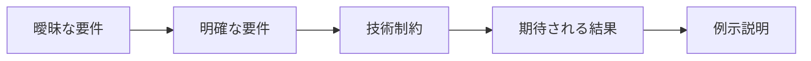
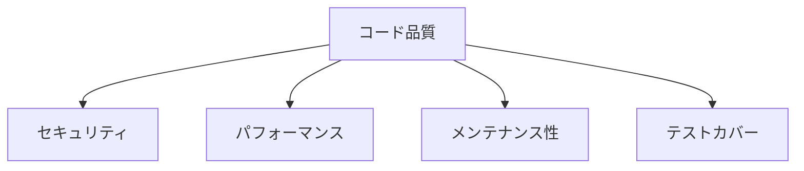
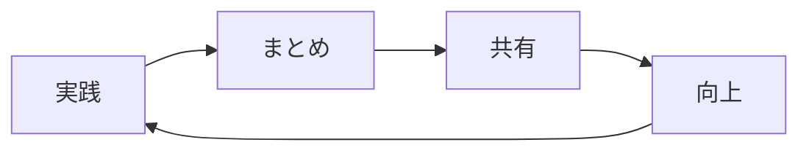

<style>
.custom-block {
  margin: 2rem 0;
}

.custom-block + .custom-block {
  margin-top: 1.5rem;
}
</style>

# AIプログラミングの心構え

AIプログラミングを始める前に、その特性を理解することが重要です：

::: warning 🎲 ランダム性について
大規模言語モデルは次に適切な単語を予測するように動作するため、同じ質問でも異なる解決策が得られる場合があります。これは欠陥ではなく特性です。より安定した結果を得るには、特定の技術スタックやフレームワークを指定するなど、明確な要件を提供することが効果的です。
:::

::: info 📊 普遍性について
AIは膨大なインターネットデータから学習しているため、一般的な解決策を提供する傾向があります。特殊な実装方法が必要な場合は、特定の設計基準やコーディング規約を明示的に伝えることで、期待に沿ったコード生成を促すことができます。
:::

::: tip 📝 コンテキスト制限について
現在のAIモデルは約20万語程度のコンテキストウィンドウ制限があります。大規模プロジェクトを扱う際は、プロジェクト構造とファイル分割を適切に計画してください。README.mdへの記録や@codebaseの活用などで、必要なコンテキスト情報を効果的に提供しましょう。
:::

::: details 🤔 思考パターンについて
AIは表面的な要求を直接満たそうとしますが、深層的なシステム設計の考慮が不足する場合があります。複雑な問題に直面した際は、まず問題分析をAIに依頼し、包括的な思考を促すことでより良い結果を得られます。
:::

AI時代において、新しいプログラミングの思考パターンを確立する必要があります。AIは代替手段ではなく、強力なアシスタントであり協働パートナーです。本ガイドは、AIを活用してプログラミング効率と品質を向上させるための適切な心構えを確立する手助けをします。

## 基本原則

### 1. AIをプログラミングパートナーとして扱う 🤝

AIを経験豊富な同僚のように考えましょう。アドバイスや参考情報を提供しますが、最終決定権は常にあなたにあります。レストランでの注文のように、ウェイターは今日のおすすめを提案しますが、何を食べるか決めるのはあなた自身です。

プログラミング時には：

- AIの意見を積極的に求めるが盲従しない
- 提案された解決策の適切性を常に検討
- 優れた解決策を保存し、独自の「ナレッジベース」を構築

### 2. プロジェクトの舵取り役として ⛵

あなたがプロジェクトの船長であり、AIは航海士です。技術スタックの選択、コード品質基準の設定など、重要な決定は常にあなたが行う必要があります。

カーナビゲーションを使用する運転のように：

- 目的地はあなたが決定
- ナビの提案する渋滞ルートを必要に応じて回避
- 安全確認は常に自分で行う

### 3. 学習意欲を維持する 📚

プログラマーの成長はゲームのレベルアップに似ています。AIはクリアを早めますが、スキルポイントは自分で獲得する必要があります：

- 新機能の実装方法を理解する
- 優れたコードの設計理由を考察する
- 「なぜ」「より良い方法はないか」と常に自問する

AIは脳を代替するものではなく、脳を強化するツールです。フィットネストレーナーのように正しい動きを指導しますが、鍛えるのはあなた自身の筋肉です。

## 作業方法

### 1. タスク分解

::: tip 🎯 全体視点から始める
コーディング前にプロジェクトの全体像を理解しましょう。絵画の下書きのように、技術アーキテクチャと実装パスを事前に計画することで、後工程の手戻りを防ぎます。
:::

::: info 🚶 段階的実装戦略
大きなタスクを小さな単位に分割し、一度に一つの問題に集中して解決します。小さなステップを積み重ねてプロジェクトを構築しましょう。
:::

::: tip 🔄 継続的改善マインド
基本的なフレームワークから構築を始め（家の基礎工事のように）、機能を段階的に追加しながらコード品質を向上させ、プロジェクトを進化させ続けます。
:::

### 2. AIとの協働

1. **明確なコミュニケーション**

```typescript
// 良いプロンプト例
"ユーザー認証処理用のTypeScript関数を作成：
1. 入力検証
2. パスワード暗号化
3. トークン生成
4. エラーハンドリングを含む"

// 悪いプロンプト例
"ログイン機能を作って"
```

2. **段階的開発**

```typescript
// ステップ1：基本構造
async function authenticateUser(credentials: Credentials) {
  // 基本検証ロジック
}

// ステップ2：詳細実装追加
async function authenticateUser(credentials: Credentials) {
  // 1. 入力検証
  validateCredentials(credentials)

  // 2. ユーザー検索
  const user = await findUser(credentials.email)

  // 3. パスワード検証
  await verifyPassword(credentials.password, user.password)

  // 4. トークン生成
  return generateToken(user)
}

// ステップ3：エラーハンドリング追加
async function authenticateUser(credentials: Credentials) {
  try {
    validateCredentials(credentials)
    const user = await findUser(credentials.email)
    await verifyPassword(credentials.password, user.password)
    return generateToken(user)
  }
  catch (error) {
    handleAuthError(error)
  }
}
```

3. **コードレビュー**

```typescript
// AIが生成したコードをレビュー
function processData(data: unknown) {
  // チェックポイント1：型安全
  if (!isValidData(data)) {
    throw new Error('Invalid data')
  }

  // チェックポイント2：性能の考慮
  const results = processLargeDataSet(data)

  // チェックポイント3：エラーハンドリング
  try {
    return transformResults(results)
  }
  catch (error) {
    handleError(error)
  }
}
```

## ベストプラクティス

### 1. プロンプトエンジニアリングの芸術 🎨

AIとの対話は、明確な指示が必要な聡明な助手を教えるようにすることです。良いプロンプトを作るには、以下の点に注意する必要があります：

外国の友人にメールを書くように、要件を具体的に説明して理解しやすくすることです。例えば、「ログイン機能を作成する」だけでなく、必要な部分を説明する必要があります：ユーザー認証、パスワード暗号化、トークン生成など。これにより、AIは正確な回答を提供できます。



### 2. コード品質のコントロール 🔍

建物を建てるように、コード品質はプロジェクトの長期的な安定性に直接関係します。特に注意が必要な点は以下の通りです：

- セキュリティ：防犯ドアやセキュリティカメラを設置する
- パフォーマンス：エレベーターが速く、廊下が広いことを確保
- メンテナンス性：管線レイアウトが合理的で、後でのメンテナンスが容易
- テストカバー：防水や地震テストなどを行う



### 3. 継続的改善の道 🌱

プログラミングは園芸のように、継続的な育成と改善が必要です。私たちは以下のことができます：

- 日記のように毎日の収穫と教訓を記録する
- 定期的に振り返り、整理することで、雑草を取り除き、剪定する
- チーム内で経験を共有し、学び合い、向上させる



::: tip ヒント

- AIを協働パートナーとして扱う
- 学習と思考の習慣を維持する
- コード品質と長期的なメンテナンスに注意する
  :::

::: warning 注意

- AIに過度に依存しない
- 独立思考能力を維持する
- コード品質とセキュリティに注意する
  :::
