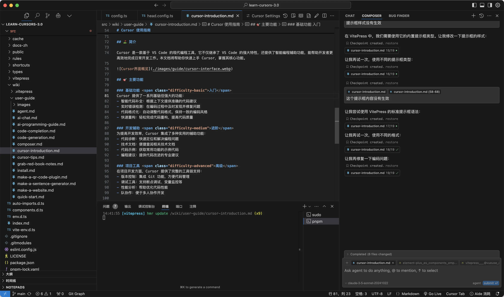

# Cursor 使用前の紹介

::: details 🤔 考えてみましょう
プログラミングがWordを使うように簡単になったらどうでしょう？「統計表を作成したい」と言うだけでツールが作れる。これはSFではなく、Cursorがもたらす変化です。

Cursorはプログラミング学習の方法を再定義しています：

- 複雑な構文規則に悩まされる必要がなくなります
- 問題解決に集中できます
- 誰もがソフトウェア創造に参加できます
  :::

::: tip 🎯 Cursorを選ぶ理由

### 🌟 3つの革新的な進化

1. **💡 対話でコードを書く**
   従来のプログラミングは未知の構文規則と論理的障壁に満ちていましたが、Cursorはこのプロセスを執筆体験のように変えます。自然言語でアイデアを説明するだけで、完全なコードに即座に変換されます。

2. **🚀 アイデアを迅速に製品化**
   Cursorの最大の革新は、「コードの書き方」から「解決すべき問題」へ注意を移すことです。初心者にとっては学習曲線が速く、プロの開発者にとっては作業効率が向上します。

3. **🌈 開発の「民主化」**
   規範的で専門的なコードを生成することで、Cursorは新人でも実際のプロジェクトに迅速に参加できます。初心者とプロの開発者の境界を曖昧にし、コラボレーションをよりスムーズにします。これは開発効率を向上させるだけでなく、より多くの人々がソフトウェア創造に参加する機会を提供します。

### 🎓 単なるツールではなく、プログラミング教育の新たなパラダイム

より直感的で、効率的で、誰もが利用しやすくなりました。AIプログラミングの旅を始め、新しい方法でソフトウェアを創造する方法を探求しましょう。
:::

## ⛳️ 概要

CursorはVS Codeをベースにした現代的なプログラミングツールで、VS Codeの強力な機能を継承しつつ、インテリジェントなプログラミング支援機能を提供し、開発者が日常の開発作業をより効率的に完了するのを支援します。このドキュメントはCursorの基本操作とコア機能を迅速に習得するのに役立ちます。

## 🎯 主な機能

### 基本機能 入門

Cursorは次のような基本的で強力な機能を提供します：

- インテリジェントコード補完：コンテキストに基づいた正確なコード提案
- リアルタイムエラー検出：コーディング中に問題を即座に発見・修正
- コードフォーマット：コードスタイルを自動調整し一貫性を保持
- 迅速なリファクタリング：コードリファクタリングを容易にし品質向上

### 開発支援 中級

開発効率向上のため、Cursorは様々な実用的な支援機能を統合：

- コード診断：プログラミング問題の迅速な特定と解決
- 技術文書：関連技術文書の容易な参照
- コードサンプル：一般的な機能のサンプルコード取得
- プログラミングアドバイス：コード改善の専門的提案

### プロジェクトツール 上級

プロジェクト開発において、Cursorは完全なツールチェーンをサポート：

- バージョン管理：Git機能を統合しコード管理を容易に
- デバッグツール：ブレークポイントデバッグ、変数監視などをサポート
- パフォーマンス分析：コード最適化を支援
- チームコラボレーション：複数人での開発を容易に

## 💡 使用シナリオ

Cursorは様々な開発シナリオに適応：

**日常開発** 入門
コード記述、問題デバッグ、パフォーマンス最適化などの個人開発作業。

**チームコラボレーション** 中級
コードレビュー、ナレッジシェア、プロジェクトコラボレーションなどのチーム開発活動。

**技術探索** 上級
新技術の学習、プロトタイプ開発などの探索的作業。

::: tip 使用上のアドバイス

- 基本機能から順に慣れていきましょう
- ショートカットを活用し操作効率を向上
- 定期的にツールを更新し新機能を取得
  :::
