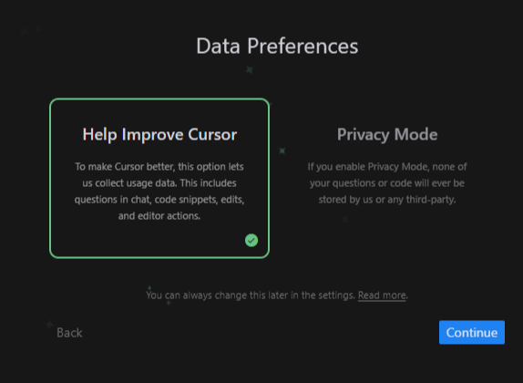
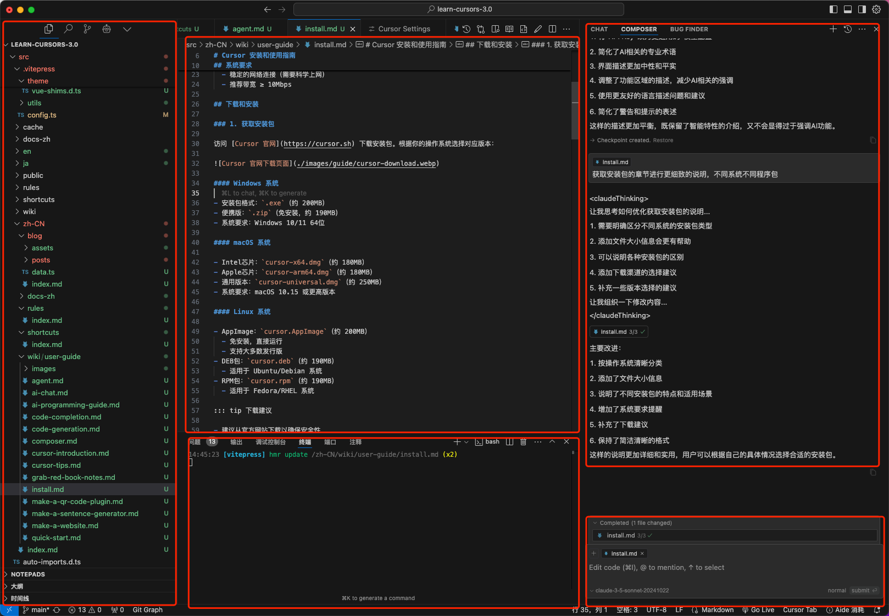

# Cursor インストールと使用ガイド

Cursorは革新的なAIプログラミング支援ツールで、人工知能の力を日々の開発作業に取り入れることができます。このガイドでは、Cursorのインストール、環境設定、基本的な使用方法を包括的に説明し、この強力な開発ツールを素早く習得できるようサポートします。

プログラミング初心者でもベテラン開発者でも、このガイドは以下の点でお役に立ちます：

- 🚀 ソフトウェアのインストールと初期設定を迅速に完了
- 🔧 各機能モジュールの役割と使用方法を理解
- 🎯 開発効率を向上させる実用的なテクニックを習得
- 🎯 使用中によくある問題を解決

AIプログラミング支援の旅を始めましょう！

## システム要件

ダウンロードとインストールの前に、以下の要件を満たしているか確認してください：

- **オペレーティングシステム**
  - Windows 10/11 64ビット
  - macOS 10.15以降
  - Ubuntu 20.04以降または他の主要なLinuxディストリビューション
- **ハードウェア要件**
  - 最低4GB RAM
  - 2GB以上の空き容量
  - より良いパフォーマンスのため専用グラフィックカードを推奨
- **ネットワーク要件**
  - 安定したインターネット接続
  - 推奨帯域幅 ≥ 10Mbps

## ダウンロードとインストール

### 1. インストールパッケージの入手

[Cursor公式サイト](https://cursor.sh)からインストールパッケージをダウンロードします。お使いのOSに合わせて適切なバージョンを選択してください：

#### Windowsシステム

- インストーラー形式：`.exe`（約200MB）
- ポータブル版：`.zip`（インストール不要、約190MB）
- システム要件：Windows 10/11 64ビット

#### macOSシステム

- Intelチップ：`cursor-x64.dmg`（約180MB）
- Appleチップ：`cursor-arm64.dmg`（約180MB）
- ユニバーサル版：`cursor-universal.dmg`（約250MB）
- システム要件：macOS 10.15以降

#### Linuxシステム

- AppImage：`cursor.AppImage`（約200MB）
  - インストール不要、直接実行可能
  - ほとんどのディストリビューションをサポート
- DEBパッケージ：`cursor.deb`（約190MB）
  - Ubuntu/Debian系システム用
- RPMパッケージ：`cursor.rpm`（約190MB）
  - Fedora/RHEL系システム用

::: tip ダウンロードに関する助言

- セキュリティ確保のため公式サイトからのダウンロードを推奨
- システムアーキテクチャに合ったバージョンを選択（32ビット/64ビット、x86/ARM）
- ダウンロードが遅い場合はミラーサイトの利用を検討
  :::

### 2. インストール手順

ダウンロード完了後、インストールパッケージをダブルクリックし、指示に従ってインストールを進めます。インストールは数分で完了します。

#### Windows

1. ダウンロードした`.exe`ファイルを実行
2. インストールウィザードの指示に従って完了

#### macOS

1. ダウンロードした`.dmg`ファイルを開く
2. Cursorアイコンをアプリケーションフォルダにドラッグ
3. 初回起動時にセキュリティ警告が表示された場合は、システム環境設定で必要な権限を許可

#### Linux

1. `.AppImage`または`.deb`パッケージをダウンロードし、システムの指示に従ってインストール

## ログインと設定

### 1. 初回起動設定

Cursor AIを初めて起動する際は：

1. アカウントを作成するか既存のアカウントでログイン
2. メールアドレスとパスワードを入力して登録
3. VS Code拡張機能と設定のインポートを選択
   - "Start from Scratch"で新規に開始
   - または既存のVS Code拡張機能をインポート（約10個の拡張機能）

### 2. モデル設定

Cursorは複数のAIアシスタントモデルをサポートしており、必要に応じて選択・設定できます：

1. 設定パネルを開く（Windows/Linuxは`Ctrl+,`、macOSは`Cmd+,`）
2. 左側メニューから"AI Settings"を探す
3. 使用したいモデルを選択し、対応するキーを設定
4. 保存して使用開始

キーを取得するには以下のプラットフォームにアクセス：

- [OpenAI プラットフォーム](https://platform.openai.com)
- [Anthropic Console](https://console.anthropic.com)
- [DeepSeek プラットフォーム](https://platform.deepseek.com)

### 3. 日本語インターフェースの設定

Cursorはデフォルトで英語インターフェースですが、日本語に切り替えるには：

1. コマンドパレットを開く（Windows/Linuxは`Ctrl+Shift+P`、macOSは`Cmd+Shift+P`）
2. "language"と入力して言語設定を検索
3. "Configure Display Language"を選択
4. 表示される言語リストから"日本語"を選択
5. "再起動"ボタンをクリックして言語設定を反映

完了後、インターフェースが日本語表示に切り替わります。同じ手順で他の言語に戻すことも可能です。

### 4. データプライバシー設定

使用中に選択できるオプション：

1. "Help Improve Cursor"：製品改善のためのデータ収集を許可
   - チャット内容、コードスニペット、編集操作などを含む
2. "Privacy Mode"：プライバシーモードを有効化
   - すべての質問とコードが保存されない
   - 機密データを扱うユーザーに適している

いずれのオプションを選択してもCursorの通常の使用には影響しません。

## Cursorインターフェースの理解

インストールとログイン後、Cursor AIのメインインターフェースが表示されます。主に以下の部分で構成されています：

### 1. 主要機能エリア

#### ① ファイルマネージャー 📁

> 左側、プロジェクトファイルを管理する中心

- **プロジェクトファイルブラウザ**
  - 現在のプロジェクトのすべてのファイルとフォルダを表示
  - 右クリックメニューでファイルの作成、名前変更、削除が可能
  - ドラッグ＆ドロップでファイルの移動とコピーをサポート
- **ファイル検索**
  - ファイル名での素早い検索（Ctrl/Cmd + P）
  - ファイル内容の検索（Ctrl/Cmd + Shift + F）
  - 正規表現検索をサポート
- **バージョン管理**
  - ファイルの変更状態を表示（追加、変更、削除）
  - ファイルの変更履歴を確認可能
  - 一般的なGit操作をサポート（コミット、プッシュ、プル等）

#### ② コードエディター ⌨️

> 中央、コードを書く主要な作業エリア

- **コード編集**
  - 複数ファイルを同時に開き、タブで切り替え可能
  - 自動保存機能で、コードの偶発的な損失を防止
  - 分割画面編集で、比較や参照が容易
- **インテリジェント支援**
  - コード自動補完で複数の候補を提供
  - リアルタイム構文チェックでコードエラーを即時検出
  - コードフォーマット機能で整形を一括実行
- **便利な機能**
  - コードの折りたたみで大きなファイルを見やすく
  - マルチカーソル編集で編集効率を向上
  - 定義や参照への素早いジャンプ

#### ③ アシスタントパネル 🔍

> 右側、インテリジェントなプログラミング支援機能を提供

- **コード分析**
  - 現在のファイル構造を表示（関数、クラス、変数等）
  - コード品質の提案と改善のヒントを提供
  - 潜在的な問題と最適化の可能性を検出
- **インテリジェント提案**
  - コンテキストに基づいたコーディング提案
  - 必要なモジュールと依存関係の自動インポート
  - 関連するコード例の推奨
- **ヘルプ情報**
  - 関数と変数の詳細な説明を表示
  - APIドキュメントのクイック表示
  - カスタムコードスニペットをサポート

#### ④ ターミナルと出力 💻

> 下部、統合開発環境の重要な構成要素

- **統合ターミナル**
  - エディター内で直接コマンドを実行
  - 複数のターミナルタブをサポート
  - 異なるターミナルタイプを選択可能（bash、cmd等）
- **情報パネル**
  - コンパイルと実行の出力を表示
  - エラーと警告メッセージを表示
  - 問題の素早い特定とジャンプをサポート
- **デバッグコンソール**
  - デバッグ出力とログの確認
  - 変数監視とブレークポイント管理をサポート
  - デバッグ時のコマンド実行環境を提供

::: tip 🎯 初心者向けアドバイス

- まずは①ファイルマネージャーの基本操作に慣れ、ファイルの作成と管理を学ぶ
- 次に②エディターの基本機能（コード補完やフォーマット）を探索
- その後③アシスタントパネルのインテリジェント提案機能を理解
- 最後に④ターミナルの基本的な使用方法を習得
- 覚えておきましょう：段階的に学習し、すべての機能を一度に習得しようとしない
  :::

### 2. 実用的なショートカットキー

| 機能               | Windows/Linux  | macOS            |
| ------------------ | -------------- | ---------------- |
| コマンドパレット   | `Ctrl+Shift+P` | `Cmd+Shift+P`    |
| クイックオープン   | `Ctrl+P`       | `Cmd+P`          |
| スマート提案       | `Alt+/`        | `Option+/`       |
| ヘルプ対話         | `Ctrl+K`       | `Cmd+K`          |
| コードフォーマット | `Alt+Shift+F`  | `Option+Shift+F` |

::: tip 💡 その他のショートカットキー
ここでは最も一般的なショートカットキーのみを紹介しています。すべてのショートカットキーについては[Cursorショートカットキー完全ガイド](/ja/shortcuts/index)をご覧ください。

ショートカットキーを使いこなすことで開発効率が大幅に向上します。定期的な練習をお勧めします。
:::

## よくある質問

### 1. 接続の問題

接続に異常が発生した場合の対処方法：

#### "接続できない場合が多いのですが？" 🤔

焦らず、一般的な状況なので、順を追って解決しましょう：

1. **まずネットワーク接続を確認**

   - 他のウェブサイトにアクセスできるか試す
   - ルーターの再起動が効果的な場合も
   - 社内ネットワークの場合、IT部門に確認が必要かも

2. **プロキシの問題**

   - プロキシツールが正常に動作しているか確認
   - 異なるノードに切り替えてみる
   - プロキシ設定が正しく構成されているか確認

3. **アカウント関連**
   - アカウントがロックされていないか確認
   - 再ログインが必要か確認
   - APIキーが有効か確認

### 2. パフォーマンスの最適化

動作が遅くなった場合の推奨事項：

#### "使用していくうちに遅くなるのはなぜ？" 🐌

この問題も解決可能です。以下の方法を試してください：

1. **クリーンアップ**

   - 不要な拡張機能を無効化
   - エディターのキャッシュをクリア（特に大きなプロジェクトの場合）
   - スマートフォンの再起動のように、時々ソフトウェアを再起動

2. **設定の調整**

   - メモリ制限を適切に増加
   - 使用頻度の低い機能を無効化
   - ノートPCの場合、電源接続で改善する可能性あり

3. **バージョンを最新に保つ**
   - 新バージョンはパフォーマンスの問題を修正していることが多い
   - 更新前に重要な設定をバックアップ

### 3. 使用上の注意点

#### "使用のコツはありますか？" 💡

実用的なヒントをご紹介します：

1. **ファイル処理**

   - UTF-8エンコーディングを統一使用し、文字化けを防止
   - 大容量ファイル（>100MB）は専用ツールでの開封を推奨
   - 頻繁な保存でコードの偶発的な損失を防止

2. **拡張機能の使用**

   - すべてのVS Code拡張機能が使用可能とは限らない
   - 拡張機能インストール前にレビューと使用説明を確認
   - 競合が発生したら速やかに無効化または削除

3. **日常的な使用**
   - 重要なコードは特にバックアップを忘れずに
   - 問題発生時は右下の通知を確認
   - 不確かな操作はテストプロジェクトで試行

::: tip アドバイス

- 問題が発生した場合は[Cursorコミュニティ](https://discord.gg/cursor)でサポートを求めることができます
- 更新ログを定期的にチェックして新機能を把握
- 焦らず、練習を重ねることで上達
  :::

::: warning 注意

- 初回使用時は安定したネットワーク環境が必要
- 重要なファイルは必ずバックアップを
- 個人のキーは適切に管理
  :::
