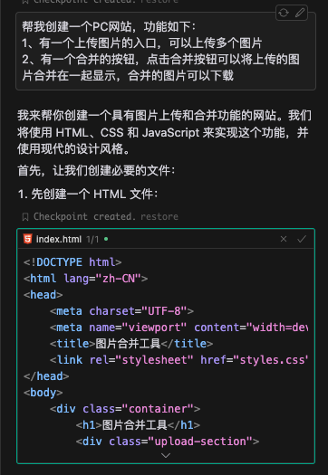
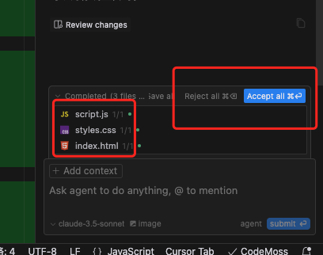
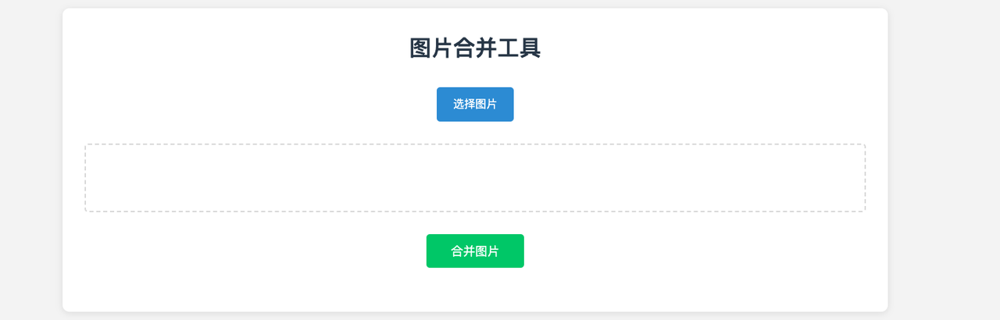
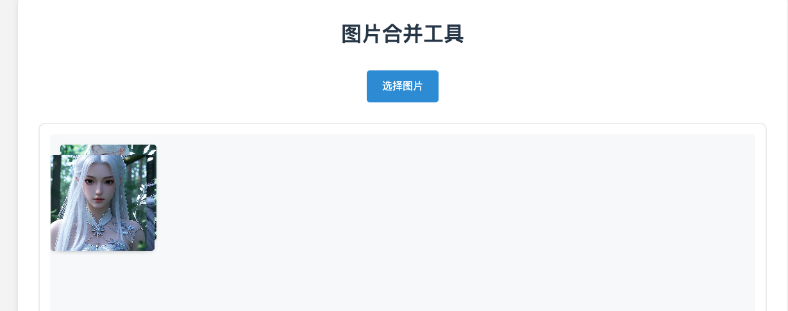
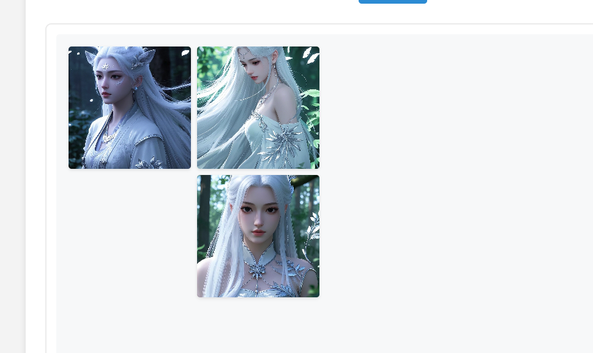
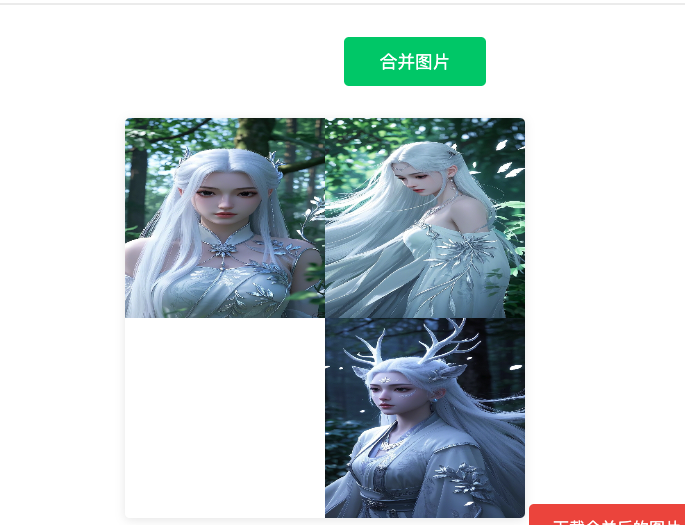
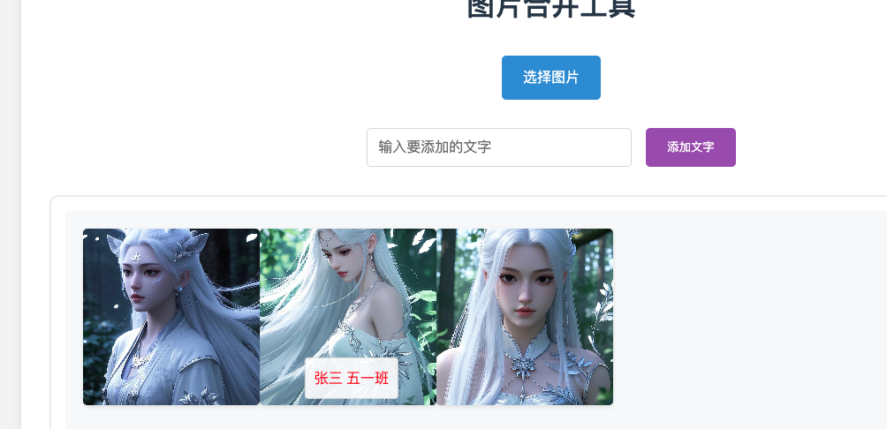
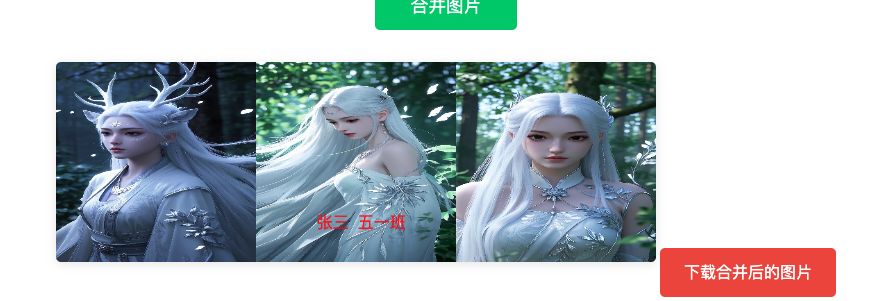

# 実践チュートリアル：対話で画像結合ツールを作る

::: tip 💡 学習目標
このチュートリアルでは、実際の事例を通じて以下の方法を学びます：

- 日常生活のニーズを具体的な製品に変換する
- Cursor AIを使用して迅速に機能を開発する
- 対話を通じてコードをデバッグし最適化する
  :::

## 一、プロジェクトの起源

### 1. 要件の背景

日常生活において、学校はよく保護者にフィードバック情報を提供するよう求めます。例えば、申込書やその他の書類です。これらの情報は通常、複数の画像を含み、以下が必要です：

- 複数の画像を1つに結合する
- 子供の名前を追加する
- 1枚の完全な画像に整理して先生に送る

### 2. 現在の課題

現在の処理方法は比較的面倒です：

- Wordドキュメントを開く必要がある
- 手動で1枚ずつ画像を挿入する
- 位置とサイズを調整する
- テキストの説明を追加する
- 最後にスクリーンショットを保存する

### 3. 解決策

シンプルなウェブツールを開発し、以下を実現します：

- 画像の一括アップロード
- ドラッグ＆ドロップで位置を調整
- テキストの説明を追加
- ワンクリックで結合してダウンロード

## 二、開発プロセス

### 1. 環境準備

::: warning 事前準備

- 新しいプロジェクトフォルダを作成
- Cursorでフォルダを開く
- 基本的な操作インターフェースに慣れる
  :::


### 2. 要件の説明

AIチャットボックスを開き（ショートカット `Ctrl+i`）、製品の要件を明確に説明します：

```
PCウェブサイトを作成してください。機能は以下の通りです：
1. 画像をアップロードできる入口があり、複数の画像をアップロードできる
2. 結合ボタンがあり、クリックするとアップロードした画像を1つに結合して表示し、結合した画像をダウンロードできる
```



コード生成後、以下のような情報が表示されます



最初の赤枠は変更または生成されたファイルを示します

2番目の赤枠

Reject all は コードを拒否することを意味し、クリックすると新しく追加されたコードが取り消されます

Accept all は コードを受け入れることを意味し、コードが有効になります

大胆にAccept allをクリックしてください

ウェブページを開くと、このような感じです。各自のインターフェースは異なる場合がありますが、問題ありません。これからAI対話で調整していきます。



## 三、機能の改善

### 1. 基本機能の実装

今やるべきことは機能のデバッグを開始し、問題がないか確認することです


一度で完了し、ダウンロードできます。

### 2. ドラッグ＆ドロップ機能の最適化

現在の画像結合は左右の横並びのみですが、位置を自由に調整できるようにしたいと思います。例えば、画像1が1番目の位置、画像2が2列目というように。そこで、AIに最適化したい内容を伝えます：

> 画像結合エリアで以下の機能を実現してください：
>
> 1、画像を自由にドラッグして順序を変更できる。例えば、画像1を画像2の右に、画像3を画像1の下に配置できる
>
> 2、キャンバスのような機能を作ることができます

最初の文は具体的な機能を説明し、2番目の文はAIをこの方向に導くためのものです。この文は書かなくても、一歩一歩進めることもできます。

コードを更新した後、このような問題が発生しました



画像が重なっています。問題ありません、AIに問題を伝えましょう

> 現在問題が発生しています。修正をお願いします。問題は以下の通りです：
>
> ドラッグした画像が重なっています。画像は重ならず、1つの画像が1つの位置を占めるようにしたいです。

送信後、重なりの問題は解決しましたが、画像を他の画像の下にドラッグできません


> 重なりの問題は解決しましたが、画像を他の画像の下にドラッグできません。再度要件を明確にします
>
> 1、画像は他の画像の左側または右側にドラッグでき、ドラッグ完了後はその位置を占めます
>
> 2、画像は他の画像の上または下にドラッグでき、ドラッグ完了後もその位置を占めます。
>
> 例えば、最初は 画像1、画像2、画像3 があり、画像3を画像1の下にドラッグすると、結合後の画像では画像3が画像1の下に配置されます。



問題は解決しましたが、画像と画像の間に白い隙間があります

> 結合後の画像と画像の間に白い隙間がないようにしてください。画像同士が密着するようにしてください



### 3. テキスト追加機能

子供の名前を書き入れます

> 新しい機能を追加してください。
>
> テキスト入力ボックスを追加し、テキストを入力できるようにします。このテキストも任意の位置にドラッグでき、テキストは赤色で、結合画像にこのテキストを含めます





最後にAIにこのページを最適化し、機能説明を書いてもらいます


## 四、経験のまとめ

::: tip 💡 開発の感想

1. **AI駆動の開発**

   - コードを手書きする必要なし
   - 対話だけで機能を実現
   - AIは自然言語の要件を理解可能

2. **段階的な改善**

   - まず基本機能を実現
   - 徐々に新機能を追加
   - ユーザー体験を継続的に改善

3. **実用的なアドバイス**
   - 説明は明確で具体的に
   - 問題は段階的に解決可能
   - AIに質問することを恐れない
     :::

全過程で私は1行のコードも書いていません。すべてAIが自動で完了しました。恐ろしいほどです。

ただし、このプロジェクトはとてもシンプルで、フロントエンドプロジェクトのみです。第2の実践プロジェクトではバックエンドとデータベースも含まれます。

最後の経験は、皆さんはAIに質問することを恐れないでください。どんな質問にも答えてくれます
