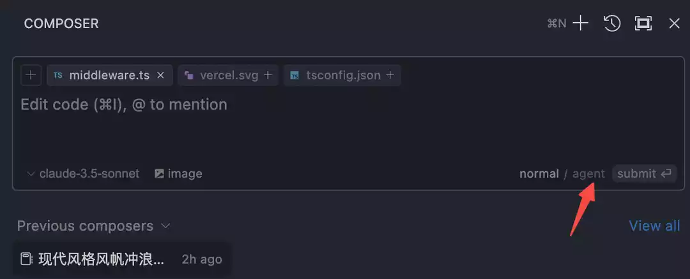
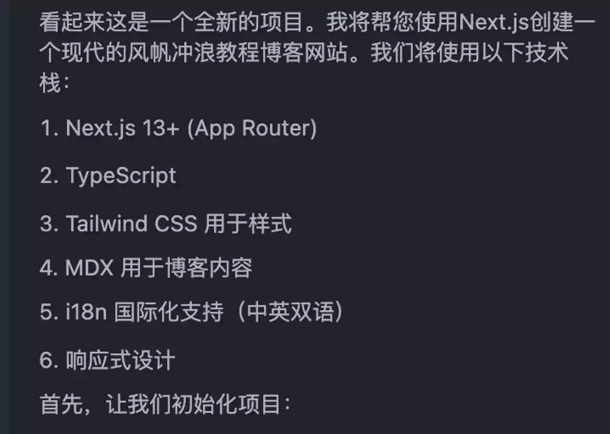

# Agent智能助手


Cursor Agent 是一个革命性的 AI 代理系统，它不仅仅是一个简单的代码助手，而是一个能够像真实程序员一样思考和工作的智能伙伴。它能够自主完成复杂的编程任务，理解项目上下文，并提供持续的开发支持最新版本。

## Agent 是什么？

Agent（智能代理）是 Cursor 4.3 版本推出的重大更新功能。与传统的代码补全或简单问答不同，Agent 更像是一个"会思考"的编程助手。它的两个关键特点是：

- **主动性**：能够主动理解需求、规划方案、解决问题
- **执行力**：能够自主完成复杂的任务序列



## 核心特性

### 1. 智能上下文理解

- **自动收集上下文**：主动分析项目结构和相关代码
- **需求理解**：准确把握开发意图和目标
- **依赖分析**：识别项目依赖和技术栈

### 2. 主动问题解决

- **错误诊断**：自动分析和修复错误
- **性能优化**：识别并解决性能瓶颈
- **代码重构**：提供代码改进建议

### 3. 多任务协同

- **并行处理**：同时处理多个相关任务
- **状态管理**：维护任务执行状态
- **资源协调**：优化资源使用

## 布局和界面

### 新版布局变化


- **Composer 位置**：从屏幕中央移至右侧
- **Chat 集成**：与 Chat 共用右侧 Tab 栏
- **快捷切换**：使用 cmd+L 和 cmd+I 在功能间切换

### 开启 Agent 模式


1. 打开 Composer（cmd+I）
2. 点击 Agent 图标切换到 Agent 模式
3. 开始使用增强功能

## 实际应用场景

### 1. 项目初始化

```typescript
// Agent 可以帮助完整搭建项目框架
interface ProjectSetup {
  name: string
  template: 'next' | 'vite' | 'express'
  features: string[]
  dependencies: Record<string, string>
}

// 示例：初始化 Next.js 项目
const setup: ProjectSetup = {
  name: 'my-next-app',
  template: 'next',
  features: ['typescript', 'auth', 'database'],
  dependencies: {
    'next': 'latest',
    '@prisma/client': '^5.0.0'
  }
}
```

### 2. 功能开发


Agent 会：

1. 分析需求并拆分任务
2. 规划实现步骤
3. 编写核心代码
4. 添加测试用例
5. 优化代码质量

### 3. 问题诊断和修复

```typescript
// Agent 自动诊断和修复问题
interface DiagnosticResult {
  type: 'error' | 'warning' | 'info'
  location: CodeLocation
  message: string
  suggestion?: string
  autoFix?: () => Promise<void>
}

async function diagnoseAndFix(
  issue: string
): Promise<DiagnosticResult[]> {
  // 1. 分析问题
  const diagnosis = await analyzeProblem(issue)

  // 2. 生成修复方案
  const fixes = await generateFixes(diagnosis)

  // 3. 应用修复
  await applyFixes(fixes)

  return diagnosis
}
```

## 工作流程

### 1. 需求分析



- 理解用户需求
- 确定技术约束
- 规划实现路径

### 2. 代码生成和优化

Agent 生成的代码遵循最佳实践：

- 类型安全
- 错误处理
- 性能优化
- 可维护性

### 3. 测试和部署

- 自动生成测试用例
- 运行测试套件
- 提供部署建议

## 最佳实践

### 1. 有效沟通

为获得最佳结果：

- 提供清晰的需求描述
- 指定具体的约束条件
- 及时提供反馈

### 2. 渐进式开发

1. 从小任务开始
2. 逐步增加复杂度
3. 持续验证和优化

### 3. 代码审查

Agent 可以：

- 检查代码质量
- 发现潜在问题
- 提供改进建议

## 使用技巧

### 1. 命令执行


- Agent 会自动在 Composer 中执行命令
- 用户确认后执行
- 支持后台运行

### 2. 多任务处理

- 终端命令和对话可并行
- 任务状态实时更新
- 资源自动调度

### 3. 问题解决

当遇到问题时，Agent 会：

1. 主动分析原因
2. 提供解决方案
3. 验证修复效果

## 注意事项

::: tip 提示

- 提供详细的上下文信息
- 验证生成的代码
- 保持与 Agent 的交互
  :::

::: warning 注意事项

- 重要决策需人工确认
- 定期备份关键数据
- 注意代码安全性
  :::

## 常见问题

### 1. Agent 模式未生效

- 检查 Cursor 版本是否最新
- 确认是否正确开启 Agent 模式
- 验证网络连接状态

### 2. 代码生成质量

- 提供更多上下文信息
- 明确指定约束条件
- 及时提供反馈和修正

### 3. 性能问题

- 优化任务规模
- 合理设置并发数
- 适当使用后台执行

## 未来展望

Agent 技术正在快速发展：

- 更强的理解能力
- 更智能的决策
- 更自然的交互
- 更广泛的应用

通过不断学习和适应，Agent 将成为开发者更得力的助手，帮助我们更高效地完成开发任务。
