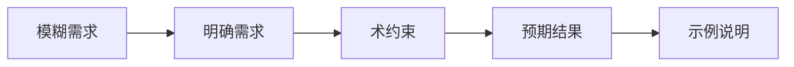
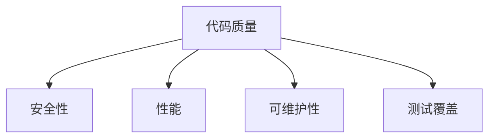
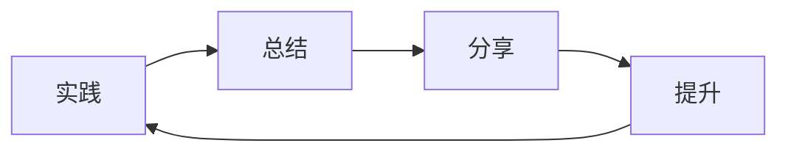

<style>
.custom-block {
  margin: 2rem 0;
}

.custom-block + .custom-block {
  margin-top: 1.5rem;
}
</style>

# 用AI编程的心态

在开始使用 AI 编程之前，你需要了解它的几个关键特点：

::: warning 🎲 关于随机性
大型语言模型的工作方式就像在预测下一个最合适的词，这导致即便是相同的问题，每次也可能得到不同的解决方案。这不是缺陷，而是它的特性。如果你希望得到更稳定的结果，最好的方式是提供更明确的要求，比如指定具体的技术栈或框架，这样可以帮助 AI 在更小的范围内思考。
:::

::: info 📊 关于普遍性
AI 是通过学习海量的互联网数据训练出来的，这意味着它倾向于提供比较大众化的解决方案。如果你需要一些特殊的实现方式，最好明确告诉它你的特定需求，比如要求它遵循某个特定的设计标准或编码规范。这样可以引导 AI 生成更符合你预期的代码。
:::

::: tip 📝 关于上下文限制
当前的 AI 模型在处理长文本时是有限制的，通常是20万字左右的上下文窗口。这意味着在处理大型项目时，你需要合理规划项目结构和文件拆分。建议在项目开始时就做好记录（比如在 README.md 中），并在对话时善用 @codebase 等方式来提供必要的上下文信息。
:::

::: details 🤔 关于思维方式
AI 往往倾向于直接满足你的表面需求，但可能会忽略一些深层的系统设计考虑。当你遇到复杂的问题时，建议先让 AI 帮你分析问题，而不是直接要求它给出解决方案。通过引导它进行更全面的思考，你能得到更好的结果。
:::

在 AI 时代，我们需要建立新的编程思维模式。AI 不是替代品，而是强大的助手和协作伙伴。本文将帮助你建立正确的心态，更好地利用 AI 来提升编程效率和质量。

## 基本原则

### 1. 把 AI 当作你的编程搭档 🤝

想象一下，AI 就像一个经验丰富的同事，它可以给你提供建议和参考，但最终的决定权还是在你手中。就像在餐厅点菜，服务员可以推荐今日特色，但你才是决定吃什么的人。

在编程时：
- 多问问 AI 的意见，但不要盲从
- 主动思考它给出的建议是否合适
- 把好的解决方案保存下来，慢慢建立自己的"锦囊妙计"

### 2. 做项目的掌舵人 ⛵

记住，你才是项目的船长，AI 是你的大副。航向要往哪里走，用什么技术栈，代码质量的标准是什么，这些重要决定都需要你来把握。

就像开车使用导航：
- 你决定目的地，AI 帮你规划路线
- 你来判断路况，必要时绕开导航建议的拥堵路段
- 你负责确保安全，不能因为导航说往前开就不看路况

### 3. 保持学习的热情 📚

程序员的成长之路就像玩游戏升级，AI 可以帮你更快地过关，但技能点数还是要自己一点一点攒：

- 遇到新功能，先理解它是怎么实现的
- 看到好的代码，琢磨一下为什么要这样写
- 保持好奇心，多问问"为什么"和"是不是还有更好的方法"

记住：AI 不是来代替你的大脑，而是来帮你的大脑变得更强大。就像健身时的私教，它可以指导你正确的动作要领，但锻炼的是你自己的肌肉。

## 工作方式

### 1. 任务分解

::: tip 🎯 从全局视角出发
在开始编码之前，先花时间理解整个项目的需求和目标，就像画画要先打草稿一样，先规划好技术架构和实现路径，这样能避免后期走弯路。
:::

::: info 🚶 循序渐进的实现策略
把大型任务分��成小块，就像吃饭要一口一口吃一样，每次专注解决一个问题，通过小步快跑的方式逐步构建你的项目。
:::

::: tip 🔄 持续优化的心态
先搭建最基本的框架，就像盖房子要先打地基一样，然后再逐步添加功能，持续改进代码质量，让项目不断进化和成长。
:::

### 2. 与 AI 协作

1. **清晰沟通**
```
// 好的提示示例
"创建一个 TypeScript 函数，用于处理用户认证，
需要包含：
1. 输入验证
2. 密码加密
3. Token 生成
4. 错误处理"

// 不好的提示示例
"写个登录功能"
```

2. **渐进式开发**
```typescript
// 第一步：基本结构
async function authenticateUser(credentials: Credentials) {
  // 基本验证逻辑
}

// 第二步：添加详细实现
async function authenticateUser(credentials: Credentials) {
  // 1. 验证输入
  validateCredentials(credentials)
  
  // 2. 查找用户
  const user = await findUser(credentials.email)
  
  // 3. 验证密码
  await verifyPassword(credentials.password, user.password)
  
  // 4. 生成 token
  return generateToken(user)
}

// 第三步：添加错误处理
async function authenticateUser(credentials: Credentials) {
  try {
    validateCredentials(credentials)
    const user = await findUser(credentials.email)
    await verifyPassword(credentials.password, user.password)
    return generateToken(user)
  } catch (error) {
    handleAuthError(error)
  }
}
```

3. **代码审查**
```typescript
// AI 生成的代码要审查
function processData(data: unknown) {
  // 检查点 1: 类型安全
  if (!isValidData(data)) {
    throw new Error('Invalid data')
  }

  // 检查点 2: 性能考虑
  const results = processLargeDataSet(data)

  // 检查点 3: 错误处理
  try {
    return transformResults(results)
  } catch (error) {
    handleError(error)
  }
}
```

## 最佳实践

### 1. 提示工程的艺术 🎨

与 AI 对话就像教导一个聪明但需要明确指示的助手。要写出好的提示，需要做到以下几点：

想象你在给一个外国朋友写邮件，要把需求说得既详细又容易理解。比如不要只说"我要一个登录功能"，而是要说明具体需要哪些部分：用户验证、密码加密、token 生成等。这样 AI 才能给出准确的答案。



### 2. 代码质量把控 🔍

就像建造一座大楼，代码质量直接关系到项目的长期稳定性。我们需要特别关注：

- 安全性：就像给房子装防盗门和监控
- 性能：确保电梯够快、走廊够宽
- 可维护性：管线布局合理，方便以后维修
- 测试覆盖：就像做好防水、防震等测试



### 3. 持续改进之道 🌱

编程就像园艺，需要持续的培育和改进。我们可以：

- 像写日记一样记录每天的收获和教训
- 定期回顾和总结，就像给花园除草、修剪
- 在团队中分享经验，互相学习和提高



::: tip 提示
- 将 AI 视为协作伙伴而不是替代品
- 保持学习和思考的习惯
- 注重代码质量和长期维护
:::

::: warning 注意
- 不要过度依赖 AI
- 保持独立思考能力
- 关注代码质量和安全性
::: 