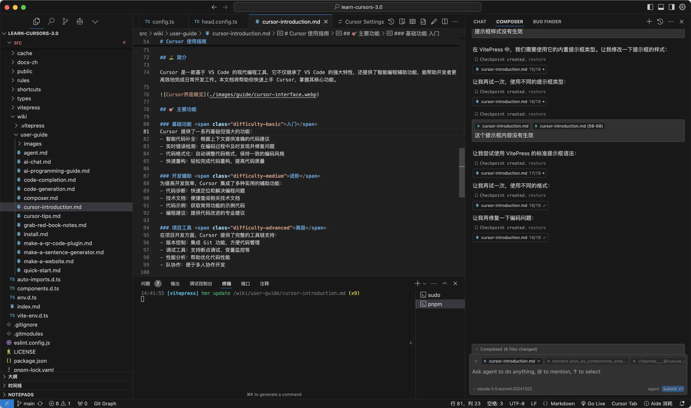

# Cursor 使用前的介绍

::: details 🤔 思考一下
想象一下，如果编程可以像使用 Word 一样简单：你说"我要制作一个统计表格"，它就能帮你把工具做出来。这不是科幻，这就是 Cursor 带来的改变。

Cursor 正在重新定义编程的学习方式：
- 不再被复杂的语法规则困扰
- 把注意力集中在解决问题上
- 让每个人都能参与软件创造
:::

::: tip 🎯 为什么选择 Cursor
### 🌟 三大革新性突破

1. **💡 通过对话写代码**  
   传统编程充满了陌生的语法规则和逻辑障碍，而 Cursor 把这个过程变成了类似写作的体验。你只需用自然语言描述你的想法，它就能立即翻译成完整的代码。

2. **🚀 让想法快速变成产品**  
   Cursor 最大的革新在于，它让你把注意力从"如何写代码"转移到"解决什么问题"。对初学者来说，这意味着更快的学习曲线；对专业开发者来说，这意味着更高的工作效率。

3. **🌈 让开发变得"民主化"**  
   通过生成规范、专业的代码，Cursor 让新手也能快速参与到实际项目中。它模糊了初学者和专业开发者之间的界限，让协作变得更加顺畅。这不仅提升了开发效率，更重要的是，它正在让更多人有机会参与到软件创造中。

### 🎓 这不仅是一个工具，而是编程教育的新范式
更直观、更高效、更平民化。让我们开始这段 AI 编程之旅，探索如何用全新的方式来创造软件。
:::

## ⛳️ 简介

Cursor 是一款基于 VS Code 的现代编程工具，它不仅继承了 VS Code 的强大特性，还提供了智能编程辅助功能，能帮助开发者更高效地完成日常开发工作。本文档将帮助你快速上手 Cursor，掌握其核心功能。

## 🎯 主要功能

### 基础功能 入门
Cursor 提供了一系列基础但强大的功能：
- 智能代码补全：根据上下文提供准确的代码建议
- 实时错误检测：在编码过程中及时发现并修复问题
- 代码格式化：自动调整代码格式，保持一致的编码风格
- 快速重构：轻松完成代码重构，提高代码质量

### 开发辅助 进阶
为提高开发效率，Cursor 集成了多种实用的辅助功能：
- 代码诊断：快速定位和解决编程问题
- 技术文档：便捷查阅相关技术文档
- 代码示例：获取常用功能的示例代码
- 编程建议：提供代码改进的专业建议

### 项目工具 高级
在项目开发方面，Cursor 提供了完整的工具链支持：
- 版本控制：集成 Git 功能，方便代码管理
- 调试工具：支持断点调试、变量监控等
- 性能分析：帮助优化代码性能
- 队协作便于多人协作开发

## 💡 使用场景

Cursor 适用于多种开发场景：

**日常开发** 入门
编写代码、调试问题、优化性能等个人开发工作。

**团队协作** 进阶
代码评审、知识分享、项目协作等团队开发活动。

**技术探索** 高级
学习新技术、验证方案原型开发等探索性工作。

::: tip 使用建议
- 循序渐进，从基础功能开始熟悉
- 善用快捷键，提高操作效率
- 定期更新工具，及时获取新特性
:::

