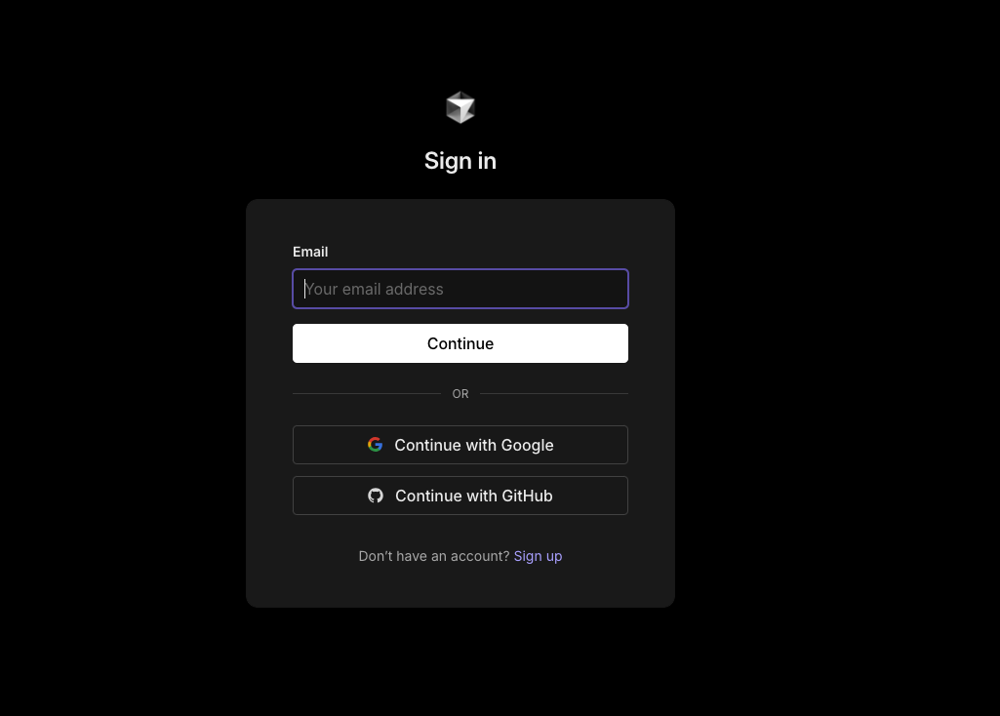

# Cursor 安装和使用指南

Cursor 是一款革新性的 AI 辅助编程工具，它将人工智能的力量带入你的日常开发工作中。本指南将全面介绍 Cursor 的安装部署、环境配置和基础使用方法，帮助你快速掌握这个强大的开发工具。

无论你是刚接触编程的新手，还是经验丰富的开发者，这份指南都能帮助你：

- 🚀 快速完成软件安装和初始化配置
- 🔧 了解各个功能模块的作用和使用方法
- 🎯 掌握提高开发效率的实用技巧
- 🎯 解决使用过程中的常见问题

让我们开始这段 AI 辅助编程的探索之旅吧！

## 系统要求

在下载安装前，请确保你的系统满足以下要求：

- **操作系统**
  - Windows 10/11 64位
  - macOS 10.15+
  - Ubuntu 20.04+ 或其他主流 Linux 发行版
- **硬件要求**
  - 至少 4GB RAM
  - 2GB 可用磁盘空间
  - 推荐使用独立显卡以获得更好的性能
- **网络要求**
  - 稳定的网络连接（需要科学上网）
  - 推荐带宽 ≥ 10Mbps

## 下载和安装

### 1. 获取安装包

访问 [Cursor 官网](https://cursor.sh) 下载安装包。根据你的操作系统选择对应版本：

#### Windows 系统

- 安装包格式：`.exe`（约 200MB）
- 便携版：`.zip`（免安装，约 190MB）
- 系统要求：Windows 10/11 64位

#### macOS 系统

- Intel芯片：`cursor-x64.dmg`（约 180MB）
- Apple芯片：`cursor-arm64.dmg`（约 180MB）
- 通用版本：`cursor-universal.dmg`（约 250MB）
- 系统要求：macOS 10.15 或更高版本

#### Linux 系统

- AppImage：`cursor.AppImage`（约 200MB）
  - 免安装，直接运行
  - 支持大多数发行版
- DEB包：`cursor.deb`（约 190MB）
  - 适用于 Ubuntu/Debian 系统
- RPM包：`cursor.rpm`（约 190MB）
  - 适用于 Fedora/RHEL 系统

::: tip 下载建议

- 建议从官方网站下载以确保安全性
- 选择与系统架构匹配的版本（32位/64位，x86/ARM）
- 如遇下载缓慢，可尝试使用镜像站点
  :::

### 2. 安装步骤

下载完成后，双击安装包并按照提示进行安装。安装过程非常简单，只需几分钟即可完成。

#### Windows

1. 运行下载的 `.exe` 安装文件
2. 按照安装向导的提示完成安装

#### macOS

1. 打开下载的 `.dmg` 文件
2. 将 Cursor 图标拖拽到 Applications 文件夹
3. 首次运行时，如果提示安全警告，请在系统偏好设置中允许必要的权限

#### Linux

1. 下载 `.AppImage` 或 `.deb` 包并按照系统提示完成安装

## 登录和配置

### 1. 首次启动配置

首次打开 Cursor AI 时，你将看到欢迎界面，需要完成以下步骤：

### 1. 账户设置

1. 创建新账户或登录已有账户

   - 如果是新用户，点击"Sign Up"（注册）
   - 如果已有账户，点击"Sign In"（登录）

2. 填写注册信息

   - 输入你的电子邮箱地址
   - 设置一个安全的密码（建议使用字母、数字和符号的组合）
   - 确认密码

3. 初始化设置选择

   - 你会看到"Import VS Code Settings"（导入VS Code设置）的选项
   - 两个选择：
     - "Start from Scratch"（从头开始）：推荐给初学者，提供一个全新的干净环境
     - "Import VS Code Extensions"（导入VS Code扩展）：如果你之前使用过VS Code，可以导入你熟悉的工具和设置

   > 💡 小贴士：VS Code是另一个流行的代码编辑器，它的扩展是一些额外的功能模块。如果你是编程新手，建议选择"Start from Scratch"，这样可以避免环境过于复杂。

### 2. 选择AI助手模型

Cursor支持多种AI模型，它们就像不同的"助手"，各有特长：以下是支持的模型平台：

- [OpenAI 平台](https://platform.openai.com)
- [Anthropic Console](https://console.anthropic.com)
- [DeepSeek 平台](https://platform.deepseek.com)

> 💡 建议：如果你是初学者，可以先使用免费的Claude 2.1体验一下，熟悉后再考虑升级到更高级的模型。

### 3. 界面语言设置

如果你想把界面切换为中文（推荐中文用户使用）：

1. 点击左下角的设置图标（⚙️）
2. 选择"Settings"（设置）
3. 在搜索框中输入"language"
4. 找到"Preferred Language"（首选语言）
5. 从下拉菜单中选择"简体中文"
6. 点击"重启"按钮使设置生效

### 4. 数据隐私设置

在使用过程中，你需要决定是否参与产品改进计划：

1. "Help Improve Cursor"（帮助改进Cursor）选项
   - 如果选择"是"：
     - Cursor会收集你的使用数据来改进产品
     - 包括：对话内容、代码片段、编辑操作等
   - 如果选择"否"：
     - 你的所有操作都将保持私密
     - 不会向Cursor团队分享任何数据

> 💡 隐私建议：如果你计划用Cursor处理敏感或私密的项目，建议选择不分享数据。

### 5. 可能遇到的问题

1. 注册邮箱收不到验证邮件

   - 检查垃圾邮件文件夹
   - 等待几分钟后重试
   - 尝试使用其他邮箱地址

2. 无法连接到AI服务器

   - 检查网络连接
   - 确认是否需要使用代理服务器
   - 稍后重试

3. 界面显示异常
   - 尝试刷新页面
   - 重启Cursor
   - 检查是否有新版本更新

完成以上设置后，你就可以开始使用Cursor进行编程学习和开发工作了！如果遇到任何问题，可以：

- 查看帮助文档
- 加入Cursor中文社区寻求帮助
- 通过官方支持渠道联系客服

## 认识 Cursor 界面

安装并登录后，你将进入 Cursor AI 的主界面，主要包含以下部分：

### 1. 主要功能区域

#### ① 文件管理器 📁

> 左侧，是你管理项目文件的中心

- **项目文件浏览**
  - 显示当前项目的所有文件和文件夹
  - 可以通过右键菜单创建、重命名、删除文件
  - 支持拖拽文件进行移动和复制
- **文件搜索**
  - 支持按文件名快速查找（Ctrl/Cmd + P）
  - 可以搜索文件内容（Ctrl/Cmd + Shift + F）
  - 支持正则表达式搜索
- **版本控制**
  - 显示文件的修改状态（新增、修改、删除）
  - 可以查看文件的修改历史
  - 支持常见的 Git 操作（提交、推送、拉取等）

#### ② 代码编辑器 ⌨️

> 中央，是你编写代码的主要工作区

- **代码编辑**
  - 支持多文件同时打开，通过标签页切换
  - 自动保存功能，避免意外丢失代码
  - 支持分屏编辑，方便对比和参考
- **智能辅助**
  - 代码自动补全，提供多种可能的选项
  - 实时语法检查，及时发现代码错误
  - 代码格式化，一键美化代码排版
- **便捷功能**
  - 代码折叠，方便查看大文件
  - 多光标编辑，提高编辑效率
  - 快速跳转到定义或引用处

#### ③ 辅助面板 🔍

> 右侧，提供智能编程辅助功能

- **代码分析**
  - 显示当前文件的结构（函数、类、变量等）
  - 提供代码质量建议和改进提示
  - 检测潜在的问题和优化空间
- **智能建议**
  - 根据上下文提供编码建议
  - 自动导入所需的模块和依赖
  - 推荐相关的代码示例
- **帮助信息**
  - 显示函数和变量的详细说明
  - 提供 API 文档快速查看
  - 支持自定义代码片段

#### ④ 终端与输出 💻

> 底部，集成开发环境的重要组成部分

- **集成终端**
  - 直接在编辑器中执行命令
  - 支持多个终端标签页
  - 可以选择不同的终端类型（bash、cmd等）
- **信息面板**
  - 显示编译和运行输出
  - 展示错误和警告信息
  - 支持问题快速定位和跳转
- **调试控制台**
  - 查看调试输出和日志
  - 支持变量监视和断点管理
  - 提供调试时的命令执行环境

::: tip 🎯 初学者建议

- 建议先熟悉①文件管理器的基本操作，学会创建和管理文件
- 然后探索②编辑器的基本功能，如代码补全和格式化
- 接着了解③辅助面板提供的智能提示功能
- 最后掌握④终端的基本使用方法
- 记住：循序渐进，不要急于一次掌握所有功能
  :::

### 2. 实用快捷键

| 功能       | Windows/Linux  | macOS            |
| ---------- | -------------- | ---------------- |
| 命令面板   | `Ctrl+Shift+P` | `Cmd+Shift+P`    |
| 快速打开   | `Ctrl+P`       | `Cmd+P`          |
| 智能提示   | `Alt+/`        | `Option+/`       |
| 帮助对话   | `Ctrl+K`       | `Cmd+K`          |
| 代码格式化 | `Alt+Shift+F`  | `Option+Shift+F` |

::: tip 💡 更多快捷键
这里只列出了最常用的快捷键，如需了解全部快捷键，请查看 [Cursor 快捷键大全](/zh-CN/shortcuts/index)。

熟练使用快捷键可以大大提高开发效率，建议经常练习使用。
:::

## 常见问题

### 1. 连接问题

遇到连接异常时，可以尝试：

#### "怎么老是连不上啊？" 🤔

别着急，这种情况很常见，我们一步步来解决：

1. **先看看网络连接**

   - 测试一下能不能打开其他网站
   - 重启路由器可能会有帮助
   - 如果用的是公司网络，可能需要找IT部门帮忙

2. **科学上网的问题**

   - 确保你的代理工具正常运行
   - 尝试切换不同的节点
   - 检查代理设置是否正确配置

3. **账号相关**
   - 确认账号没有被锁定
   - 看看是不是需要重新登录
   - API密钥是否还有效

### 2. 性能优化

如果运行变慢，建议：

#### "为什么越用越卡？" 🐌

这个问题也不难解决，试试这些方法：

1. **清理一下"垃圾"**

   - 关掉不用的扩展插件
   - 清理编辑器缓存（特别是大项目用久了）
   - 偶尔重启一下软件，就像重启手机一样

2. **调整一下设置**

   - 适当增加内存限制
   - 关闭一些不常用的功能
   - 如果用的是笔记本，插上电源可能会快一些

3. **保持版本更新**
   - 新版本通常会修复性能问题
   - 更新前记得备份重要配置

### 3. 使用建议

#### "有什么使用技巧吗？" 💡

这里有一些实用小贴士：

1. **文件处理**

   - 统一用 UTF-8 编码，省得出现乱码
   - 超大文件（>100MB）最好用专门的工具打开
   - 经常保存，避免意外丢失代码

2. **扩展使用**

   - 并不是所有 VS Code 的扩展都能用
   - 装扩展前先看看评价和使用说明
   - 遇到冲突及时禁用或卸载

3. **日常使用**
   - 做好文件备份，特别是重要代码
   - 遇到问题先看看右下角有没有提示
   - 不确定的操作可以先在测试项目里试试

::: tip 小贴士

- 遇到问题时，可以在 [Cursor 社区](https://discord.gg/cursor) 寻求帮助
- 记得经常看看更新日志，了解新功能
- 保持耐心，熟能生巧
  :::

::: warning 注意

- 首次使用需要稳定的网络环境
- 重要文件请注意备份
- 个人密钥请妥善保管
  :::
