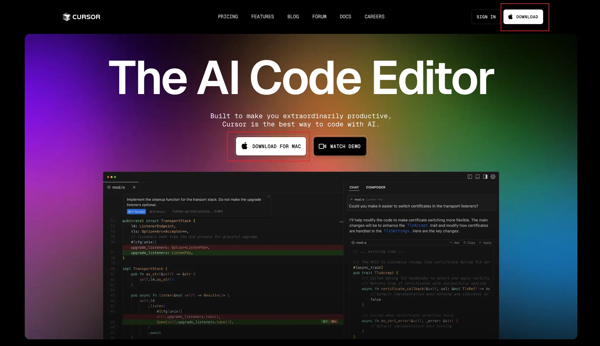
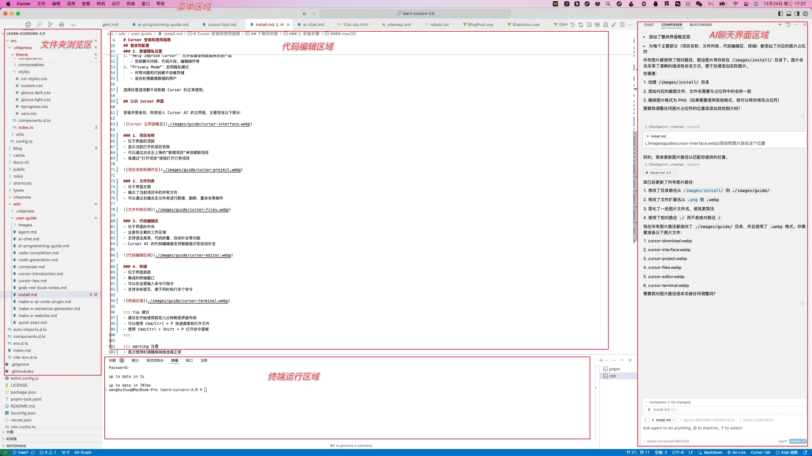

# Cursor 安装和使用指南

本文将指导你完成 Cursor AI 的下载安装、登录配置，并介绍基本界面，帮助你快速开始使用这个强大的 AI 编程工具。

## 下载和安装

### 1. 获取安装包

1. 访问 [Cursor 官网](https://cursor.sh)
2. 点击"Download"按钮下载适合你操作系统的版本

### 2. 安装步骤

下载完成后，双击安装包并按照提示进行安装。安装过程非常简单，只需几分钟即可完成。

#### Windows
1. 运行下载的 `.exe` 安装文件
2. 按照安装向导的提示完成安装

#### macOS
1. 打开下载的 `.dmg` 文件
2. 将 Cursor 图标拖拽到 Applications 文件夹
3. 首次运行时，如果提示安全警告，请在系统偏好设置中允许必要的权限

#### Linux
1. 下载 `.AppImage` 或 `.deb` 包并按照系统提示完成安装

## 登录和配置

### 1. 首次启动配置

首次打开 Cursor AI 时，你需要：

1. 创建一个账户或登录现有账户
2. 输入你的邮箱和密码进行注册
3. 选择是否导入 VS Code 扩展和设置
   - 可以选择"Start from Scratch"从头开始
   - 或导入现有的 VS Code 扩展（约10个扩展）

### 2. 配置中文界面

Cursor 默认使用英文界面，如需切换到中文：

1. 打开命令面板（Windows/Linux 使用 `Ctrl+Shift+P`，macOS 使用 `Cmd+Shift+P`）
2. 输入 "language" 搜索语言设置
3. 选择 "Configure Display Language"
4. 在弹出的语言列表中选择 "中文(简体)"
5. 点击 "重启" 按钮使语言设置生效

完成后，界面将切换为中文显示。你可以随时通过相同的步骤切换回其他语言。

### 3. 数据隐私设置

在使用过程中，你可以选择：

1. "Help Improve Cursor"：允许收集使用数据来改进产品
   - 包括聊天内容、代码片段、编辑操作等
2. "Privacy Mode"：启用隐私模式
   - 所有问题和代码都不会被存储
   - 适合处理敏感数据的用户

选择任意选项都不会影响 Cursor 的正常使用。

## 认识 Cursor 界面

安装并登录后，你将进入 Cursor AI 的主界面，主要包含以下部分：

### 1. 项目名称
- 位于界面的顶部
- 显示当前打开的项目名称
- 可以通过点击左上角的"新建项目"来创建新项目
- 或通过"打开项目"按钮打开已有项目

### 2. 文件列表
- 位于界面左侧
- 展示了当前项目中的所有文件
- 可以通过右键点击文件来进行新建、删除、重命名等操作

### 3. 代码编辑区
- 位于界面的中央
- 这是你主要的工作区域
- 支持语法高亮、代码折叠、自动补全等功能
- Cursor AI 的代码编辑器支持智能提示和自动补全

### 4. 终端
- 位于界面底部
- 集成的终端窗口
- 可以在这里输入命令行指令
- 支持多标签页，便于同时执行多个命令

::: tip 建议
- 建议在开始使用前花几分钟熟悉界面布局
- 可以使用 Cmd/Ctrl + P 快速搜索和打开文件
- 使用 Cmd/Ctrl + Shift + P 打开命令面板
:::

::: warning 注意
- 首次使用时请确保网络连接正常（需要科学上网-你们懂得的！）
- 如遇到问题，可以查看官方文档或寻求社区帮助
::: 