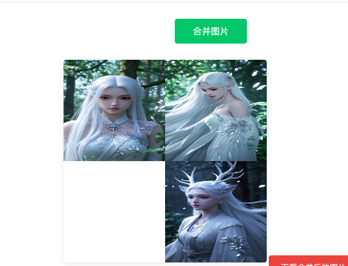

# 实战教程：用对话打造一个图片合并工具

::: tip 💡 学习目标
本教程将通过一个实际案例，教你如何：

- 将生活中的需求转化为具体的产品
- 使用 Cursor AI 快速开发功能
- 通过对话调试和优化代码
  :::

## 一、项目起源

### 1. 需求背景

在日常生活中，学校经常会要求家长提供一些反馈信息，比如报名表或其他表格。这些信息通常包含多张图片，需要：

- 将多张图片拼接在一起
- 添加孩子的姓名
- 整理成一张完整的图片发给老师

### 2. 现有痛点

目前的处理方式比较繁琐：

- 需要打开 Word 文档
- 手动一张张插入图片
- 调整位置和大小
- 添加文字说明
- 最后再截图保存

### 3. 解决方案

开发一个简单的网页工具，实现：

- 批量上传图片
- 拖拽调整位置
- 添加文字说明
- 一键合并下载

## 二、开发过程

### 1. 环境准备

::: warning 前期准备

- 创建新的项目文件夹
- 使用 Cursor 打开文件夹
- 熟悉基本的操作界面
  :::


### 2. 需求描述

打开 AI 对话框（快捷键 `Ctrl+i`），清晰地描述产品需求：

```
帮我创建一个PC网站，功能如下：
1. 有一个上传图片的入口，可以上传多个图片
2. 有一个合并的按钮，点击合并按钮可以将上传的图片合并在一起显示，合并的图片可以下载
```


代码生成完后，出现如下信息


第一个红框代表改动或者生成的文件

第二个红框

Reject all 表示 拒绝接收这个代码，点了之后这些新增的代码会被撤销

Accept all 表示 接受代码，代码会生效

大胆的点 Accept all

打开网页后，是这样子的，每个人的界面可能不一样，没关系，接下来都可以用AI对话的方式去调整。


## 三、功能迭代

### 1. 基础功能实现

你现在要做的是开始调试功能，看下有什么问题没有


一次到位，可以点击下载。

### 2. 拖拽功能优化

目前的图片合并只能左右横排，我希望他能随意的调整位置，比如图1在第一个位置，图2在第二排的。所以你告诉AI你要做的优化

> 合并图片的区域要实现如下功能：
>
> 1、图片可以随便拖拽改变顺序，比如图1在图2的右边，图三在图1的下面
>
> 2、你可以做一个类似画板一样的功能

第一句话是说具体的功能，第二句话是一个引导式的让AI朝这方向设计。你也可以不写这一句，一步一步来。

更新完代码之后，出现了这样的问题


图片重叠在一起了，没关系，告诉AI你的问题

> 现在出现了问题，请修复，问题如下：
>
> 拖拽的图片重叠在一起了，我的要求是图片不能重叠，一个图片占用一个位置。

提交之后，问题重叠的问题已经解决，但无法将图片拖拽到图片的下方


> 重叠的问题解决了，但是 图片还是无法拖拽到另一张图片的下面，再次明确需求
>
> 1、图片可以可以拖拽到其他图片的左边或者右边，拖拽完成后会占用位置
>
> 2、图片可以拖拽到其他图片的上面或者下面，拖拽完成后也会占用位置。
>
> 比如 刚开始 图1，图2 ，图3，我将图3拖拽到图1下面，那么合并完的图片，图3就在图1的下面。


问题解决了，但是图片和图片之间有白色的空隙

> 合并完的图片与图片之间不要有留白的缝隙，图片跟图片紧挨在一起



### 3. 文字添加功能

将小孩的名字写上去

> 添加一个新的功能。
>
> 新增一个输入框，可以输入一段文字，这段文字也可以拖拽到任意位置，文字是红色的，合并图片中要包含这段文字


最后让AI把这个页面优化及功能说明写下


## 四、经验总结

::: tip 💡 开发心得

1. **AI 驱动开发**

   - 无需手写代码
   - 通过对话即可实现功能
   - AI 能理解自然语言需求

2. **迭代优化**

   - 先实现基础功能
   - 逐步添加新特性
   - 持续优化用户体验

3. **实用建议**
   - 描述要清晰具体
   - 问题可以分步解决
   - 不要怕问AI问题
     :::

整个过程我没有自己写一个代码，全是AI自动完成，恐怖如斯。

但是这个项目很简单，只有前端项目，在我们的第二个实战项目中会包含后端和数据库。

最后的经验就是，大家要勇于去问AI，反正它都会回答你
